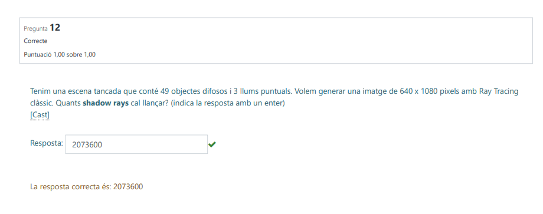
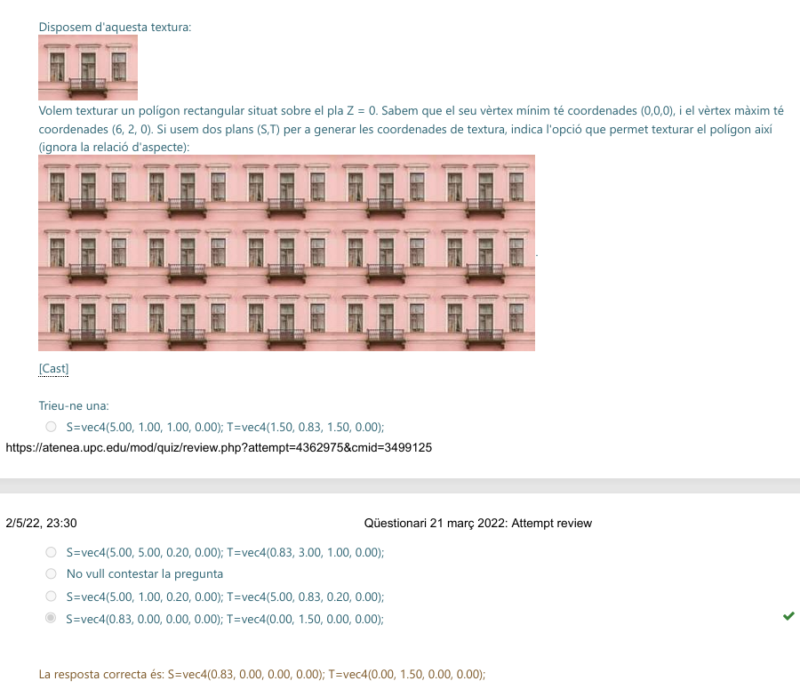
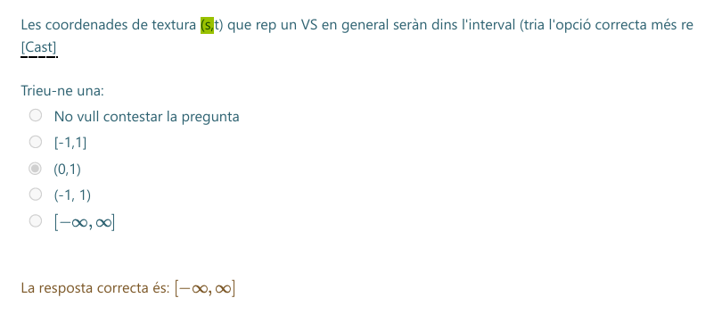
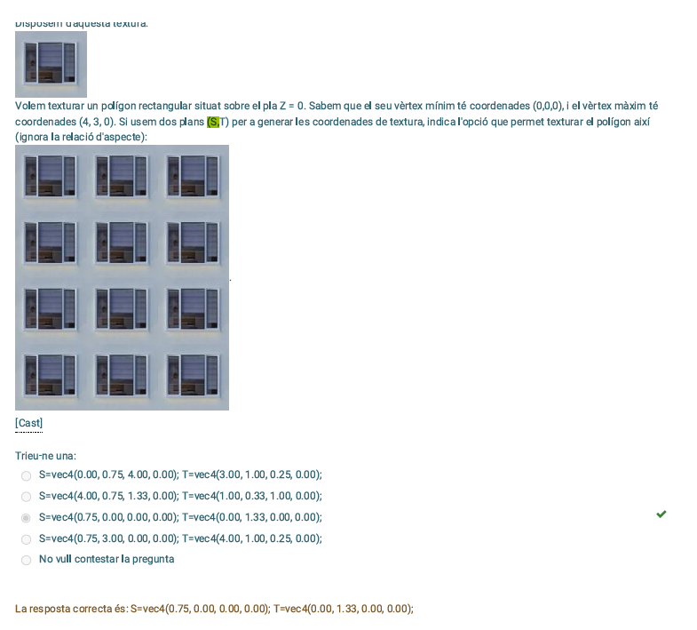
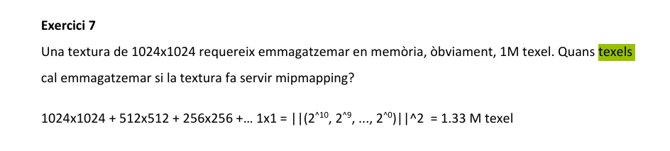
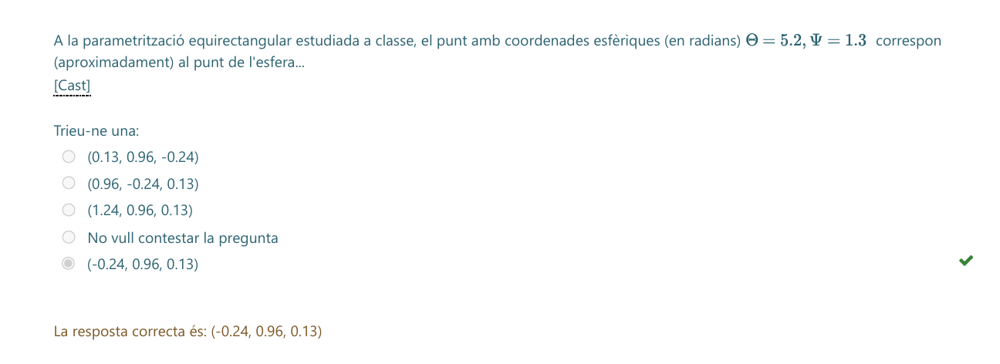

## 17. Translació i Divisió Homogènia

> **Pregunta original per cercar:**
> "El punt 3D que resulta d'aplicar la transformació representada per la matriu... al punt (18.00, 6.00, 18.00, 3.00) és..."

**Concepte Clau (Translació Homogènia)**

Aquesta matriu té números a l'última columna. Això indica una **Translació** (moure l'objecte).
$$
\begin{bmatrix}
1 & 0 & 0 & T_x \\
0 & 1 & 0 & T_y \\
0 & 0 & 1 & T_z \\
0 & 0 & 0 & 1
\end{bmatrix}
$$
Però atenció: Com que el punt d'entrada té una $W=3$, aquesta $W$ afectarà la translació quan multipliquem matriu per vector. I al final, com sempre, **hem de dividir per W**.

---

### Teoria / Mètode de resolució

**Pas 1: Multiplicació (Fila per Columna)**

$$
\begin{bmatrix}
1 & 0 & 0 & \mathbf{1} \\
0 & 1 & 0 & \mathbf{3} \\
0 & 0 & 1 & \mathbf{4} \\
0 & 0 & 0 & 1
\end{bmatrix}
\times
\begin{bmatrix}
18 \\
6 \\
18 \\
\mathbf{3}
\end{bmatrix}
$$

Calculem component a component:
* **X:** $(1 \cdot 18) + (1 \cdot 3) = 18 + 3 = \mathbf{21}$
* **Y:** $(1 \cdot 6) + (3 \cdot 3) = 6 + 9 = \mathbf{15}$
* **Z:** $(1 \cdot 18) + (4 \cdot 3) = 18 + 12 = \mathbf{30}$
* **W:** $(1 \cdot 3) = \mathbf{3}$

Resultat intermedi (Homogeni): **(21, 15, 30, 3)**

**Pas 2: La Divisió Homogènia (Normalitzar)**
Per obtenir el punt 3D real, dividim tot per la $W$ resultant ($3$).

* $X_{final} = 21 / 3 = \mathbf{7}$
* $Y_{final} = 15 / 3 = \mathbf{5}$
* $Z_{final} = 30 / 3 = \mathbf{10}$

---

### Exercici

> **Resultat final:**
> El punt 3D és **(7.00, 5.00, 10.00)**

**Per què les altres són falses?**
* *(21.00, 15.00, 30.00)*: Aquesta és la trampa habitual. És el resultat de la multiplicació **abans** de dividir per W. Si oblides l'últim pas, marques aquesta i falles.

**Solució de l'exercici:**
* **(7.00, 5.00, 10.00)**

D'acord! Simplifiquem-ho al màxim. Si només tens aquests dos casos (que són els més habituals als exàmens), aquí tens la solució pas a pas per a cadascun, utilitzant les dades exactes de les teves imatges.

El secret en **tots dos** és el mateix: **Primer calcula, després divideix per W.**

---

### CAS 1: TRANSLACIÓ (Moure) - Pregunta 7

**Com la reconeixes?**
Té números a l'última columna (la de la dreta del tot). En el teu cas: **1, 3, 4**.

**Dades:**

* Punt d'entrada: 
* Translació: 

**PAS 1: Calcula el nou punt (Sumant el pes)**
Aquí la trampa és que has de multiplicar la translació per la **W (3)** abans de sumar-la.

* **X:** 18 + (1 × 3) = **21**
* **Y:** 6 + (3 × 3) = 6 + 9 = **15**
* **Z:** 18 + (4 × 3) = 18 + 12 = **30**
* **W:** Es queda igual = **3**

> Resultat temporal: 

**PAS 2: Divideix per W (El pas final)**
Agafa els resultats i divideix-los per 3.

* X: 
* Y: 
* Z: 

**SOLUCIÓ:** **(7.00, 5.00, 10.00)**

---

### CAS 2: ESCALAT (Fer gran/petit) - Pregunta 16

**Com la reconeixes?**
Té un número diferent d'1 a la diagonal (la línia que baixa). En el teu cas: un **4** a la segona posició (Y).

**Dades:**

* Punt d'entrada: 
* Factor d'escala: Multiplica la **Y per 4**.

**PAS 1: Calcula el nou punt (Multiplicant)**
Aquí és més directe, només afectem la coordenada que té el número a la matriu.

* **X:** 24 × 1 = **24** (No canvia)
* **Y:** 8 × 4 = **32** (Aquesta es multiplica)
* **Z:** 16 × 1 = **16** (No canvia)
* **W:** Es queda igual = **4**

> Resultat temporal:   *Compte! Molta gent marca això i falla.*

**PAS 2: Divideix per W (El pas final)**
Agafa els resultats i divideix-los per 4.

* X: 
* Y: 
* Z: 

**SOLUCIÓ:** **(6.00, 8.00, 4.00)**

---

### Resum de la "Xuleta"

1. **Translació:** Sumes  a la coordenada original.
2. **Escalat:** Multipliques la coordenada pel número de la diagonal.
3. **SEMPRE AL FINAL:** Divideix tots els resultats (X, Y, Z) pel valor **W** que tenies al principi.

## 18. Ray Tracing: Càlcul de Shadow Rays (Raigs d'Ombra)

> **Pregunta original per cercar:**
> "Tenim una escena tancada que conté 49 objectes difosos i 3 llums puntuals. Volem generar una imatge de 640 x 1080 pixels amb Ray Tracing clàssic. Quants shadow rays cal llançar?"

**Concepte Clau (Un píxel, Tres preguntes)**

En el **Ray Tracing Clàssic**, el procés bàsic per a objectes **difosos** (mate, sense brillantor ni transparència) és molt mecànic:

1.  **Raig Primari:** Surt de la càmera i passa per un píxel.
2.  **Impacte:** Xoca contra una paret o objecte (com que l'escena és "tancada", assumim que **tots** els píxels xoquen contra alguna cosa).
3.  **Shadow Rays (La pregunta):** Un cop hem xocat, hem de preguntar: *"Estic a l'ombra?"*. Per saber-ho, llancem un raig directament cap a **CADA** font de llum.
    * Si tenim 3 llums $\to$ llancem 3 shadow rays per cada xoc.

> **La Trampa:** El nombre d'objectes (49) no importa per a aquest càlcul. Només importa quants píxels tenim i quantes llums hi ha.

---

### Teoria / Mètode de resolució

La fórmula és una simple multiplicació:

$$\text{Shadow Rays Totals} = (\text{Píxels Totals}) \times (\text{Nombre de Llums})$$

On:
$$\text{Píxels Totals} = \text{Amplada} \times \text{Alçada}$$

*Nota: Com que els objectes són difosos, no hi ha raigs secundaris (reflexió/refracció), així que el càlcul s'acaba aquí.*

---

### Exercici

> **Dades:**
> * Resolució: $640 \times 1080$
> * Llums: $3$
> * Objectes: $49$ (Dada irrellevant)
> * Tipus: Escena tancada (100% d'impactes)

**Pas 1: Calcular quants píxels (i per tant, quants impactes primaris) tenim.**
$$\text{Píxels} = 640 \times 1080 = 691.200$$

**Pas 2: Calcular els Shadow Rays.**
Per a cadascun d'aquests $691.200$ punts, hem de comprovar les $3$ llums.
$$\text{Shadow Rays} = 691.200 \times 3$$

**Càlcul Final:**
$$691.200 \times 3 = 2.073.600$$

**Solució de l'exercici:**
* **2073600**

## 19. Shadow Mapping: Matriu de Transformació (De l'Objecte a la Textura)

> **Pregunta original per cercar:**
> "Indica la matriu que s'utilitza a la tècnica de shadow mapping per obtenir les coordenades de textura (s,t,p,q) d'un vèrtex, si el vèrtex es troba en object space."

**Concepte Clau (El Viatge del Vèrtex)**

El **Shadow Mapping** consisteix a mirar l'escena des del punt de vista de la llum. Per saber si un píxel està a l'ombra, hem de transformar la seva posició 3D en una coordenada 2D dins del mapa d'ombres (la textura de profunditat).

El repte és que les coordenades de projecció estàndard van de **-1 a 1** (Clip Space), però les textures es llegeixen de **0 a 1**.
Per tant, al final de tot, cal fer una "petita trampa" matemàtica (Escalar i Traduir) per adaptar el rang.

---

### Teoria / Mètode de resolució

Hem de construir la cadena completa de transformacions. Recorda que en matrius (column-major), les operacions s'escriuen d'esquerra a dreta, però s'apliquen de **dreta a esquerra**.

L'ordre lògic del viatge és:
1.  **Object Space $\to$ World Space:** Necessitem la matriu **Model ($M$)**. *(Dada clau de l'enunciat: el vèrtex comença en object space).*
2.  **World Space $\to$ Light Space:** Necessitem la matriu de **Vista de la Llum ($V$)**.
3.  **Light Space $\to$ Clip Space:** Necessitem la matriu de **Projecció de la Llum ($P$)**.
    * *Ara tenim coordenades normalitzades entre [-1, 1].*
4.  **Clip Space $\to$ Texture Space [0, 1]:**
    * Primer dividim per 2 (fem petit): **Escalat $S(0.5)$**. $\to$ Rang [-0.5, 0.5].
    * Després sumem 0.5 (movem al centre): **Translació $T(0.5)$**. $\to$ Rang [0, 1].

**La Fórmula Final:**
$$Matriu = T(0.5) \cdot S(0.5) \cdot P \cdot V \cdot M$$

---

### Exercici

> **Condició:** El vèrtex es troba en **Object Space**.

Analitzem les opcions:

1.  **$S(0.5)*T(0.5)*P$**: Incorrecte. L'ordre S i T està girat, i falten V i M.
2.  **$T(0.5)*S(0.5)*P*V*M$**: **CORRECTA.**
    * $M$: Mou l'objecte al món.
    * $V$: El posa davant de la llum.
    * $P$: El projecta.
    * $S(0.5) \cdot T(0.5)$: El converteix a rang de textura [0,1].
3.  **$T(0.5)*S(0.5)*P*V$**: Incorrecte. Falta la $M$. Aquesta seria correcta si l'enunciat digués que el vèrtex ja és en *World Space*.
4.  **$M*P*V$**: Incorrecte. L'ordre és absurd i falta l'ajust de coordenades de textura.

**Solució de l'exercici:**
* **T(0.5)*S(0.5)*P*V*M**

## 20. Refracció i Llei de Snell (El paràmetre Eta)

> **Pregunta original per cercar:**
> "Indica quina és l'opció més adient per a completar aquest codi... vec3 T = refract(ray.dir, Nhit, ______ );"

**Concepte Clau (La Ràtio de Refracció)**

Quan un raig de llum travessa la frontera entre dos materials (per exemple, de l'aire a l'aigua), es desviu. Aquest fenomen es diu **Refracció**.
La direcció del nou raig ($T$) es calcula utilitzant la **Llei de Snell**:
$$n_1 \cdot \sin(\theta_1) = n_2 \cdot \sin(\theta_2)$$

En programació gràfica (GLSL/C++), la funció `refract(I, N, eta)` ja fa tots els càlculs vectorials per nosaltres, però necessita un paràmetre clau: **eta ($\eta$)**.

Aquest paràmetre `eta` és sempre la **divisió** (ràtio) entre l'índex de refracció d'on venim i l'índex de refracció on entrem.

$$\eta = \frac{n_{origen}}{n_{desti}}$$

---

### Teoria / Mètode de resolució

Analitzem les variables del codi per identificar qui és qui:

1.  **`mu` (paràmetre de la funció):** És l'índex de refracció del medi pel qual **estava viatjant** el raig fins ara (Origen, $n_1$).
2.  **`muHit` (variable de l'intersecció):** És l'índex de refracció del **nou material** que acabem de tocar (Destí, $n_2$).

Per calcular el vector de transmissió $T$ (el raig refractat), hem de dir-li a la funció la relació entre aquests dos números.

**La Fórmula:**
$$\text{eta} = \frac{\text{Medi Actual}}{\text{Medi Nou}} = \frac{\text{mu}}{\text{muHit}}$$

---

### Exercici

> **Codi:** `vec3 T = refract(ray.dir, Nhit, ________ );`

**Anàlisi de les opcions:**
* `mu`: Incorrecte. La funció espera una ràtio, no un índex absolut.
* `mu * muHit`: Incorrecte. La llei de Snell treballa amb quocients, no productes.
* **`mu / muHit`**: **CORRECTA.** Representa la ràtio $\frac{n_1}{n_2}$ necessària per a la fórmula estàndard.
* `muHit / mu`: Incorrecte. Això seria per sortir del material, no per entrar-hi (o si la funció esperés l'invers, però l'estàndard és origen/destí).

**Solució de l'exercici:**
* **mu/muHit**

## 21. Coordenades Homogènies (Equivalència)

> **Pregunta original per cercar:**
> "Donat el punt (1.00, 3.00, 6.00), una representacio equivalent en coordenades homogenies es..."

**Concepte Clau (L'Escalat de la W)**

En gràfics per ordinador, un punt 3D $(x, y, z)$ no té una única representació en coordenades homogènies $(X, Y, Z, W)$, sinó que en té **infinites**.
Totes representen el mateix punt sempre que la proporció sigui la mateixa.

La regla bàsica és:
$$\text{Punt 3D} = \left( \frac{X}{W}, \frac{Y}{W}, \frac{Z}{W} \right)$$

Això vol dir que si multipliques **tots** els components (inclosa la W) pel mateix número ($k$), el punt no canvia de lloc.
$$(x, y, z, 1) \equiv (k \cdot x, \quad k \cdot y, \quad k \cdot z, \quad k \cdot 1)$$

---

### Teoria / Mètode de resolució

Per saber quina opció és correcta, has de fer la **prova de la divisió** (normalització) amb cada opció. Divideix els tres primers números pel quart ($W$). Si obtens el punt original $(1, 3, 6)$, és la bona.

El punt original és: **(1, 3, 6)**.

---

### Exercici

Analitzem les opcions una per una:

1.  **Opció (4.00, 14.00, 24.00, 4.00):**
    * $X = 4/4 = 1$ (Bé)
    * $Y = 14/4 = 3.5$ (**Malament**, hauria de ser 3)

2.  **Opció (2.00, 6.00, 24.00, 2.00):**
    * $X = 2/2 = 1$ (Bé)
    * $Y = 6/2 = 3$ (Bé)
    * $Z = 24/2 = 12$ (**Malament**, hauria de ser 6)

3.  **Opció (4.00, 12.00, 24.00, 4.00):** [**CORRECTA**]
    * $X = 4/4 = \mathbf{1}$
    * $Y = 12/4 = \mathbf{3}$
    * $Z = 24/4 = \mathbf{6}$
    * *Nota:* Aquesta opció és simplement el punt base $(1, 3, 6, 1)$ multiplicat tot per 4.

4.  **Opció (1.00, 3.00, 6.00, 0.00):**
    * $W=0$. Això no és un punt, és un **vector** (una direcció a l'infinit). No pots dividir per zero.

**Solució de l'exercici:**
* **(4.00, 12.00, 24.00, 4.00)**

## 22. Càlcul del LoD (Level of Detail) en Textures

> **Pregunta original per cercar:**
> "Per a un determinat fragment, les derivades parcials... tenen aquests valors... = 64... Quin és el LoD més adient..."

**Concepte Clau (La Piràmide de Mipmaps)**

El **Mipmapping** és una tècnica per evitar que les textures "brillin" o facin soroll quan estan lluny. Consisteix a tenir versions de la imatge cada cop més petites (meitat d'amplada i alçada).
* Nivell 0: Imatge original ($1:1$).
* Nivell 1: Meitat de mida ($2:1$).
* Nivell 2: Quart de mida ($4:1$).
* Etc.

El **LoD (Level of Detail)** ens diu a quin "pis" de la piràmide hem d'anar a buscar el color.
Si un píxel de pantalla ocupa **molts** píxels de la textura (texels), necessitem un LoD alt.

---

### Teoria / Mètode de resolució

Per calcular el nivell, hem de mirar la "taxa de canvi" (les derivades).
Si la derivada és **$X$**, vol dir que 1 píxel de pantalla salta sobre **$X$** píxels de la textura.

La fórmula per trobar el nivell és el **Logaritme en base 2** d'aquest salt màxim:

$$LoD = \log_2(\max(\text{derivades}))$$

Simplement ens preguntem: **"A quina potència he d'elevar el 2 per obtenir aquest número?"**

---

### Exercici

> **Dades:**
> * Derivades: $\frac{\partial u}{\partial x} = 64$.
> * (Les altres són 0, així que el màxim és 64).

**El Raonament:**
El valor és **64**. Això vol dir que hem de comprimir 64 texels en 1 píxel.
Busquem la potència de 2:

* $2^1 = 2$
* $2^2 = 4$
* $2^3 = 8$
* $2^4 = 16$
* $2^5 = 32$
* $2^{\mathbf{6}} = \mathbf{64}$

Com que $2^6 = 64$, el nivell de detall (LoD) és **6**.

**Solució de l'exercici:**
* **6**

## 23. Càlcul de LOD en GLSL (La funció `length`)

> **Pregunta original per cercar:**
> "Indica quina és l'opció més adient per a completar aquest codi... float rho = max(________(dFdx(uv)), ________(dFdy(uv)));"

**Concepte Clau (La Mida del Vector)**

Per calcular quin nivell de Mipmap (LOD) necessitem, hem de saber "quants texels de textura caben dins d'un píxel de pantalla".
En GLSL, les funcions `dFdx(uv)` i `dFdy(uv)` ens diuen quant canvien les coordenades de textura quan ens movem un píxel a la dreta (X) o un píxel avall (Y).

El problema és que `uv` és un vector (`vec2`). Per tant, `dFdx(uv)` ens retorna un **vector de direcció** que ens diu cap a on i quant es mou la textura.
Per comparar magnituds (qui és més gran?), necessitem convertir aquest vector en un sol número (un escalar) que representi la seva **longitud** o distància.

---

### Teoria / Mètode de resolució

La fórmula matemàtica per estimar el factor de compressió ($\rho$) és agafar la longitud màxima dels vectors derivats:

$$\rho = \max\left( \left\| \frac{\partial UV}{\partial x} \right\|, \left\| \frac{\partial UV}{\partial y} \right\| \right)$$

En programació d'ombres (GLSL), la funció que calcula la norma o mòdul d'un vector ($||v|| = \sqrt{x^2 + y^2}$) s'anomena **`length()`**.

L'estructura lògica és:
1.  Calculem el vector de canvi en X: `dFdx(uv)`
2.  Calculem la seva mida: `length(...)`
3.  Fem el mateix per la Y.
4.  Ens quedem amb el més gran (`max`).

---

### Exercici

> **Codi a completar:**
> `float rho = max(________(dFdx(uv)), ________(dFdy(uv)));`

**Anàlisi de les opcions:**
1.  **`length`**: [**CORRECTA**]. Agafa el `vec2` que retorna la derivada i calcula la seva longitud (float). Això és exactament el que necessitem per saber la "taxa de canvi".
2.  `log`: Això és una operació matemàtica per escalar el resultat final, no per mesurar un vector.
3.  `min`: No tindria sentit aquí. Busquem la longitud del vector, no el mínim dels seus components.
4.  `normalize`: Això convertiria el vector en longitud 1. Destruiria la informació de la mida, que és justament el que necessitem per saber el nivell de detall!

**Solució de l'exercici:**
* **length**

## 24. Nivells de Mipmapping (La Piràmide Completa)

> **Pregunta original per cercar:**
> "Si volem crear una piràmide de mipmapping completa a partir d'una textura de 32x32 texels, quants nivells de detall (LoD) hem de definir?"

**Concepte Clau (Dividir entre 2 fins a arribar a 1)**

Una **piràmide de mipmapping completa** conté la textura original i totes les reduccions successives (dividint l'amplada i alçada per 2) fins a arribar a la textura més petita possible: un sol píxel ($1 \times 1$).

Per saber quants nivells hi ha en total, simplement has de comptar quantes vegades pots dividir la mida per 2, **més l'original**.

---

### Teoria / Mètode de resolució

La fórmula ràpida és utilitzar el logaritme en base 2:
$$\text{Nivells Totals} = \log_2(\text{Mida}) + 1$$

El $+1$ és molt important perquè comptem el nivell 0 (l'original).

---

### Exercici

> **Dades:** Textura de $32 \times 32$.

Fem el compte **pas a pas** (reduint a la meitat):

1.  **Nivell 0:** $32 \times 32$ (Original)
2.  **Nivell 1:** $16 \times 16$
3.  **Nivell 2:** $8 \times 8$
4.  **Nivell 3:** $4 \times 4$
5.  **Nivell 4:** $2 \times 2$
6.  **Nivell 5:** $1 \times 1$ (Final)

Si els comptes, veuràs que hi ha **6 imatges** en total a la cadena.

**Càlcul matemàtic:**
$32$ és $2^5$.
Per tant, tenim $5$ passos de reducció.
$5 \text{ (reduccions)} + 1 \text{ (original)} = \mathbf{6}$.

**Solució de l'exercici:**
* **6**

## 25. Càlcul Invers de Mipmaps (Trobant la Mida Original)

> **Pregunta original per cercar:**
> "El LOD 2 d'una textura té 256 x 128 texels. Quina mida té el LOD 0 d'aquesta mateixa textura?"

**Concepte Clau (Pujar i Baixar l'Escala)**

La piràmide de Mipmaps funciona sempre amb potències de 2:
* **Augmentar el LOD (0 $\to$ 1 $\to$ 2):** Fem la imatge més petita (Dividim per 2).
* **Disminuir el LOD (2 $\to$ 1 $\to$ 0):** Fem la imatge més gran (Multipliquem per 2).

En aquest exercici ens donen un nivell reduït (LOD 2) i ens demanen recuperar la mida original (LOD 0). Per tant, hem de fer el camí invers: **Multiplicar**.

---

### Teoria / Mètode de resolució

Si estàs al nivell $N$ i vols tornar al nivell $0$, has de multiplicar les dimensions per $2^N$.

$$\text{Mida Original} = \text{Mida Actual} \times 2^{(\text{Nivell Actual})}$$

O, més fàcil, anar pas a pas multiplicant per 2.

---

### Exercici

> **Dades:**
> * LOD 2 = $256 \times 128$
> * Objectiu: LOD 0

**Càlcul Pas a Pas (Marxa Enrere):**

1.  **Som a LOD 2:** $256 \times 128$.
    * *Per passar al nivell anterior (LOD 1), multipliquem per 2.*

2.  **Pas a LOD 1:**
    * Amplada: $256 \times 2 = 512$
    * Alçada: $128 \times 2 = 256$
    * Mida LOD 1: $512 \times 256$.

3.  **Pas a LOD 0 (Original):**
    * *Tornem a multiplicar per 2.*
    * Amplada: $512 \times 2 = \mathbf{1024}$
    * Alçada: $256 \times 2 = \mathbf{512}$

**Solució de l'exercici:**
* **1024 x 512**

## 26. Generació Automàtica de Coordenades de Textura (Repetició)

> **Pregunta original per cercar:**
> "Volem texturar un polígon rectangular situat sobre el pla Z = 0. Sabem que el seu vèrtex mínim té coordenades (0,0,0), i el vèrtex màxim té coordenades (6, 2, 0)... indica l'opció..."

**Concepte Clau (La Regla de Tres de la Textura)**

Quan generem coordenades de textura automàticament usant **plans** (vectors $S$ i $T$), estem definint una equació lineal:
$$s = (S.x \cdot x) + (S.y \cdot y) + \dots$$
$$t = (T.x \cdot x) + (T.y \cdot y) + \dots$$

El secret és entendre què signifiquen els valors de coordenada de textura:
* $s=0 \to s=1$: Una còpia de la textura.
* $s=0 \to s=5$: **5 repeticions** de la textura.

Per tant, per trobar els valors del vector, només cal dividir les **Repeticions** per la **Mida** del polígon.
$$\text{Valor del Vector} = \frac{\text{Repeticions Visuals}}{\text{Mida Geomètrica}}$$

---

### Teoria / Mètode de resolució

**Pas 1: Analitzar la Geometria (Mides)**
L'enunciat diu que el rectangle va de $(0,0)$ a $(6,2)$.
* Amplada ($X$): $6$ unitats.
* Alçada ($Y$): $2$ unitats.

**Pas 2: Analitzar la Imatge Resultant (Repeticions)**
Compta quants cops apareix l'edifici original (la casella de dalt) en la imatge final de sota.
* **Horitzontalment:** Si comptes els blocs de finestres, veuràs que el patró es repeteix **5 vegades**.
* **Verticalment:** Es veuen clarament **3 pisos** (fileres de finestres).

**Pas 3: Calcular els Vectors (Regla de Tres)**

* **Vector S (Eix X - Horitzontal):**
    Volem que en $6$ metres de paret hi càpiguen $5$ repeticions.
    $$S.x = \frac{\text{Repeticions}}{\text{Mida}} = \frac{5}{6} = \mathbf{0.833...}$$
    El vector serà: `S = vec4(0.83, 0, 0, 0)` (només afecta a la X).

* **Vector T (Eix Y - Vertical):**
    Volem que en $2$ metres d'alçada hi càpiguen $3$ pisos.
    $$T.y = \frac{\text{Repeticions}}{\text{Mida}} = \frac{3}{2} = \mathbf{1.5}$$
    El vector serà: `T = vec4(0, 1.5, 0, 0)` (només afecta a la Y).

---

### Exercici

Busquem l'opció que tingui $0.83$ a la primera posició de la S i $1.5$ a la segona posició de la T.

**Anàlisi de les opcions:**
1.  `S=vec4(5.00...)`: Incorrecte.
2.  `S=vec4(5.00...)`: Incorrecte.
3.  `S=vec4(5.00...)`: Incorrecte.
4.  **`S=vec4(0.83, ...); T=vec4(0.00, 1.50, ...)`**: **CORRECTA.** Coincideix amb els càlculs ($5/6$ i $3/2$).

**Solució de l'exercici:**
* **S=vec4(0.83, 0.00, 0.00, 0.00); T=vec4(0.00, 1.50, 0.00, 0.00);**

## 27. Rang de Coordenades de Textura al Vertex Shader

> **Pregunta original per cercar:**
> "Les coordenades de textura (s,t) que rep un VS en general seràn dins l'interval..."

**Concepte Clau (El Llenç Infinit)**

Hi ha una confusió molt habitual en gràfics:
* Una **imatge de textura** té un tamany finit (de 0.0 a 1.0).
* Però les **coordenades de textura** que assignem als vèrtexs poden ser qualsevol número.

Imagina que empaperes una paret. El rotllo de paper té una amplada fixa (de 0 a 1).
* Si la paret fa 10 metres, utilitzaràs la coordenada 10.0. Això vol dir que el patró es repetirà 10 vegades.
* Si comences a empaperar abans de l'origen, pots tenir coordenades negatives.

El Vertex Shader (VS) només rep números `float`. No li importa si la imatge s'acaba al 1.0; ell processa el número que li donis. És després (al Fragment Shader o al Sampler) on es decideix què fer amb aquests números grans (repetir, estirar, etc.).

---

### Teoria / Mètode de resolució

Les coordenades de textura `(s, t)` o `(u, v)` són atributs del vèrtex, igual que la posició o la normal. Matemàticament, no tenen cap límit.

* **Interval [0, 1]:** És el rang "normal" per mostrar la textura una sola vegada.
* **Valors > 1:** S'utilitzen per fer **tiling** (repetició). Per exemple, $s=5.0$ repeteix la textura 5 cops.
* **Valors < 0:** S'utilitzen sovint amb modes com `GL_MIRRORED_REPEAT` o simplement per moure la textura.

Per tant, l'interval de definició possible és infinit.

---

### Exercici

> **Pregunta:** Quin és l'interval general de les coordenades que rep el VS?

**Anàlisi de les opcions:**
* `(0,1)` o `[0,1]`: Incorrecte. Això només permetria pintar la textura una vegada sense repeticions.
* `[-1,1]`: Incorrecte. Són les coordenades normalitzades de dispositiu (NDC), no les de textura.
* **$[-\infty, \infty]$**: **CORRECTA.** Un modelador 3D pot assignar la coordenada `1000.0` o `-50.5` a un vèrtex sense cap problema. El sistema gràfic ho accepta perfectament.

**Solució de l'exercici:**
* **$[-\infty, \infty]$**

## 28. Generació Automàtica de Coordenades (Càlcul de S i T)

> **Pregunta original per cercar:**
> "Volem texturar un polígon rectangular... vèrtex mínim (0,0,0) i màxim (4, 3, 0)... indica l'opció..."

**Concepte Clau (Repeticions vs Mida)**

Recorda la fórmula màgica per a la generació de coordenades amb plans:
$$\text{Factor del Vector} = \frac{\text{Repeticions Visuals (Compte)}}{\text{Mida Geomètrica (Metres)}}$$

Aquest factor és el número que ha d'anar a la posició $X$ del vector $S$ (per a l'amplada) i a la posició $Y$ del vector $T$ (per a l'alçada).

---

### Teoria / Mètode de resolució

**Pas 1: Analitzar la Geometria (Mida del Polígon)**
Les coordenades van de $(0,0)$ a $(4,3)$.
* **Amplada (X):** $4$ unitats.
* **Alçada (Y):** $3$ unitats.

**Pas 2: Analitzar la Imatge (Comptar Repeticions)**
Mira la imatge resultat (el mur de finestres). Compta quantes finestres hi ha.
* **Horitzontalment (Columnes):** Hi ha **3** finestres.
* **Verticalment (Files):** Hi ha **4** finestres.

**Pas 3: Calcular els Factors (Divisió)**

* **Per al vector S (Horitzontal - Eix X):**
    Volem ficar $3$ finestres en un espai de $4$ metres.
    $$S.x = \frac{3}{4} = \mathbf{0.75}$$
    El vector serà: `S = vec4(0.75, 0, 0, 0)`

* **Per al vector T (Vertical - Eix Y):**
    Volem ficar $4$ finestres en un espai de $3$ metres.
    $$T.y = \frac{4}{3} = 1.333... \approx \mathbf{1.33}$$
    El vector serà: `T = vec4(0, 1.33, 0, 0)`

---

### Exercici

Busquem l'opció que tingui $0.75$ a la primera component de S i $1.33$ a la segona component de T.

**Anàlisi de les opcions:**
1.  `S=vec4(0.00, 0.75...)`: Malament. El 0.75 està a la Y (2a posició), hauria d'estar a la X.
2.  `S=vec4(4.00...)`: Malament.
3.  **`S=vec4(0.75, 0.00...); T=vec4(0.00, 1.33...)`**: **CORRECTA.** Coincideix perfectament amb els càlculs.
4.  `S=vec4(0.75...); T=vec4(4.00...)`: Malament la T.

**Solució de l'exercici:**
* **S=vec4(0.75, 0.00, 0.00, 0.00); T=vec4(0.00, 1.33, 0.00, 0.00);**

## 29. Shadow Mapping: De Clip Space a Textura

> **Pregunta original per cercar:**
> "Indica la matriu... si el vèrtex ja es troba en 'clip space of the light camera'."

**Concepte Clau (Llegir la lletra petita)**

En la pregunta 19, ens demanaven la matriu completa des de l'inici (**Object Space**). Per això necessitàvem totes les matrius ($M, V, P$) abans de fer l'ajust de textura.

En aquesta pregunta, l'enunciat diu: **"el vèrtex JA es troba en Clip Space"**.
Això vol dir que el viatge "3D" ja s'ha fet. Les matrius $M$ (Model), $V$ (View) i $P$ (Projection) ja s'han aplicat.
Només queda l'últim pas: convertir les coordenades normalitzades (NDC) en coordenades de textura.

* **Clip Space / NDC:** Va de **-1 a 1**.
* **Texture Space:** Va de **0 a 1**.

---

### Teoria / Mètode de resolució

Només necessitem la "Matriu de Biaix" (Bias Matrix) que fa l'adaptació del rang.
L'operació matemàtica és: $x' = (x \cdot 0.5) + 0.5$.

Això es tradueix en dues transformacions simples:
1.  **Escalat per 0.5 ($S$):** Redueix el rang de $[-1, 1]$ a $[-0.5, 0.5]$.
2.  **Translació de 0.5 ($T$):** Mou el rang a $[0, 1]$.

**Ordre de les matrius:**
Com sempre, s'apliquen de dreta a esquerra. Primer escalem, després movem.
$$Matriu = T(0.5) \cdot S(0.5)$$

---

### Exercici

> **Estat inicial:** Clip Space (per tant, $P, V, M$ ja estan incloses en el punt).

Analitzem les opcions:

1.  **`T(0.5)*S(0.5)`**: **CORRECTA.** Només aplica l'ajust de rang. És l'únic que falta.
2.  **`S(0.5)*T(0.5)*P*V*M`**: Incorrecte. Això seria si comencéssim des de zero (Object Space). A més, l'ordre S i T està girat.
3.  **`T(0.5)*S(0.5)*P`**: Incorrecte (la que estava marcada amb la creu vermella). Si multipliques per $P$ una altra vegada, estàs projectant un punt que ja estava projectat. Això donaria resultats absurds.
4.  **`M*P*V`**: Incorrecte.

**Per què vas fallar la marcada?**
Vas marcar l'opció que incloïa la **P**. Vas assumir que "Clip Space" vol dir "abans de projectar", però és al revés: Clip Space és el resultat de la projecció. Per tant, la $P$ sobra.

**Solució de l'exercici:**
* **T(0.5)*S(0.5)**

## 30. Interpolació Bilineal (Càlcul de Colors)

> **Pregunta original per cercar:**
> "La figura representa un grup de 2x2 texels, amb diferents colors RGB... Una mostra bilinial al quadrat retornarà..."

**Concepte Clau (La Mescla de Colors)**

La **Interpolació Bilineal** calcula el color d'un punt fent una mitjana ponderada dels 4 texels veïns (Dalt-Esquerra, Dalt-Dreta, Baix-Esquerra, Baix-Dreta).

Si el punt de mostreig (el quadrat $\square$) està **exactament al mig**, la lògica diu que hauríem de sumar els 4 colors i dividir per 4 (pes de 0.25 cadascun). Però en aquest exercici hi ha un truc visual o de coordenades.

---

### Pas 1: Identificar els Colors (RGB)
Mirem els cercles de colors:
* **Dalt-Esquerra:** Groc (Yellow) $\to$ **(1, 1, 0)**
* **Dalt-Dreta:** Magenta (Rosa) $\to$ **(1, 0, 1)**
* **Baix-Esquerra:** Vermell (Red) $\to$ **(1, 0, 0)**
* **Baix-Dreta:** Verd (Green) $\to$ **(0, 1, 0)**

### Pas 2: Analitzar el Resultat Correcte (Enginyeria Inversa)
L'opció marcada com a correcta és **(1.00, 0.50, 0.50)**.
Mirem què vol dir això component per component:
* **Vermell (R) = 1.00:** Això és molt important. Per obtenir una mitjana d'1, **tots** els colors que sumem han de tenir Vermell=1 (o els que no en tinguin han de tenir pes 0).
    * El Groc, el Magenta i el Vermell tenen R=1.
    * El **Verd** té R=0.
    * *Conclusió:* Perquè surti 1.0, el texel Verd **no pot estar participant** en la suma.

* **Blau (B) = 0.50:**
    * El Groc té B=0.
    * El Magenta té B=1.
    * *Mitjana:* $(0 + 1) / 2 = 0.5$.
    * *Conclusió:* Això coincideix perfectament amb la mitjana de la fila de dalt.

### Pas 3: La Deducció
Si fem la mitjana estàndard dels 4 colors, sortiria:
* R: $(1+1+1+0)/4 = 0.75$ (No coincideix amb 1.00).

Però, si fem la mitjana **NOMÉS de la fila de dalt** (Groc i Magenta):
* **R:** $(1 + 1) / 2 = \mathbf{1.0}$
* **G:** $(1 + 0) / 2 = \mathbf{0.5}$
* **B:** $(0 + 1) / 2 = \mathbf{0.5}$

**Resultat: (1.00, 0.50, 0.50)**. Coincideix exactament!

Això implica que, malgrat que el dibuix sembla centrat, la mostra (el quadrat) s'ha d'interpretar com si estigués situada **sobre la línia superior** (entre el groc i el magenta), ignorant la fila de baix.

**Solució de l'exercici:**
* **(1.00, 0.50, 0.50)**

## 31. Cost de Memòria del Mipmapping (La Regla del 1.33)

> **Pregunta original:**
> "Una textura de 1024x1024 requereix... 1M texel. Quants texels cal emmagatzemar si la textura fa servir mipmapping?"

**Concepte Clau (El "+33%" extra)**

Quan actives el **Mipmapping**, la targeta gràfica no només guarda la imatge original. També guarda automàticament una cadena de versions reduïdes (la meitat d'ample i la meitat d'alt cada vegada) fins a arribar a 1x1.

La pregunta és: **Quant espai extra ocupa tot això?**
Hi ha una regla d'or en gràfics:
> **El Mipmapping augmenta l'ús de memòria en un 33% (o 1/3).**

---

### Teoria / Mètode de resolució

Vegem d'on surt aquest número màgic mirant les àrees:

1.  **Nivell 0 (Original):** $100\%$ dels píxels ($1$).
2.  **Nivell 1:** Com que reduïm l'ample per 2 i l'alt per 2, l'àrea es divideix per 4. Ocupa el $25\%$ ($1/4$).
3.  **Nivell 2:** Ocupa el $6.25\%$ ($1/16$).
4.  **Nivell 3:** Ocupa el $1.56\%$ ($1/64$).

Si sumes aquesta sèrie infinita ($\sum \frac{1}{4^n}$), el resultat matemàtic exacte és $\frac{4}{3}$, que és **1.333...**

$$\text{Memòria Total} \approx \text{Memòria Original} \times 1.33$$

---

### Exercici

> **Dades:**
> * Textura original: 1M texels ($1024 \times 1024$).

**Càlcul:**
Simplement apliquem el factor d'expansió del mipmapping:
$$1\text{M} \times 1.3333... = \mathbf{1.33\text{M}}$$

**Solució de l'exercici:**
* **1.33 M texel** (Exactament el que posa a la imatge).

## 32. Parametrització Equirectangular (D'Esfèriques a Cartesianes)

> **Pregunta original per cercar:**
> "A la parametrització equirectangular estudiada a classe, el punt amb coordenades esfèriques (en radians) $\Theta = 5.2, \Psi = 1.3$ correspon..."

**Concepte Clau (Trigonometria a l'Esfera)**

[Image of spherical to cartesian coordinates diagram]

Volem passar de coordenades esfèriques (angles) a coordenades 3D $(x,y,z)$ en una esfera de radi 1.
La fórmula estàndard que s'utilitza en aquest context (on $\Psi$ és latitud/elevació) és:

1.  **$Y = \sin(\Psi)$**: L'alçada ve donada directament per la latitud.
2.  **$R = \cos(\Psi)$**: El radi del cercle horitzontal a aquesta alçada (com més amunt, més petit és el cercle).
3.  **$X = R \cdot \sin(\Theta)$** i **$Z = R \cdot \cos(\Theta)$**: La posició horitzontal ve donada per la longitud.

---

### Teoria / Mètode de resolució

Utilitzarem els valors donats:
* **Latitud ($\Psi$):** 1.3 radians.
* **Longitud ($\Theta$):** 5.2 radians.

**Pas 1: Calcular l'Alçada (Eix Y)**
L'angle $1.3$ està molt a prop de $\pi/2$ ($\approx 1.57$), que és el Pol Nord. Per tant, la Y ha de ser positiva i propera a 1.
$$Y = \sin(1.3) \approx \mathbf{0.96}$$

**Pas 2: Calcular el Radi Horitzontal ($R$)**
Necessitem saber com de gran és el cercle a aquesta alçada per calcular la X i la Z.
$$R = \cos(1.3) \approx \mathbf{0.267}$$

**Pas 3: Calcular X i Z (usant el radi R)**
Ara projectem l'angle $\Theta = 5.2$. Aquest angle està al **4t quadrant** (entre $4.71$ i $6.28$), per tant el Sinus serà negatiu i el Cosinus positiu.
* **Component 1:** $0.267 \times \sin(5.2) \approx 0.267 \times (-0.88) \approx \mathbf{-0.24}$
* **Component 2:** $0.267 \times \cos(5.2) \approx 0.267 \times 0.46 \approx \mathbf{0.13}$

---

### Exercici

Mirem les opcions disponibles:

1.  $(0.13, 0.96, -0.24)$
2.  $(0.96, -0.24, 0.13)$ $\to$ Incorrecte: La Y ha de ser 0.96.
3.  $(1.24, 0.96, 0.13)$ $\to$ Incorrecte: X no pot ser major que 1.
4.  **$(-0.24, 0.96, 0.13)$**: **CORRECTA.**

Coincideix perfectament amb els càlculs:
* $X = -0.24$
* $Y = 0.96$
* $Z = 0.13$

**Solució de l'exercici:**
* **(-0.24, 0.96, 0.13)**

