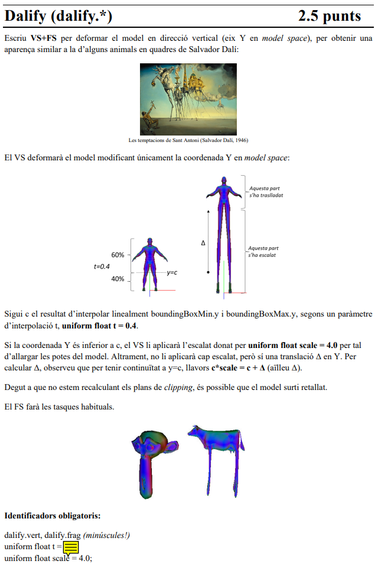
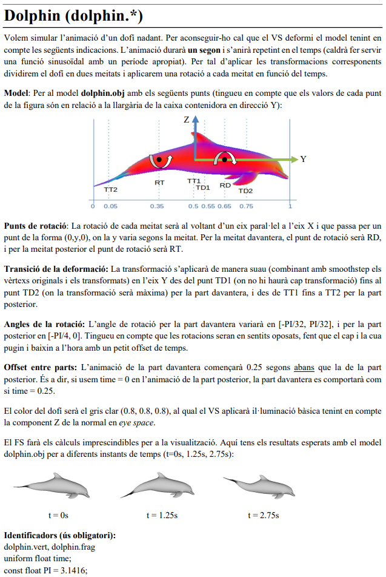
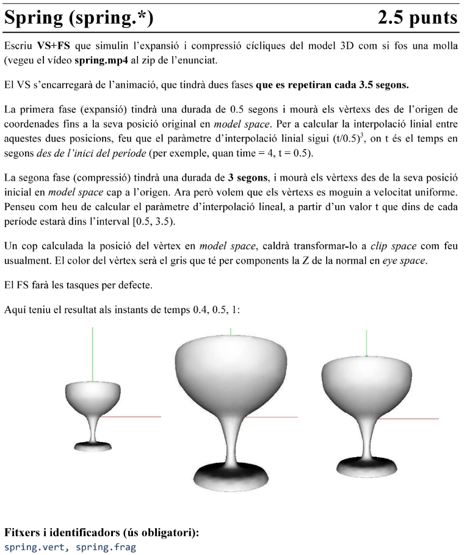
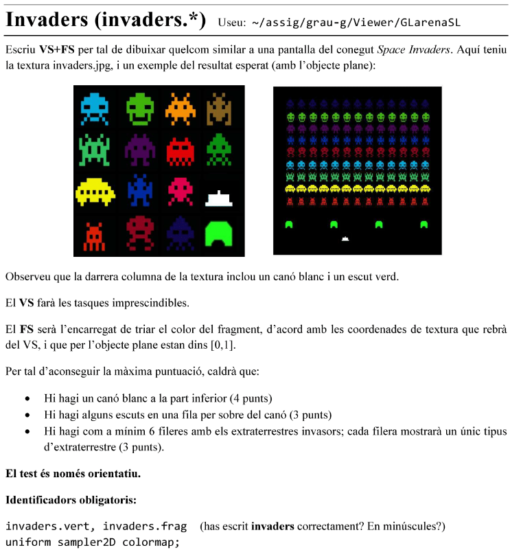
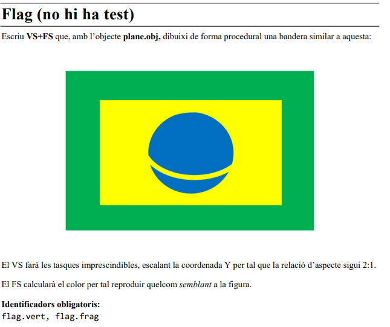
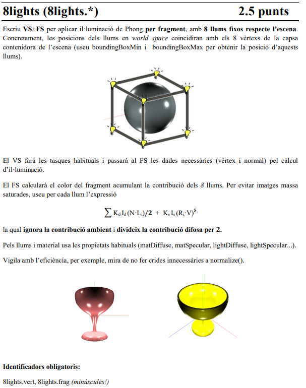
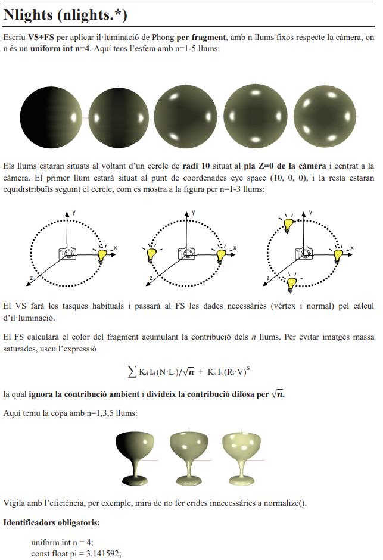

# Parcial 1

# Tipos de esqueleto

## Class A-Esqueleto (PER-VERTEX) (Deformación)

### A-Vertex Shader

```glsl
#version 330 core

// --- INPUTS (from your 3D model) ---
layout (location = 0) in vec3 vertex;
layout (location = 1) in vec3 normal;
layout (location = 2) in vec3 color;
layout (location = 3) in vec2 texCoord;

// --- OUTPUTS (to the Fragment Shader) ---
out vec4 frontColor; // El color FINAL calculado por vértice
out vec2 vtexCoord;  // La coordenada de textura

// --- UNIFORMS (from the viewer) ---
uniform mat4 modelViewProjectionMatrix;
uniform mat3 normalMatrix;

void main()
{
    vec4 vertex_objectspace = vec4(vertex, 1.0);
    vec3 normal_objectspace = normal;

    // Calcula la normal en Eye Space
    vec3 N = normalize(normalMatrix * normal_objectspace);

    // Calcula el color (iluminación simple por Z)
    frontColor = vec4(color,1.0) * N.z;

    // Pasa la coordenada de textura
    vtexCoord = texCoord;

    // Calcula la posición final
    gl_Position = modelViewProjectionMatrix * vertex_objectspace;
}
```

**NOTA** Si te pide modificar la Projection y la Normal Space, se tiene que calcular por si solo:

```glsl
#version 330 core

// --- INPUTS (from your 3D model) ---
layout (location = 0) in vec3 vertex;
layout (location = 1) in vec3 normal;
layout (location = 2) in vec3 color;
layout (location = 3) in vec2 texCoord;

// --- OUTPUTS (to the Fragment Shader) ---
out vec4 frontColor; // El color FINAL calculado por vértice
out vec2 vtexCoord;  // La coordenada de textura

// --- UNIFORMS (from the viewer) ---
uniform mat4 modelViewProjectionMatrix;
uniform mat3 normalMatrix;

void main()
{
    //P_object = texture ...
    //P_eye_4 = modelViewMatrix * vec4(P_object, 1.0);

    // Calcula la posición final
    gl_Position = projectionMatrix * P_eye_4;
}
```

### A-Fragment Shader

```glsl
#version 330 core

// --- INPUT (from the Vertex Shader) ---
in vec4 frontColor; // Recibe el color interpolado

// --- OUTPUT ---
out vec4 fragColor;

void main()
{
    // Simplemente asigna el color calculado en el VS
    fragColor = frontColor;
}
```


## Class B-Esqueleto (PER-FRAGMENT) (Texturas+Iluminación)

### B-Vertex Shader

```glsl
#version 330 core

// --- INPUTS (from your 3D model) ---
layout (location = 0) in vec3 vertex;
layout (location = 1) in vec3 normal;
layout (location = 2) in vec3 color;
layout (location = 3) in vec2 texCoord;

// --- OUTPUTS (to the Fragment Shader) ---
out vec2 vtexCoord; // Pasa la coordenada de textura

// --- UNIFORMS (from the viewer) ---
uniform mat4 modelViewProjectionMatrix;

void main()
{
    // Pasa la coordenada de textura
    vtexCoord = texCoord;

    // Calcula la posición final
    gl_Position = modelViewProjectionMatrix * vec4(vertex, 1.0);
}
```


### B-Fragment Shader

```glsl
#version 330 core

// --- INPUT (from the Vertex Shader) ---
in vec2 vtexCoord;

// --- OUTPUT ---
out vec4 fragColor;

// --- UNIFORMS (Añadir los que necesites) ---
// (p.ej., uniform sampler2D colorMap;)

void main()
{
    // ==============================================================
    // DEBES declarar una variable 'finalColor'.
    //
    // (p.ej., vec4 texColor = texture(colorMap, vtexCoord);)
    // (p.ej., vec4 finalColor = texColor;)
    // ==============================================================

    // (Esta línea usará el 'finalColor' que has definido arriba)
    fragColor = finalColor;
}
```

---

# Ejercicio Tipo 1-Deformación de Geometría

* **Objetivo:** Cambiar la **forma**, **posición** o **animación** del modelo 3D.
* **Palabras Clave:** "rotar", "deformar", "proyectar", "estirar", "girar cabeza", "animar".
* **Ejemplos:** `Look`, `Dolphin`, `Dalify`, `Cubify`.
* **Dónde trabajas:** Casi todo el código va en el **Vertex Shader (`.vert`)**.
* **Esqueleto a Usar:** **Esqueleto 1 (Per-Vertex)**.
* **Por qué:** Este esqueleto está diseñado para hacer el trabajo principal en el Vertex Shader (en el bloque `STEP 3 (VS)`). La iluminación simple que calcula por defecto (`frontColor = ... * N.z`) suele ser la que piden estos ejercicios.


## Ejemplo 1-Dalify

### 1.1-Enunciado



### 1.2-Vertex Shader

```glsl
#version 330 core

// --- INPUTS (from your 3D model) ---
layout (location = 0) in vec3 vertex;
layout (location = 1) in vec3 normal;
layout (location = 2) in vec3 color;
layout (location = 3) in vec2 texCoord;

// --- OUTPUTS (to the Fragment Shader) ---
out vec4 frontColor; // El color final calculado para este vértice
out vec2 vtexCoord;  // La coordenada de textura

// --- UNIFORMS (from the viewer) ---
uniform mat4 modelViewProjectionMatrix;
uniform mat3 normalMatrix;

// --- UNIFORMS (Añadidos para "Dalify") ---
uniform float t = 0.4;
uniform float scale = 4.0;
uniform vec3 boundingBoxMin; // Proporcionado por el viewer
uniform vec3 boundingBoxMax; // Proporcionado por el viewer

void main()
{
    // Estas son tus variables iniciales
    vec4 vertex_objectspace = vec4(vertex, 1.0);
    vec3 normal_objectspace = normal; // No modificamos la normal

    // ==============================================================
    // == STEP 3 (VS) - CÓDIGO DE DEFORMACIÓN "Dalify"
    // ==============================================================
    
    // 1. Calcular 'c' (el punto de corte en Y)
    // Interpolar linealmente entre el min y max de Y usando 't'
    float c = mix(boundingBoxMin.y, boundingBoxMax.y, t);

    // 2. Calcular 'Δ' (Delta, la traslación)
    // El enunciado da la fórmula: c*scale = c + Δ
    // Aislamos Δ: Δ = c*scale - c
    float delta = c * (scale - 1.0);

    // 3. Aplicar la deformación (escalar o trasladar)
    if (vertex_objectspace.y < c)
    {
        // Parte de abajo: ESCALAR
        vertex_objectspace.y = vertex_objectspace.y * scale;
    }
    else
    {
        // Parte de arriba: TRASLADAR
        vertex_objectspace.y = vertex_objectspace.y + delta;
    }

    // ==============================================================

    // Calcular la normal en Eye Space (sin modificar)
    vec3 N = normalize(normalMatrix * normal_objectspace);

    // Calcular el color ("tarea habitual" del esqueleto)
    frontColor = vec4(color, 1.0) * N.z;

    // Pasar la coordenada de textura
    vtexCoord = texCoord;

    // Calcular la posición final usando el VÉRTICE DEFORMADO
    gl_Position = modelViewProjectionMatrix * vertex_objectspace;
}
```

### 1.3-Fragment Shader

```glsl
#version 330 core

in vec4 frontColor;
out vec4 fragColor;

void main()
{
    fragColor = frontColor;
}
```

---

## Ejemplo 2-Dolphin

### 2.1-Enunciado



### 2.2-Vertex Shader

```glsl
#version 330 core

layout (location = 0) in vec3 vertex;
layout (location = 1) in vec3 normal;
layout (location = 2) in vec3 color;
layout (location = 3) in vec2 texCoord;

out vec4 frontColor;
out vec2 vtexCoord;

uniform mat4 modelMatrix;
uniform mat4 viewMatrix;
uniform mat4 projectionMatrix;
uniform mat4 modelViewMatrix;
uniform mat4 modelViewProjectionMatrix;

uniform mat4 modelMatrixInverse;
uniform mat4 viewMatrixInverse;
uniform mat4 projectionMatrixInverse;
uniform mat4 modelViewMatrixInverse;
uniform mat4 modelViewProjectionMatrixInverse;

uniform mat3 normalMatrix;

uniform vec4 lightAmbient; // similar a gl_LightSource[0].ambient
uniform vec4 lightDiffuse; // similar a gl_LightSource[0].diffuse
uniform vec4 lightSpecular; // similar a gl_LightSource[0].specular
uniform vec4 lightPosition; // similar a gl_LightSource[0].position
// (sempre estarà en eye space)
uniform vec4 matAmbient; // similar a gl_FrontMaterial.ambient
uniform vec4 matDiffuse; // similar a gl_FrontMaterial.diffuse
uniform vec4 matSpecular; // similar a gl_FrontMaterial.specular
uniform float matShininess; // similar a gl_FrontMaterial.shininess

uniform float time;

uniform vec3 boundingBoxMin;
uniform vec3 boundingBoxMax;


float punt(float x){
    return (boundingBoxMax.y -boundingBoxMin.y)*x + boundingBoxMin.y;
}


void main()
{
    float pi = acos(-1);

    float RT = punt(0.35), RD = punt(0.65);

    vec3 pos = vertex;


    if(vertex.y <= punt(0.5))
    {
        float TT2 = punt(0.05), TT1 = punt(0.5);
        float factor = smoothstep(TT2,TT1,vertex.y);
        float alphaX = min(0.0, -pi/4.0*sin(time));

        mat4 T0 = mat4(vec4(1.0, 0.0, 0.0, 0),
                vec4(0.0, 1.0, 0.0, -RT),
                vec4(0.0, 0.0, 1.0, 0),
                vec4(0.0, 0.0, 0.0, 1.0));
        mat4 T1 = mat4(vec4(1.0, 0.0, 0.0, 0),
                vec4(0.0, 1.0, 0.0, RT),
                vec4(0.0, 0.0, 1.0, 0),
                vec4(0.0, 0.0, 0.0, 1.0));        
		mat4 rotX = mat4(vec4(1, 0, 0, 0), vec4(0, cos(alphaX), sin(alphaX), 0), vec4(0, -sin(alphaX), cos(alphaX), 0), vec4(0, 0, 0, 1));
        vec3 nv = (T1*rotX*T0*vec4(vertex,1.)).xyz;
        pos = mix(nv,vertex,factor);
    }
    else 
    {
        float TD1 = punt(0.55), TD2 = punt(0.75);
        float factor = smoothstep(TD1,TD2,vertex.y);
        float alphaX = pi/32.0*sin(time + 0.25);
        mat4 T0 = mat4(vec4(1.0, 0.0, 0.0, 0),
                vec4(0.0, 1.0, 0.0, -RD),
                vec4(0.0, 0.0, 1.0, 0),
                vec4(0.0, 0.0, 0.0, 1.0));
        mat4 T1 = mat4(vec4(1.0, 0.0, 0.0, 0),
                vec4(0.0, 1.0, 0.0, RD),
                vec4(0.0, 0.0, 1.0, 0),
                vec4(0.0, 0.0, 0.0, 1.0));        
		mat4 rotX = mat4(vec4(1, 0, 0, 0), vec4(0, cos(alphaX), sin(alphaX), 0), vec4(0, -sin(alphaX), cos(alphaX), 0), vec4(0, 0, 0, 1));
        vec3 nv = (T1*rotX*T0*vec4(vertex,1.)).xyz;
        pos = mix(nv,vertex,factor);
    }


    vec3 N = normalize(normalMatrix * normal);
    vtexCoord = texCoord;
    frontColor = vec4(color,1.0) * N.z;
    gl_Position =  modelViewProjectionMatrix * vec4(pos, 1.0);
}

```

### 2.3-Fragment Shader

```glsl
#version 330 core

in vec4 frontColor;
out vec4 fragColor;

void main()
{
    fragColor = frontColor;
}
```

---

## Ejemplo 3-Spring

### 3.1-Enunciado



### 3.2-Vertex Shader

```glsl
#version 330 core

// --- INPUTS (del modelo 3D) ---
layout (location = 0) in vec3 vertex;
layout (location = 1) in vec3 normal;
layout (location = 2) in vec3 color;
layout (location = 3) in vec2 texCoord;

// --- OUTPUTS (al Fragment Shader) ---
out vec4 frontColor; // El color final calculado
out vec2 vtexCoord;  // La coordenada de textura

// --- UNIFORMS (del viewer) ---
uniform mat4 modelViewProjectionMatrix;
uniform mat3 normalMatrix;

// --- UNIFORMS (Añadido para "Spring") ---
uniform float time; // Necesario para la animación

void main()
{
    // Variables de deformación
    float interp_factor = 0.0; // El factor de mezcla 't'
    vec3 vertex_objectspace = vertex;
    vec3 normal_objectspace = normal;
    vec3 origen = vec3(0.0, 0.0, 0.0);

    // ==============================================================
    // == STEP 3 (VS) - LÓGICA DE ANIMACIÓN "Spring" con MIX
    // ==============================================================
    
    // 1. Encontrar el tiempo actual dentro del ciclo de 3.5s
    float t_period = mod(time, 3.5);

    // 2. Comprobar en qué fase estamos
    if (t_period < 0.5)
    {
        // FASE 1: EXPANSIÓN (0.0s a 0.5s)
        // El enunciado pide (t/0.5)^2
        float t_exp = t_period / 0.5;
        interp_factor = pow(t_exp, 2.0);
        
        // Aplicamos la lógica 'mix' (Origen -> Vértice)
        vertex_objectspace = mix(origen, vertex, interp_factor);
    }
    else
    {
        // FASE 2: COMPRESIÓN (0.5s a 3.5s)
        
        // Mapeamos [0.5, 3.5] a [0.0, 1.0] (Lineal)
        float t_comp = (t_period - 0.5) / 3.0;
        
        // Aplicamos la lógica 'mix' (Vértice -> Origen)
        // (Esto es lo mismo que 1.0 - t_comp)
        vertex_objectspace = mix(vertex, origen, t_comp);
        
        // Guardamos el factor de escala para la normal
        interp_factor = 1.0 - t_comp;
    }

    // 3. Deformar la normal (¡LA PARTE QUE FALTABA!)
    // (Igual que en 'Dalify', debemos deformar la normal)
    // Añadimos 0.0001 para evitar dividir por cero
    normal_objectspace = normal / (interp_factor + 0.0001);

    // ==============================================================

    // Calcular la normal en Eye Space (con la normal deformada)
    vec3 N = normalize(normalMatrix * normal_objectspace);

    // Calcular el color:
    frontColor = vec4(N.z, N.z, N.z, 1.0);

    // Pasar la coordenada de textura
    vtexCoord = texCoord;

    // Calcular la posición final (con el vértice deformado)
    gl_Position = modelViewProjectionMatrix * vec4(vertex_objectspace, 1.0);
}
```

### 3.3-Fragment Shader

```glsl
#version 330 core

in vec4 frontColor;
out vec4 fragColor;

void main()
{
    fragColor = frontColor;
}
```


---
---

# Ejercicio Tipo 2-Texturas

* **Objetivo:** Decidir el color de un **píxel** basándose en texturas, coordenadas, o lógica (`if`, `distance`, `fract`, etc.).
* **Palabras Clave:** `texture()`, `sampler2D`, `colorMap`, `vtexCoord`, `if`, `discard`, `procedural`.
* **Ejemplos:** `Digits`, `Smile`, `Flag`, `Beach`, `Hunter`.
* **Dónde trabajas:** Todo el código va en el **Fragment Shader (`.frag`)**.
* **Esqueleto a Usar:** **Esqueleto 2 (Per-Fragment)**.
* **Por qué:** Necesitas control total por píxel. Tendrás que usar tu "cheatsheet" para añadir `uniforms` (como `sampler2D`) y "snippets" (como "Pasar Normal" si el efecto depende de `v_normal_eye`, como en "Smile") al esqueleto 2.

## Ejemplo 1-Hunter

### 1.1-Enunciado


### 1.2-Vertex Shader

```glsl
#version 330 core

// --- INPUTS (del modelo 3D) ---
layout (location = 0) in vec3 vertex;
layout (location = 1) in vec3 normal;   // Lo mantenemos
layout (location = 2) in vec3 color;    // Lo mantenemos
layout (location = 3) in vec2 texCoord;

// --- OUTPUTS (al Fragment Shader) ---
out vec2 vtexCoord;

// --- UNIFORMS (del viewer) ---
// No usamos 'modelViewProjectionMatrix'
// El problema pide usar la identidad.

void main()
{
    // 1. Pasar la coordenada de textura
    vtexCoord = texCoord;

    // 2. Usar la posición del vértice como posición de clipping
    // (como pide el enunciado)
    gl_Position = vec4(vertex, 1.0);
}
```

### 1.3-Fragment Shader

```glsl
#version 330 core

// --- INPUT (del Vertex Shader) ---
in vec2 vtexCoord; // Rango [0, 1]

// --- OUTPUT ---
out vec4 fragColor;

// --- UNIFORMS (Añadidos para "hunter") ---
uniform vec2 mousePosition;
uniform vec2 viewport;    // <-- 'blur.glsl' también necesita esto
uniform sampler2D jungla;   // <-- 'blur.glsl' también necesita esto
uniform float magnific = 3.0;

// ==============================================================
// == CÓDIGO PEGADO DE blur.glsl [INICIO] ==
// ==============================================================
// adaptat de https://www.shadertoy.com/view/Xltfzj. 
// no és realment Gaussià
// **requereix** que hi hagi declarat un sampler2D jungla!
// retorna el color corresponent a les coordenades de textura coords.
vec4 blurImage( in vec2 coords )
{
    float Pi = 6.28318530718; // Pi*2
    float Directions = 16.0; // BLUR DIRECTIONS (Default 16.0 - More is better but slower)
    float Quality = 8.0; // BLUR QUALITY (Default 4.0 - More is better but slower)
    float Size = 10.0; // BLUR SIZE (Radius)
    
    vec2 Radius = Size/viewport;

    vec4 Color = texture(jungla, coords);
    for( float d=0.0; d<Pi; d+=Pi/Directions)
    {
        float cd = cos(d);
        float sd = sin(d);
        for(float i=1.0/Quality; i<=1.0; i+=1.0/Quality)
        {
            Color += texture(jungla, coords+vec2(cd,sd)*Radius*i);      
        }
    }
    
    // Output to screen
    Color /= Quality * Directions - 15.0;
    return  Color;
}
// ==============================================================
// == CÓDIGO PEGADO DE blur.glsl [FIN] ==
// ==============================================================


void main()
{
    // ==============================================================
    // == LÓGICA DE "hunter" VA AQUÍ ==
    // ==============================================================

    // 1. Color por defecto: la jungla desenfocada
    // Ahora el linker PUEDE encontrar esta función
    vec4 finalColor = blurImage(vtexCoord);

    // 2. Convertir coordenadas a píxeles
    vec2 pixelCoord = vtexCoord * viewport;

    // 3. Definir los centros de los binoculares
    vec2 centerL = mousePosition + vec2(-80.0, 0.0);
    vec2 centerR = mousePosition + vec2( 80.0, 0.0);

    // 4. Calcular distancias (en píxeles)
    float distL = distance(pixelCoord, centerL);
    float distR = distance(pixelCoord, centerR);

    // 5. Comprobar si estamos en la VORERA NEGRA (radio 100 a 105)
    if ( (distL > 100.0 && distL < 105.0) || 
         (distR > 100.0 && distR < 105.0) )
    {
        finalColor = vec4(0.0, 0.0, 0.0, 1.0); // Negro
    }
    // 6. Comprobar si estamos en la LENTE (radio < 100)
    else if (distL < 100.0 || distR < 100.0)
    {
        // --- Lógica de Magnificación ---
        vec2 M_tex = mousePosition / viewport;
        vec2 P_tex = M_tex + (vtexCoord - M_tex) / magnific;
        
        // Muestreamos la textura *original* (nítida) en el punto P
        finalColor = texture(jungla, P_tex);
    }
    
    // ==============================================================

    // --- Asignación Final ---
    fragColor = finalColor;
}
```

---

## Ejemplo 2-Invaders

### 2.1-Enunciado



### 2.2-Vertex Shader

```glsl
#version 330 core

// --- INPUTS (del modelo 3D) ---
layout (location = 0) in vec3 vertex;
layout (location = 1) in vec3 normal;
layout (location = 2) in vec3 color;
layout (location = 3) in vec2 texCoord;

// --- OUTPUTS (al Fragment Shader) ---
out vec2 vtexCoord;

// --- UNIFORMS (del viewer) ---
uniform mat4 modelViewProjectionMatrix;

void main()
{
    // Pasar la coordenada de textura
    vtexCoord = texCoord;

    // Calcular la posición final
    gl_Position = modelViewProjectionMatrix * vec4(vertex, 1.0);
}
```

### 2.3-Fragment Shader

```glsl
#version 330 core

// --- INPUT (from the Vertex Shader) ---
in vec2 vtexCoord; // Coordinate (s, t) in the range [0, 1]

// --- OUTPUT ---
out vec4 fragColor;

// --- UNIFORMS (Added for "invaders") ---
uniform sampler2D colormap; // The "invaders.png" texture

void main()
{
    // ==============================================================
    // == "invaders" LOGIC GOES HERE ==
    // ==============================================================
    
    // 1. Default color: BLACK (this is our space background)
    vec4 finalColor = vec4(0.0, 0.0, 0.0, 1.0);

    // The texture is a 4x4 grid
    vec2 tileSize = vec2(0.25, 0.25);
    vec2 tile = vec2(0.0);
    vec2 localCoord = vec2(0.0);
    bool draw = true; 

    // Divide the screen into rows using the T (Y) coordinate
    if (vtexCoord.t > 0.8) {
        // Row 6 (e.g., blue alien)
        // Texture (Col 0, Row 3) -> Tile Y-coord = 3
        tile = vec2(0.0, 3.0); 
        localCoord.s = fract(vtexCoord.s * 12.0); // 12 aliens
        localCoord.t = (vtexCoord.t - 0.8) / 0.1; // Map [0.8, 0.9] to [0, 1]
    } else if (vtexCoord.t > 0.7) {
        // Row 5 (e.g., green alien)
        // Texture (Col 1, Row 3) -> Tile Y-coord = 3
        tile = vec2(1.0, 3.0);
        localCoord.s = fract(vtexCoord.s * 12.0);
        localCoord.t = (vtexCoord.t - 0.7) / 0.1;
    } else if (vtexCoord.t > 0.6) {
        // Row 4 (e.g., other green alien)
        // Texture (Col 0, Row 2) -> Tile Y-coord = 2
        tile = vec2(0.0, 2.0); 
        localCoord.s = fract(vtexCoord.s * 12.0);
        localCoord.t = (vtexCoord.t - 0.6) / 0.1;
    } else if (vtexCoord.t > 0.5) {
        // Row 3 (e.g., purple alien)
        // Texture (Col 1, Row 2) -> Tile Y-coord = 2
        tile = vec2(1.0, 2.0);
        localCoord.s = fract(vtexCoord.s * 12.0);
        localCoord.t = (vtexCoord.t - 0.5) / 0.1;
    } else if (vtexCoord.t > 0.4) {
        // Row 2 (e.g., yellow alien)
        // Texture (Col 0, Row 1) -> Tile Y-coord = 1
        tile = vec2(0.0, 1.0);
        localCoord.s = fract(vtexCoord.s * 12.0);
        localCoord.t = (vtexCoord.t - 0.4) / 0.1;
    } else if (vtexCoord.t > 0.3) {
        // Row 1 (e.g., small red alien)
        // Texture (Col 0, Row 0) -> Tile Y-coord = 0
        tile = vec2(0.0, 0.0);
        localCoord.s = fract(vtexCoord.s * 12.0);
        localCoord.t = (vtexCoord.t - 0.3) / 0.1;
    } else if (vtexCoord.t > 0.2) {
        // Row of SHIELDS (green)
        tile = vec2(3.0, 0.0);

        // --- Centering Logic ---

        // 1. Define row/sprite dimensions
        float rowHeight = 0.1;
        float spriteWidth = 0.1; // To keep a 1:1 aspect ratio
        float numShields = 4.0;
        
        // 2. Width of one "zone" (1.0 / 4.0 = 0.25)
        float zoneWidth = 1.0 / numShields; 

        // 3. Get the local t-coordinate (0.0 to 1.0)
        localCoord.t = (vtexCoord.t - 0.2) / rowHeight;

        // 4. Get the local s-coordinate (0.0 to 1.0)
        localCoord.s = fract(vtexCoord.s * numShields);

        // 5. Calculate ratios for centering
        // How much of the zone does the sprite fill? (0.1 / 0.25 = 0.4)
        float fill_ratio = spriteWidth / zoneWidth;
        // How much padding on *one side*? ( (1.0 - 0.4) / 2.0 = 0.3 )
        float padding_ratio = (1.0 - fill_ratio) / 2.0;

        // 6. Check if the pixel is in the drawable "window"
        // (i.e., not in the left 30% or right 30% padding)
        if (localCoord.s > padding_ratio && localCoord.s < (1.0 - padding_ratio)) 
        {
            // It is in the window [0.3, 0.7].
            // We must re-map this range back to [0.0, 1.0] for the sprite.
            
            // 1. Shift it: [0.3, 0.7] -> [0.0, 0.4]
            float shifted_s = localCoord.s - padding_ratio;
            
            // 2. Scale it: [0.0, 0.4] -> [0.0, 1.0]
            localCoord.s = shifted_s / fill_ratio;
        } else {
            // We are in the padding (the empty 30% on left or right)
            draw = false;
        }
    } else if (vtexCoord.t > 0.1) {
        // Row of the CANNON (white)
        // Texture (Col 3, Row 1) -> Tile Y-coord = 1
        tile = vec2(3.0, 1.0);
        if (vtexCoord.s > 0.45 && vtexCoord.s < 0.55) {
            localCoord.s = (vtexCoord.s - 0.45) / 0.10; 
            localCoord.t = (vtexCoord.t - 0.1) / 0.10;
        } else {
            draw = false; 
        }
    } else {
        // Empty space at the bottom
        draw = false;
    }

    // 2. If 'draw' is true, we attempt to draw a sprite.
    if (draw) {
        
        // ==================================================
        // == CHANGE IS HERE ==
        // The line 'localCoord.t = 1.0 - localCoord.t;'
        // was REMOVED to fix the upside-down sprites.
        // ==================================================
        
        // Calculate the final coordinate to sample from the texture
        vec2 sampleCoord = (tile + localCoord) * tileSize;
        
        // Read the texture color
        vec4 texColor = texture(colormap, sampleCoord);
        
        // Check the brightness
        // (The texture atlas has a black background)
        float brightness = texColor.r + texColor.g + texColor.b;
        
        if (brightness > 0.1) {
            // If it's NOT the black background,
            // update finalColor to the sprite color.
            finalColor = texColor;
        }
        // If it IS the black background (brightness < 0.1),
        // we do nothing. finalColor stays black.
    }
    // If 'draw' is false, we do nothing.
    // finalColor stays black from the beginning.

    // ==============================================================

    // --- Final Assignment ---
    fragColor = finalColor;
}
```

---

## Ejemplo 3-Flag

### 3.1-Enunciado



### 3.2-Vertex Shader

```glsl
#version 330 core

// --- INPUTS (from your 3D model) ---
layout (location = 0) in vec3 vertex;
layout (location = 1) in vec3 normal;
layout (location = 2) in vec3 color;
layout (location = 3) in vec2 texCoord;

// --- OUTPUTS (to the Fragment Shader) ---
out vec2 vtexCoord;

// --- UNIFORMS (from the viewer) ---
uniform mat4 modelViewProjectionMatrix;

void main()
{
    vtexCoord = texCoord;
    
    // Create a new vertex variable
    vec4 new_vertex = vec4(vertex, 1.0);
    
    // Scale the Y coordinate by 0.5 to make the
    // 1x1 plane into a 1x0.5 (2:1 aspect ratio) rectangle
    new_vertex.y = new_vertex.y * 0.5;

    // Calculate the final position using the MODIFIED vertex
    gl_Position = modelViewProjectionMatrix * new_vertex;
}
```

### 3.3-Fragment Shader

```glsl
#version 330 core

// --- INPUT (del Vertex Shader) ---
in vec2 vtexCoord;

// --- OUTPUT ---
out vec4 fragColor;

// --- CONSTANTS (Definimos los colores y formas) ---
const vec4 COLOR_GREEN  = vec4(0.0, 1.0, 0.0, 1.0);
const vec4 COLOR_YELLOW = vec4(1.0, 1.0, 0.0, 1.0);
const vec4 COLOR_BLUE   = vec4(0.0, 0.0, 1.0, 1.0);

// --- Constantes del Círculo Azul ---
const float BLUE_CIRCLE_RADIUS = 0.12;
const vec2  BLUE_CENTER_TEX = vec2(0.5, 0.5); // Centro de la pantalla

// --- Constantes de la Banda Amarilla ---
const float BAND_OUTER_RADIUS = 0.20; // Más grande que el azul (0.12)
const float BAND_THICKNESS = 0.02;  
const vec2  BAND_CENTER_TEX = vec2(0.5, 0.70); // Centro movido a T=0.7 

void main()
{    
    // a. Empezar con el fondo verde
    vec4 finalColor = COLOR_GREEN;

    // b. Dibujar el rectángulo amarillo
    if (vtexCoord.s > 0.15 && vtexCoord.s < 0.85 && vtexCoord.t > 0.15 && vtexCoord.t < 0.85) {
        finalColor = COLOR_YELLOW;
    }

    // --- 2. Círculo Azul (Cálculo separado) ---
    // Centramos y corregimos el aspecto para el círculo azul
    float centered_s_blue = vtexCoord.s - BLUE_CENTER_TEX.s;
    float centered_t_blue = (vtexCoord.t - BLUE_CENTER_TEX.t) * 0.5;
    float dist_blue = length(vec2(centered_s_blue, centered_t_blue));

    // Dibujamos el círculo azul
    if (dist_blue < BLUE_CIRCLE_RADIUS) finalColor = COLOR_BLUE;
    
    // --- 3. Banda Amarilla (Cálculo separado) ---
    // Centramos y corregimos el aspecto para la banda amarilla
    float centered_s_band = vtexCoord.s - BAND_CENTER_TEX.s;
    float centered_t_band = (vtexCoord.t - BAND_CENTER_TEX.t) * 0.5;
    float dist_band = length(vec2(centered_s_band, centered_t_band));

    // Calculamos el radio interior
    float band_inner_radius = BAND_OUTER_RADIUS - BAND_THICKNESS;

    // Comprobamos si el píxel está en el "anillo"
    if (dist_band < BAND_OUTER_RADIUS && dist_band > band_inner_radius)
    {
        // "Dibujar solo si el píxel está en la mitad inferior de la pantalla
        if (vtexCoord.t < 0.5) finalColor = COLOR_YELLOW;
    }
    
    // --- Asignación Final ---
    fragColor = finalColor;
}
```

---


---
---

# Ejercicio Tipo 3-Iluminación (Phong)
* **Objetivo:** Calcular el modelo de luz de Phong (Ambiental, Difuso, Especular) para cada **píxel**.
* **Palabras Clave:** `Phong`, `Iluminación`, `N`, `L`, `V`, `R`, `matDiffuse`, `lightSpecular`, etc.
* **Ejemplos:** `Nlights`, `LightChange`, `8lights`.
* **Dónde trabajas:** El cálculo principal va en el **Fragment Shader (`.frag`)**.
* **Esqueleto a Usar:** **Esqueleto 2 (Per-Fragment)**.
* **Por qué:** Este es el caso más claro para el Esqueleto 2. Debes usar tu "cheatsheet" para añadir los "snippets" **obligatorios**:
    1.  **"Pasar Normal"** (para obtener `v_normal_eye` para **N**).
    2.  **"Pasar Posición del Ojo"** (para obtener `v_position_eye` para **V** y **L**).
    3.  **Todos los `uniforms`** de materiales (`mat...`) y luces (`light...`) que necesites.

---

## Ejemplo 1-8lights

### 1.1-Enunciado



### 1.2-Vertex Shader

```glsl
#version 330 core

// --- INPUTS (from your 3D model) ---
layout (location = 0) in vec3 vertex;
layout (location = 1) in vec3 normal;
layout (location = 2) in vec3 color;
layout (location = 3) in vec2 texCoord;

// --- OUTPUTS (to the Fragment Shader) ---
out vec2 vtexCoord;
out vec3 v_normal_eye;   // Added from cheatsheet
out vec3 v_position_eye; // Added from cheatsheet

// --- UNIFORMS (from the viewer) ---
// We need these for the snippets
uniform mat3 normalMatrix;   // Added from cheatsheet
uniform mat4 modelViewMatrix;  // Added from cheatsheet
uniform mat4 projectionMatrix; // Added from cheatsheet

void main()
{
    // Pass the texture coordinate
    vtexCoord = texCoord;

    // --- "Pass Eye Position" Logic ---
    vec4 pos_eye_4 = modelViewMatrix * vec4(vertex, 1.0);
    v_position_eye = vec3(pos_eye_4);

    // --- "Pass Normal" Logic ---
    v_normal_eye = normalize(normalMatrix * normal);
    
    // --- "Pass Eye Position" Logic (continued) ---
    gl_Position = projectionMatrix * pos_eye_4;
}
```

### 1.3-Fragment Shader

```glsl
#version 330 core

// --- INPUT (from the Vertex Shader) ---
in vec2 vtexCoord;
in vec3 v_normal_eye;   // Added from cheatsheet
in vec3 v_position_eye; // Added from cheatsheet

// --- OUTPUT ---
out vec4 fragColor;

// --- UNIFORMS (Added for "8lights") ---
// Standard lighting uniforms (from cheatsheet)
uniform vec4 lightDiffuse;
uniform vec4 lightSpecular;
uniform vec4 matDiffuse;
uniform vec4 matSpecular;
uniform float matShininess;

// Uniforms to get light positions
uniform vec3 boundingBoxMin;
uniform vec3 boundingBoxMax;
uniform mat4 viewMatrix; // To convert lights from World to Eye space

void main()
{
    // ==============================================================
    // == STEP 3 (FS) - "8lights" Logic
    // ==============================================================

    // --- a. Initialize ---
    // Start with black, as the formula ignores ambient
    vec4 finalColor = vec4(0.0, 0.0, 0.0, 1.0);

    // --- b. Define the 8 light positions in World Space ---
    // (We get these from the bounding box corners)
    vec3 lightPos_world[8];
    lightPos_world[0] = vec3(boundingBoxMin.x, boundingBoxMin.y, boundingBoxMin.z); // 0
    lightPos_world[1] = vec3(boundingBoxMax.x, boundingBoxMin.y, boundingBoxMin.z); // 1
    lightPos_world[2] = vec3(boundingBoxMin.x, boundingBoxMax.y, boundingBoxMin.z); // 2
    lightPos_world[3] = vec3(boundingBoxMax.x, boundingBoxMax.y, boundingBoxMin.z); // 3
    lightPos_world[4] = vec3(boundingBoxMin.x, boundingBoxMin.y, boundingBoxMax.z); // 4
    lightPos_world[5] = vec3(boundingBoxMax.x, boundingBoxMin.y, boundingBoxMax.z); // 5
    lightPos_world[6] = vec3(boundingBoxMin.x, boundingBoxMax.y, boundingBoxMax.z); // 6
    lightPos_world[7] = vec3(boundingBoxMax.x, boundingBoxMax.y, boundingBoxMax.z); // 7

    // --- c. Get N and V (constants for all lights) ---
    vec3 N = normalize(v_normal_eye);
    vec3 V = normalize(-v_position_eye); // Vector to viewer

    // --- d. Start the loop ---
    for (int i = 0; i < 8; i++)
    {
        // --- e. Transform this light's pos to Eye Space ---
        vec3 lightPos_eye = vec3(viewMatrix * vec4(lightPos_world[i], 1.0));

        // --- f. Calculate L and R for this light ---
        vec3 L = normalize(lightPos_eye - v_position_eye);
        vec3 R = reflect(-L, N);

        // --- g. Calculate Diffuse & Specular (per formula) ---
        float NdotL = max(0.0, dot(N, L));
        
        // Diffuse term (divided by 2)
        vec4 dif = (matDiffuse * lightDiffuse * NdotL) / 2.0;

        // Specular term
        vec4 spec = vec4(0.0);
        if (NdotL > 0.0) // only add specular if light hits
        {
            float RdotV = pow(max(0.0, dot(R, V)), matShininess);
            spec = matSpecular * lightSpecular * RdotV;
        }

        // --- h. Accumulate ---
        finalColor += dif + spec;
    }
    
    finalColor.a = 1.0; // Ensure alpha is 1

    // ==============================================================


    // --- Final Assignment ---
    fragColor = finalColor;
}
```

---

## Ejemplo 2-Nlights

### 2.1-Enunciado



### 2.2-Vertex Shader

```glsl
#version 330 core

// --- INPUTS (from your 3D model) ---
layout (location = 0) in vec3 vertex;
layout (location = 1) in vec3 normal;
layout (location = 2) in vec3 color;
layout (location = 3) in vec2 texCoord;

// --- OUTPUTS (to the Fragment Shader) ---
out vec2 vtexCoord;
out vec3 v_normal_eye;   // <-- From "Pass Normal"
out vec3 v_position_eye; // <-- From "Pass Eye Position"

// --- UNIFORMS (from the viewer) ---
// We need these for the snippets
uniform mat3 normalMatrix;   // <-- From "Pass Normal"
uniform mat4 modelViewMatrix;  // <-- From "Pass Eye Position"
uniform mat4 projectionMatrix; // <-- From "Pass Eye Position"

void main()
{
    // Pass the texture coordinate
    vtexCoord = texCoord;

    // --- "Pass Eye Position" Logic ---
    vec4 pos_eye_4 = modelViewMatrix * vec4(vertex, 1.0);
    v_position_eye = vec3(pos_eye_4);

    // --- "Pass Normal" Logic ---
    v_normal_eye = normalMatrix * normal;
    
    // --- "Pass Eye Position" Logic (continued) ---
    gl_Position = projectionMatrix * pos_eye_4;
}
```

### 2.3-Fragment Shader

```glsl
#version 330 core

// --- INPUT (from the Vertex Shader) ---
in vec2 vtexCoord;
in vec3 v_normal_eye;   // <-- From "Pass Normal"
in vec3 v_position_eye; // <-- From "Pass Eye Position"

// --- UNIFORMS (Add as needed) ---
// Problem-specific uniforms
uniform int n = 4;
const float pi = 3.141592;

// Standard lighting uniforms (from cheatsheet)
uniform vec4 lightDiffuse;
uniform vec4 lightSpecular;
uniform vec4 matDiffuse;
uniform vec4 matSpecular;
uniform float matShininess;

// --- OUTPUT ---
out vec4 fragColor;

void main()
{
    // ==============================================================
    // == STEP 3 (FS) - "Nlights" Logic
    // ==============================================================

    // --- a. Initialize ---
    // Start with black, since there is no ambient term
    vec4 finalColor = vec4(0.0, 0.0, 0.0, 1.0);
    
    // --- b. Get N and V (constants for all lights) ---
    vec3 N = normalize(v_normal_eye);
    vec3 V = normalize(-v_position_eye); // Vector to viewer

    // --- c. Get the formula's divisor ---
    float sqrt_n = sqrt(float(n));

    // --- d. Start the loop ---
    for (int i = 0; i < n; i++)
    {
        // --- e. Calculate this light's position ---
        float angle = 2.0 * pi * float(i) / float(n);
        vec3 lightPos_eye = vec3(10.0 * cos(angle), 10.0 * sin(angle), 0.0);

        // --- f. Calculate L and R for this light ---
        vec3 L = normalize(lightPos_eye - v_position_eye);
        vec3 R = reflect(-L, N);

        // --- g. Calculate Diffuse & Specular (per formula) ---
        float NdotL = max(0.0, dot(N, L));
        
        // Diffuse term (divided by sqrt(n))
        vec4 dif = (matDiffuse * lightDiffuse * NdotL) / sqrt_n;

        // Specular term
        vec4 spec = vec4(0.0);
        if (NdotL > 0.0) // only add specular if light hits
        {
            float RdotV = pow(max(0.0, dot(R, V)), matShininess);
            spec = matSpecular * lightSpecular * RdotV;
        }

        // --- h. Accumulate ---
        finalColor += dif + spec;
    }
    
    finalColor.a = 1.0; // Ensure alpha is 1
    
    // ==============================================================


    // --- Final Assignment ---
    fragColor = finalColor;
}
```

---

## Ejemplo 3-

### 3.1-Enunciado


### 3.2-Vertex Shader

```glsl

```

### 3.3-Fragment Shader

```glsl

```

---

## Ejemplo 3-

### 3.1-Enunciado


### 3.2-Vertex Shader

```glsl

```

### 3.3-Fragment Shader

```glsl

```

---


