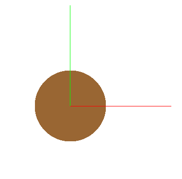
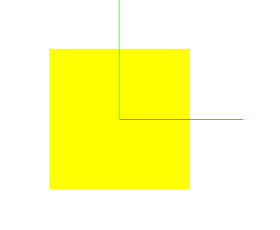
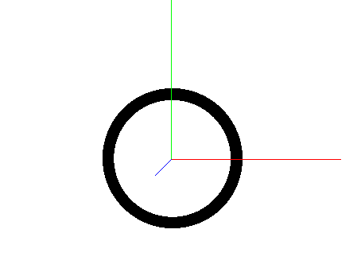
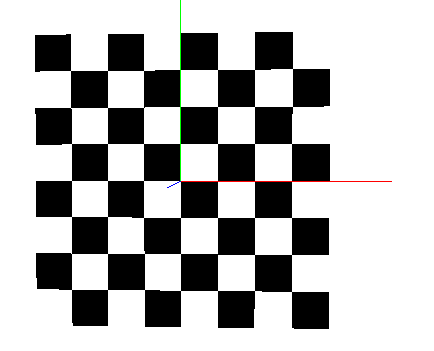
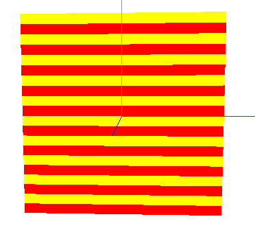
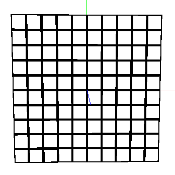
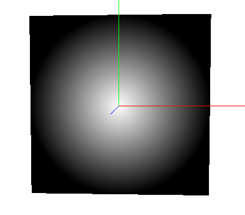

# Lab1 Gráficos

# 1-Definiciones

## 1.1-Vectores

### 1.1.1-Vec2

Los **vec2** son vectores de 2 dimensiones que representan principalmente **coordenadas de textura 2D (s, t)** o posiciones en 2D (x, y).

```glsl
vec2(0.5, 0.5) // El centro de una textura (s=0.5, t=0.5)
```

### 1.1.2-Vec3

Los **vec3** son vectores de 3 dimensiones que representan **posiciones en el espacio 3D (x, y, z)**, **vectores de dirección** (como Normales o Luces) o **colores RGB**.

```glsl
vec3(1.0, 0.0, 0.0) // Rojo puro (RGB)
```

### 1.1.3-Vec4

Los **vec4** son vectores de 4 dimensiones que representa un color RGBA (Red, Green, Blue, Alpha).

```glsl
vec4(0.0, 0.0, 0.0, 1.0) //Negro opaco
```

### 1.1.4-Definiciones de colores

```glsl
// --- Colores Primarios (Aditivos) ---
const vec4 COLOR_RED    = vec4(1.0, 0.0, 0.0, 1.0);
const vec4 COLOR_GREEN  = vec4(0.0, 1.0, 0.0, 1.0);
const vec4 COLOR_BLUE   = vec4(0.0, 0.0, 1.0, 1.0);

// --- Colores Secundarios (Sustractivos) ---
const vec4 COLOR_YELLOW = vec4(1.0, 1.0, 0.0, 1.0); // (Rojo + Verde)
const vec4 COLOR_CYAN   = vec4(0.0, 1.0, 1.0, 1.0); // (Verde + Azul)
const vec4 COLOR_MAGENTA= vec4(1.0, 0.0, 1.0, 1.0); // (Rojo + Azul)

// --- Colores Acromáticos ---
const vec4 COLOR_WHITE  = vec4(1.0, 1.0, 1.0, 1.0);
const vec4 COLOR_BLACK  = vec4(0.0, 0.0, 0.0, 1.0);
const vec4 COLOR_GRAY   = vec4(0.5, 0.5, 0.5, 1.0);

// --- Otros colores comunes ---
const vec4 COLOR_ORANGE = vec4(1.0, 0.5, 0.0, 1.0);
const vec4 COLOR_BROWN  = vec4(0.6, 0.4, 0.2, 1.0);
const vec4 COLOR_PURPLE = vec4(0.5, 0.0, 0.5, 1.0);
```

---

## 1.2-Teoría Pipeline

En el vertex shader se realiza el proceso de visualización:


Básicamente son 6 pasos de transformación de espacios:

1.Object => 2. World => 3.Eye => 4.Clip => 5.Normalize => 6.Window

El Hardware se ocupa de los pasos 5-6. 

Es decir, en el vertex shader tenemos que jugar con los pasos 1-4. Esto se hace con las matrices:

``` glsl
// Pas 1
modelMatrix;

// Pas 2
modelViewMatrix = viewMatrix*modelMatrix;

// Pas 3
vec4 pos_eye_4 = modelViewMatrix * vec4(vertex, 1.0);

// Pas 4
gl_Position = projectionMatrix * pos_eye_4;
```

Notése como gl_Position es la coordenada final Clip Space.

Obviamente esto es análogo a hacerlo directamente:

``` glsl
gl_Position = modelViewProjectionMatrix * vec4(vertex, 1.0);
```

---

## 1.3-Iluminación

Luces

Seguimos el modelo de iluminación de Phong. Este modelo describe el color de un punto en una superficie como la **suma de tres componentes de luz**:

La fórmula completa es:

**$Color_{Final}$ = $Color_{Ambiental}$ + $Color_{Difuso}$ + $Color_{Especular}$**


### 1.3.1-Componente Ambiental (Ambient) $I_a K_a$

* **¿Qué es?** Es una luz de fondo constante. Simula la luz indirecta que rebota por toda la escena, asegurando que las partes en sombra no sean completamente negras.
* **Propiedades que necesita:**
    * `matAmbient` ($K_a$): El **color ambiental del material** (cuánta luz ambiental refleja).
    * `lightAmbient` ($I_a$): El **color de la luz ambiental** de la escena.
* **Fórmula:**
    $Color_{Ambiental} = K_a \cdot I_a$

En código:

``` glsl
// uniform vec4 matAmbient;  // Ka
// uniform vec4 lightAmbient; // Ia

vec4 Color_Ambiental = matAmbient * lightAmbient;
```

**Si no hay luz ambiente, o se ignora, la empezamos en negro.**
``` glsl
vec4 finalColor = vec4(0.0, 0.0, 0.0, 1.0);
```

### 1.3.2-Componente Difusa (Diffuse) $K_d I_d (N \cdot L)$

* **¿Qué es?** Es el **color base** del objeto. Simula cómo la luz se dispersa por igual en todas las direcciones desde una superficie mate (como papel o tiza).
* **Propiedades que necesita:**
    * `matDiffuse` ($K_d$): El **color difuso del material** (su color "real").
    * `lightDiffuse` ($I_d$): El **color de la luz** principal.
    * **N**: El vector **Normal** (unitario) de la superficie (hacia dónde "mira" la superficie).
    * **L**: El vector **Luz** (unitario) (la dirección desde el punto hacia la fuente de luz).
* **Fórmula:**
    $Color_{Difuso} = K_d \cdot I_d \cdot \max(0.0, N \cdot L)$
    * **$(N \cdot L)$** es el producto escalar (`dot(N, L)`). Mide qué tan alineada está la superficie con la luz. Si es 1, la luz da de lleno. Si es 0, la luz pasa de refilón. Si es negativo, la luz está detrás y `max(0.0, ...)` lo convierte en 0.

En código:

``` glsl
// uniform vec4 matDiffuse;   // Kd
// uniform vec4 lightDiffuse;  // Id
// uniform float matShininess; // S
//
// Vectors (han d'estar normalitzats):
// vec3 N; // Vector Normal (unitari)
// vec3 L; // Vector Llum (unitari)

float NdotL = max(0.0, dot(N, L));
vec4 Color_Difuso = matDiffuse * lightDiffuse * NdotL;
```

### 1.3.3-Componente Especular (Specular) $K_s I_s (R \cdot V)^S$

* **¿Qué es?** Es el **brillo** o reflejo directo de la luz. Simula cómo la luz rebota en una superficie pulida (como metal o plástico).
* **Propiedades que necesita:**
    * `matSpecular` ($K_s$): El **color especular del material** (de qué color es el brillo).
    * `lightSpecular` ($I_s$): El **color del brillo** de la luz.
    * `matShininess` ($S$): La **brillantor** o "dureza" del reflejo (un número alto crea un punto de luz pequeño y nítido; un número bajo crea un brillo amplio y difuso).
    * **V**: El vector **Vista** (unitario) (la dirección desde el punto hacia la cámara/ojo).
    * **R**: El vector **Reflejo** (unitario) (la dirección en que la luz $L$ rebota sobre la normal $N$). Se calcula con `reflect(-L, N)`.
* **Fórmula:**
    $Color_{Especular} = K_s \cdot I_s \cdot \text{pow}(\max(0.0, R \cdot V), S)$
    * **$(R \cdot V)$** es el producto escalar (`dot(R, V)`). Mide qué tan alineado está tu ojo con el "rebote" de la luz. Si es 1, ves el reflejo de lleno.

En código:

``` glsl
// Propietats:
// uniform vec4 matSpecular;  // Ks
// uniform vec4 lightSpecular; // Is
// uniform float matShininess; // S
//
// Vectors (han d'estar normalitzats):
// vec3 N; // Vector Normal
// vec3 L; // Vector Llum
// vec3 V; // Vector Vista
// vec3 R; // Vector Reflex (calculat)

vec3 R = reflect(-L, N); // reflect() calcula el rebot de L sobre N
float RdotV = max(0.0, dot(R, V));
vec4 Color_Especular = matSpecular * lightSpecular * pow(RdotV, matShininess);
```

### Resumen de Propiedades

Para calcular la iluminación completa en un punto, necesitas saber:

* **4 Vectores (en el mismo sistema de coordenadas, p.ej., Eye Space):**
    * **N (Normal):** Hacia dónde mira la superficie.
    * **L (Luz):** Hacia dónde está la luz.
    * **V (Vista):** Hacia dónde está la cámara.
    * **R (Reflejo):** Hacia dónde rebota la luz.
* **Propiedades del Material (uniforms `mat...`):**
    * $K_a$ (`matAmbient`): Color de fondo.
    * $K_d$ (`matDiffuse`): Color base.
    * $K_s$ (`matSpecular`): Color del brillo.
    * $S$ (`matShininess`): Dureza del brillo.
* **Propiedades de la Luz (uniforms `light...`):**
    * $I_a$ (`lightAmbient`): Color de la luz ambiental.
    * $I_d$ (`lightDiffuse`): Color de la luz difusa.
    * $I_s$ (`lightSpecular`): Color de la luz especular.
    * `lightPosition`: Posición de la luz (para calcular **L**).

Con la fórmula final:

``` glsl
// El color final és la suma de les tres components
vec4 finalColor = Color_Ambiental + Color_Difuso + Color_Especular;

// Assegurem que l'alfa sigui 1.0 (opac)
finalColor.a = 1.0;
```


---

# 2-Esqueletos

## 2.1-Per-Vertex

(Usar para ejercicios de **Deformación**, p.ej., `Look`, `Dolphin`, `Cubify`)

### 2.1.1-Vertex Shader

```glsl
#version 330 core

// --- INPUTS (from your 3D model) ---
layout (location = 0) in vec3 vertex;
layout (location = 1) in vec3 normal;
layout (location = 2) in vec3 color;
layout (location = 3) in vec2 texCoord;

// --- OUTPUTS (to the Fragment Shader) ---
out vec4 frontColor; // El color FINAL calculado por vértice
out vec2 vtexCoord;  // La coordenada de textura

// --- UNIFORMS (from the viewer) ---
uniform mat4 modelViewProjectionMatrix;
uniform mat3 normalMatrix;

void main()
{
    vec4 vertex_objectspace = vec4(vertex, 1.0);
    vec3 normal_objectspace = normal;

    // Calcula la normal en Eye Space
    vec3 N = normalize(normalMatrix * normal_objectspace);

    // Calcula el color (iluminación simple por Z)
    frontColor = vec4(color,1.0) * N.z;

    // Pasa la coordenada de textura
    vtexCoord = texCoord;

    // Calcula la posición final
    gl_Position = modelViewProjectionMatrix * vertex_objectspace;
}
```

### 2.1.2-Fragment Shader

```glsl
#version 330 core

// --- INPUT (from the Vertex Shader) ---
in vec4 frontColor; // Recibe el color interpolado

// --- OUTPUT ---
out vec4 fragColor;

void main()
{
    // Simplemente asigna el color calculado en el VS
    fragColor = frontColor;
}
```

-----

## 2.2-Per-Fragment

(Usar para ejercicios de **Texturas, Color Procedural o Iluminación**, p.ej., `Smile`, `Digits`, `Nlights`, `Flag`)

### 2.2.1-Vertex Shader

```glsl
#version 330 core

// --- INPUTS (from your 3D model) ---
layout (location = 0) in vec3 vertex;
layout (location = 1) in vec3 normal;
layout (location = 2) in vec3 color;
layout (location = 3) in vec2 texCoord;

// --- OUTPUTS (to the Fragment Shader) ---
out vec2 vtexCoord; // Pasa la coordenada de textura

// --- UNIFORMS (from the viewer) ---
uniform mat4 modelViewProjectionMatrix;

void main()
{
    // Pasa la coordenada de textura
    vtexCoord = texCoord;

    // Calcula la posición final
    gl_Position = modelViewProjectionMatrix * vec4(vertex, 1.0);
}
```

### 2.2.2-Fragment Shader

```glsl
#version 330 core

// --- INPUT (from the Vertex Shader) ---
in vec2 vtexCoord;

// --- OUTPUT ---
out vec4 fragColor;

// --- UNIFORMS (Añadir los que necesites) ---
// (p.ej., uniform sampler2D colorMap;)

void main()
{
    // ==============================================================
    // DEBES declarar una variable 'finalColor'.
    //
    // (p.ej., vec4 texColor = texture(colorMap, vtexCoord);)
    // (p.ej., vec4 finalColor = texColor;)
    // ==============================================================

    // (Esta línea usará el 'finalColor' que has definido arriba)
    fragColor = finalColor;
}
```

---

# 3-Examen


Casi todos los problemas de examen se dividen en estas tres categorías. Identificar el tipo de problema te dice inmediatamente qué esqueleto usar y dónde vas a escribir tu código.

## 1. 📐 Deformación de Geometría
* **Objetivo:** Cambiar la **forma**, **posición** o **animación** del modelo 3D.
* **Palabras Clave:** "rotar", "deformar", "proyectar", "estirar", "girar cabeza", "animar".
* **Ejemplos:** `Look`, `Dolphin`, `Dalify`, `Cubify`.
* **Dónde trabajas:** Casi todo el código va en el **Vertex Shader (`.vert`)**.
* **Esqueleto a Usar:** **Esqueleto 1 (Per-Vertex)**.
* **Por qué:** Este esqueleto está diseñado para hacer el trabajo principal en el Vertex Shader (en el bloque `STEP 3 (VS)`). La iluminación simple que calcula por defecto (`frontColor = ... * N.z`) suele ser la que piden estos ejercicios.


## 2. 🎨 Texturizado y Color Procedural
* **Objetivo:** Decidir el color de un **píxel** basándose en texturas, coordenadas, o lógica (`if`, `distance`, `fract`, etc.).
* **Palabras Clave:** `texture()`, `sampler2D`, `colorMap`, `vtexCoord`, `if`, `discard`, `procedural`.
* **Ejemplos:** `Digits`, `Smile`, `Flag`, `Beach`, `Hunter`.
* **Dónde trabajas:** Todo el código va en el **Fragment Shader (`.frag`)**.
* **Esqueleto a Usar:** **Esqueleto 2 (Per-Fragment)**.
* **Por qué:** Necesitas control total por píxel. Tendrás que usar tu "cheatsheet" para añadir `uniforms` (como `sampler2D`) y "snippets" (como "Pasar Normal" si el efecto depende de `v_normal_eye`, como en "Smile") al esqueleto 2.


## 3. 💡 Iluminación (Phong)
* **Objetivo:** Calcular el modelo de luz de Phong (Ambiental, Difuso, Especular) para cada **píxel**.
* **Palabras Clave:** `Phong`, `Iluminación`, `N`, `L`, `V`, `R`, `matDiffuse`, `lightSpecular`, etc.
* **Ejemplos:** `Nlights`, `LightChange`, `8lights`.
* **Dónde trabajas:** El cálculo principal va en el **Fragment Shader (`.frag`)**.
* **Esqueleto a Usar:** **Esqueleto 2 (Per-Fragment)**.
* **Por qué:** Este es el caso más claro para el Esqueleto 2. Debes usar tu "cheatsheet" para añadir los "snippets" **obligatorios**:
    1.  **"Pasar Normal"** (para obtener `v_normal_eye` para **N**).
    2.  **"Pasar Posición del Ojo"** (para obtener `v_position_eye` para **V** y **L**).
    3.  **Todos los `uniforms`** de materiales (`mat...`) y luces (`light...`) que necesites.

---

# 4-Definiciones extra interesantes

## 4.1-Ángulo para 'n' ítems en un círculo

Esta línea de código calcula el ángulo (en radianes) para un ítem específico `i` dentro de un total de `n` ítems que están distribuidos uniformemente alrededor de un círculo completo.

### Código

```glsl
float angle = 2.0 * pi * float(i) / float(n);
```

#### Qué es cada parte

  * **`angle`**: La variable de salida. Es el ángulo en **radianes** para el ítem actual del bucle.
  * **`2.0 * pi`**: Representa un círculo completo ($2\pi$ radianes o 360°).
  * **`float(i)`**: El índice del ítem actual (p. ej., el ítem 0, el ítem 1, el ítem 2...). Se convierte a `float` para forzar una división con decimales.
  * **`float(n)`**: El número total de ítems que quieres distribuir alrededor del círculo (p. ej., `n=4` divisiones).

#### Ejemplo de Uso Genérico

Se usa dentro de un bucle `for` para encontrar la posición (x, y) de cualquier cosa que necesite estar en un círculo de **radio R**:

```glsl
// Ángulo para el ítem 'i'
float angle = 2.0 * pi * float(i) / float(n);

// Cálculo de la posición (x, y) usando trigonometría
float x = R * cos(angle);
float y = R * sin(angle);

vec3 posicion_en_el_circulo = vec3(x, y, 0.0);
```

---

## 4.2-Fórmula: Animación Cíclica (Oscilador)

Esta es la fórmula para crear un valor que oscila suavemente (como `sin` o `cos`) y que completa un ciclo cada **`N` segundos**.

### 4.2.1-Fórmula Base (El Oscilador)

Primero, creamos un "oscilador" base que va de `-1.0` a `1.0` y se repite cada `N` segundos.

  * **`time`**: Es el reloj global (en segundos) del `uniform`.
  * **`N_seconds`**: Es tu objetivo. Cuántos segundos quieres que dure un ciclo completo.
      * Si el período es **1 segundo** (como en 'Dolphin'): `N_seconds = 1.0;`
      * Si el período es **0.5 segundos**: `N_seconds = 0.5;`
      * Si el período es **2 segundos**: `N_seconds = 2.0;`
  * **`frequency`**: Es la "velocidad" a la que debe pasar el tiempo. Es el multiplicador que "comprime" o "estira" la onda `sin()` (que dura $2\pi$) para que quepa exactamente en `N_seconds`.
  * **`oscillator`**: Tu resultado base. Un `float` que va de `-1.0` a `1.0` y vuelve a `-1.0` cada `N_seconds`.


```glsl
// --- Base Cyclic Animation ---

// 1. Define the Period (how long one full cycle takes)
float N_seconds = 1.0; // e.g., 1.0 for a 1-second cycle

// 2. Calculate the Frequency (2*PI divided by the period)
float frequency = (2.0 * PI) / N_seconds;

// 3. Apply to time
float scaled_time = time * frequency;

// 4. Get the oscillator value (a value from -1.0 to 1.0)
float oscillator = sin(scaled_time);

// (Use cos(scaled_time) if you want it to start at 1.0 instead of 0.0)
```

-----

### 4.2.2-Cómo Usar el Resultado (Mapeo de Rango)

Casi nunca querrás un valor de `[-1.0, 1.0]`. Querrás un ángulo o un factor de mezcla. Aquí es donde se dividen los dos métodos del problema "Dolphin".

#### Método 1: Rango Simétrico `[-A, A]`

*(Usado para la cabeza del delfín: `[-PI/32, PI/32]`)*

Este es el método fácil. Si tu rango es simétrico alrededor de 0, solo tienes que multiplicar el oscilador por tu amplitud `A`.

```glsl
// --- Symmetrical Range Mapping ---

// 1. Define Amplitude
float A = PI / 32.0;

// 2. Get the final value
// oscillator is [-1.0, 1.0], so the result is [-A, A]
float angle = A * oscillator; 
```

#### Método 2: Rango Asimétrico `[min, max]`

*(Usado para la cola del delfín: `[-PI/4, 0]`)*

Este es el método más potente y genérico. Se hace en dos pasos:

1.  Mapear el oscilador `[-1, 1]` a un rango `[0, 1]`.
2.  Usar `mix()` (interpolación lineal) para mapear `[0, 1]` a tu rango final `[min, max]`.


```glsl
// --- Asymmetrical Range Mapping ---

// We already have 'oscillator' from the Base Formula

// --- Step 1: Map oscillator from [-1, 1] -> [0, 1] ---
// oscillator         -> [-1.0, 1.0]
// (oscillator * 0.5) -> [-0.5, 0.5]
// ( ... ) + 0.5      -> [ 0.0, 1.0]
float t = (oscillator * 0.5) + 0.5;

// --- Step 2: Map t from [0, 1] -> [min, max] ---
float min_val = -PI / 4.0;
float max_val = 0.0;

// mix() linearly interpolates between min_val and max_val using 't'
float angle = mix(min_val, max_val, t);
```


----
----

# 5-Funciones Genéricas (Hoja Maestra)

## 5.1-smoothstep

  * **Función:** `float smoothstep(float edge0, float edge1, float x);`

  * **Qué hace:** Es un "fundido" (fade) suave entre dos valores. Devuelve un valor `float` entre 0.0 y 1.0.

      * Si `x` es menor que `edge0`, devuelve **0.0**.
      * Si `x` es mayor que `edge1`, devuelve **1.0**.
      * Si `x` está *entre* `edge0` y `edge1`, devuelve un valor entre 0.0 y 1.0 que sigue una curva suave (no lineal), lo que evita cambios bruscos.

  * **Uso Práctico:** Es perfecto para aplicar deformaciones de forma gradual. En lugar de que una parte del modelo se deforme y la otra no (un corte brusco), `smoothstep` te da una zona de transición suave. 

-----

### Funciones Relacionadas (¡El Combo Esencial\!)

Casi nunca usarás `smoothstep` solo. Lo usarás en combinación con `mix` (mezclador).

#### `step(edge, x)`

  * **Función:** `float step(float edge, float x);`
  * **Qué hace:** Es un "interruptor" (ON/OFF) brusco.
      * Si `x < edge`, devuelve **0.0**.
      * Si `x >= edge`, devuelve **1.0**.

#### `mix(a, b, t)`

  * **Función:** `vec3 mix(vec3 a, vec3 b, float t);` (También funciona con `vec4`, `float`, etc.)
  * **Qué hace:** Es el "mezclador" (interpolación lineal). Mezcla `a` y `b` usando el factor `t`.
      * Si `t = 0.0`, devuelve `a`.
      * Si `t = 1.0`, devuelve `b`.
      * Si `t = 0.5`, devuelve la mitad de `a` y la mitad de `b`.

### El Combo: `smoothstep` + `mix`

Así es como los usas juntos en un problema de deformación:

```glsl
// --- Ejemplo Práctico (Deformación de Vértice) ---

// 1. Define tus posiciones
vec4 pos_original = vec4(vertex, 1.0);
vec4 pos_deformada = ... // (p.ej. la rotación de la cabeza)

// 2. Define la zona de transición
float inicio_fade = 1.45;
float fin_fade = 1.55;

// 3. Calcula el factor de mezcla 't' (0.0 a 1.0)
// smoothstep() nos da una transición suave en lugar de un corte brusco.
float t = smoothstep(inicio_fade, fin_fade, vertex.y);

// 4. Mezcla la posición original con la deformada usando 't'
vec4 vertex_objectspace = mix(pos_original, pos_deformada, t);
```

-----

## 5.2-boundingBoxMin / boundingBoxMax

  * **Qué son:** Son **uniforms** (variables globales), no funciones. El `viewer` te las da automáticamente. 

    ```glsl
    uniform vec3 boundingBoxMin;
    uniform vec3 boundingBoxMax;
    ```

  * **Qué hacen:** Contienen las coordenadas (x,y,z) de las dos esquinas opuestas de la "caja contenedora" del modelo, en **Object Space**. 

      * `boundingBoxMin` es la esquina `(x_min, y_min, z_min)`.
      * `boundingBoxMax` es la esquina `(x_max, y_max, z_max)`.

  * **Uso Práctico:** Te permiten saber dónde está un vértice *en relación* con el tamaño total del modelo (p.ej., si está en la parte de arriba, en medio, o en el 40% de la altura).

-----

### Fórmula Clave: Normalización (Obtener un factor 0.0 a 1.0)

El uso más común es "normalizar" la posición de un vértice. Si quieres saber qué tan "alto" está un vértice en el modelo (en un rango de 0.0 a 1.0):

```glsl
// (pos_actual - pos_minima) / (pos_maxima - pos_minima)
float t_y = (vertex.y - boundingBoxMin.y) / (boundingBoxMax.y - boundingBoxMin.y);
```

  * `t_y` será `0.0` para el vértice más bajo del modelo.
  * `t_y` será `1.0` para el vértice más alto del modelo.

### Ejemplo de "Dalify"

El problema "Dalify" te pide encontrar el punto `c` que está al 40% (`t = 0.4`) de la altura del modelo. Usamos `mix` (que es lo opuesto a normalizar):

```glsl
// --- Ejemplo Práctico (Encontrar un punto 'c') ---

// 1. Definir el porcentaje (0.4 = 40%)
float t = 0.4;

// 2. Interpolar entre el Y más bajo y el Y más alto
float c = mix(boundingBoxMin.y, boundingBoxMax.y, t);

// 3. Ahora 'c' es el valor Y del 40% de la altura del modelo
// y lo puedes usar para la deformación.
if (vertex.y < c) {
    // Escalar
} else {
    // Trasladar
}
```


---
---


# 6-Definiciones de texturas

## 6.1-Círculo relleno




``` glsl
in vec2 vtexCoord;
in vec4 frontColor;
out vec4 fragColor;

void main()
{
    vec4 frontColor = COLOR_WHITE;

    // 1. Definir propiedades
    vec2 center = vec2(0.5, 0.5); // Centro de la pantalla
    float radius = 0.25;         // Radio del círculo

    // 2. Calcular distancia
    float dist = distance(vtexCoord, center);

    // 3. Dibujar
    if (dist < radius) frontColor = COLOR_BROWN;

    fragColor = frontColor;
}
```

---

## 6.2-Rectángulo/Cuadrado relleno



``` glsl
in vec2 vtexCoord;
in vec4 frontColor;
out vec4 fragColor;

void main()
{
    vec4 frontColor = COLOR_WHITE;

    // 1. Definir propiedades
    vec2 center = vec2(0.5, 0.5); // Centro de la pantalla
    float radius = 0.25;         // Radio del círculo

    // 2. Calcular distancia
    float dist = distance(vtexCoord, center);

    // 3. Dibujar
    if (dist < radius) frontColor = COLOR_BROWN;

    fragColor = frontColor;
}
```

---

## 6.3-Anillo/Círculo (no relleno)



``` glsl
in vec2 vtexCoord;
in vec4 frontColor;
out vec4 fragColor;

void main()
{
    vec4 frontColor = COLOR_WHITE;

    // 1. Definir propiedades
    vec2 center = vec2(0.5, 0.5);
    float outer_radius = 0.3;
    float thickness = 0.05; // Grosor del anillo

    // 2. Calcular el radio interior
    float inner_radius = outer_radius - thickness;

    // 3. Calcular distancia
    float dist = distance(vtexCoord, center);

    // 4. Dibujar si está ENTRE los dos radios
    if (dist < outer_radius && dist > inner_radius) frontColor = COLOR_BLACK;

    fragColor = frontColor;
}
```

---

## 6.4-Pentágono


``` glsl
in vec2 vtexCoord;
in vec4 frontColor;
out vec4 fragColor;

void main()
{
    vec4 frontColor = COLOR_WHITE;

    // --- 6.5 Polígono Regular Relleno ---

    // --- 1. Definir propiedades ---
    const float PI = 3.14159265359;
    const int N_SIDES = 6; // 5=Pentágono, 6=Hexágono, 8=Octágono
    const float RADIUS = 0.25; // El radio (tamaño) del polígono
    const vec2 CENTER = vec2(0.5, 0.5);

    // --- 2. Centrar y Corregir Aspect Ratio (¡Importante!) ---
    // (Usamos la misma corrección que en el ejercicio "Flag")
    vec2 coord = vtexCoord - CENTER;
    coord.y = coord.y * 0.5; // (Corrige el (y - 0.5) * 0.5)

    // --- 3. Convertir a Coordenadas Polares ---
    // 'a' = ángulo del píxel, 'r' = distancia/radio del píxel
    float a = atan(coord.y, coord.x);
    float r = length(coord);

    // --- 4. Lógica de "Plegado" (SDF) ---
    // a. Calcular el ángulo de un solo "gajo" (slice)
    float slice_angle = (2.0 * PI) / float(N_SIDES);

    // b. Mapear nuestro ángulo al interior de un solo "gajo"
    // (Esto "pliega" todos los gajos uno encima del otro)
    a = mod(a, slice_angle);

    // c. Centrar el gajo (para que esté simétrico)
    a = a - (slice_angle / 2.0);

    // d. Calcular la distancia al borde en este ángulo
    // Esta es la distancia MÁXIMA que un píxel puede tener
    // en este ángulo y seguir estando "dentro" del polígono.
    float max_dist_en_este_angulo = RADIUS * cos(slice_angle / 2.0) / cos(a);

    // --- 5. Dibujar ---
    if (r < max_dist_en_este_angulo)
    {
        frontColor = COLOR_BLUE; // O cualquier color
    }

    fragColor = frontColor;
}
```

---

## 6.5-Tablero de ajedrez



``` glsl
in vec2 vtexCoord;
in vec4 frontColor;
out vec4 fragColor;

void main()
{
    vec4 frontColor = COLOR_WHITE;

    // --- 6.6 Tablero de Ajedrez ---
    // 1. Definir propiedades
    float N_TILES = 8.0; // 8x8
    vec4 COLOR_A = COLOR_WHITE;
    vec4 COLOR_B = COLOR_BLACK;

    // 2. Encontrar en qué casilla estamos
    float tile_x = floor(vtexCoord.s * N_TILES);
    float tile_y = floor(vtexCoord.t * N_TILES);

    // 3. Calcular si es par o impar
    float tile_sum = tile_x + tile_y;
    float c = mod(tile_sum, 2.0);

    // 4. Dibujar
    if (c < 0.5) // Es par (o 0.0)
    {
        frontColor = COLOR_A;
    }
    else // Es impar (o 1.0)
    {
        frontColor = COLOR_B;
    }

    fragColor = frontColor;
}
```

---

## 6.6-Rayas (stripes)



``` glsl
in vec2 vtexCoord;
in vec4 frontColor;
out vec4 fragColor;

void main()
{
    vec4 frontColor = COLOR_WHITE;

    // --- 6.7 Rayas (Horizontales) ---
    // 1. Definir propiedades
    float N_STRIPES = 10.0; // 10 rayas
    float WIDTH = 0.5; // 0.5 = 50% de ancho para cada color
    vec4 COLOR_A = COLOR_RED;
    vec4 COLOR_B = COLOR_YELLOW;

    // 2. Obtener coordenada local repetitiva (para el eje T/Y)
    float local_t = fract(vtexCoord.t * N_STRIPES);

    // 3. Usar step() para crear el "interruptor"
    float stripe = step(WIDTH, local_t);

    // 4. Dibujar usando mix()
    // Si stripe=0.0 (t < 0.5), usa COLOR_A
    // Si stripe=1.0 (t >= 0.5), usa COLOR_B
    frontColor = mix(COLOR_A, COLOR_B, stripe);

    // (Para rayas VERTICALES, solo cambia 'vtexCoord.t' por 'vtexCoord.s')

    fragColor = frontColor;
}
```

---

## 6.7-Rejilla (Grid)



``` glsl
in vec2 vtexCoord;
in vec4 frontColor;
out vec4 fragColor;

void main()
{
    vec4 frontColor = COLOR_WHITE;

    // 1. Definir propiedades
    float N_GRID = 10.0;
    float THICKNESS_PERCENT = 0.15; // 5% de grosor
    vec4 COLOR_LINE = COLOR_BLACK;
    vec4 COLOR_BG = COLOR_WHITE;

    // 3. Obtener coordenadas locales repetitivas
    float local_s = fract(vtexCoord.s * N_GRID);
    float local_t = fract(vtexCoord.t * N_GRID);

    // 4. Calcular el grosor real de la línea
    // (Si el grosor es 0.05, queremos 0.025 a cada lado del borde)
    float line_width = THICKNESS_PERCENT / 2.0;

    // 5. Dibujar las líneas (con 'if')
    // Comprobar si estamos cerca del borde izquierdo O derecho
    bool vertical_line = (local_s < line_width) || (local_s > 1.0 - line_width);
    // Comprobar si estamos cerca del borde inferior O superior
    bool horizontal_line = (local_t < line_width) || (local_t > 1.0 - line_width);

    if (vertical_line || horizontal_line) frontColor = COLOR_LINE;

    fragColor = frontColor;
}
```

## 6.8-Gradiente Círculo



``` glsl
in vec2 vtexCoord;
in vec4 frontColor;
out vec4 fragColor;

void main()
{
    vec4 frontColor = COLOR_WHITE;

    // --- 6.9 Gradiente Radial ---

    // 1. Definir propiedades
    vec2 center = vec2(0.5, 0.5);
    float radius = 0.5; // Radio del fundido
    vec4 COLOR_CENTER = COLOR_WHITE;
    vec4 COLOR_EDGE = COLOR_BLACK;

    // 2. Calcular distancia (¡Recuerda corregir el aspecto si es necesario!)
    float dist = distance(vtexCoord, center);

    // 3. Normalizar la distancia (mapear a [0.0, 1.0])
    // Dividimos la distancia por el radio
    // clamp() asegura que el valor no sea > 1.0
    float t = clamp(dist / radius, 0.0, 1.0);

    // 4. Dibujar
    frontColor = mix(COLOR_CENTER, COLOR_EDGE, t);

    fragColor = frontColor;
}
```