## 1. Com calcular zNear i zFar?

> **Pregunta original per cercar:**
> "Amb les matrius indicades, calcula la distància al pla de retallat posterior (zfar)"
> "Amb les matrius indicades, calcula la distància al pla de retallat anterior (znear)"

**1. ProjectionMatrix (PM)**

$$
\begin{bmatrix}
. & . & 0 & 0 \\
. & . & 0 & 0 \\
0 & 0 & \mathbf{C} & \mathbf{D} \\
0 & 0 & -1 & 0
\end{bmatrix}
$$

**2. ProjectionMatrixInv (invPM)**
$$
\begin{bmatrix}
. & . & . & . \\
. & . & . & . \\
. & . & . & . \\
0 & 0 & \mathbf{A} & \mathbf{B}
\end{bmatrix}
$$

---

### 1. Fent servir la ProjectionMatrix (PM)
*Tens C i D.*

**Fórmules:**
$$zFar = \left| \frac{D}{C + 1} \right|$$
$$zNear = \left| \frac{D}{C - 1} \right|$$

**Exemple (del teu exercici):**
* $C = -1.25, \quad D = 2.25$
* $zFar = 2.25 / (-1.25 + 1) = 2.25 / -0.25 = -9 \rightarrow$ **Resultat: 9**

---

### 2. Fent servir la ProjectionMatrixInv (invPM)
*Tens A i B. Aquest mètode sol ser més ràpid.*

**Fórmules:**
$$zFar = \left| \frac{1}{B + A} \right|$$
$$zNear = \left| \frac{1}{B - A} \right|$$

**Exemple (del teu exercici):**
* $A = 0.4444, \quad B = -0.5556$
* $Suma = -0.1112$
* $zFar = 1 / -0.1112 = -9 \rightarrow$ **Resultat: 9**

---

### ⚠️ Trucs (Cas Infinit)
Si a la matriu de projecció (PM) el valor **C és exactament -1**:
* **zFar = $\infty$ (Infinit)**
* Això vol dir que la càmera veu fins l'infinit (no hi ha límit de fons).


---

### Exercici

> Amb les matrius indicades, calcula la distància al pla de retallat posterior (zfar)

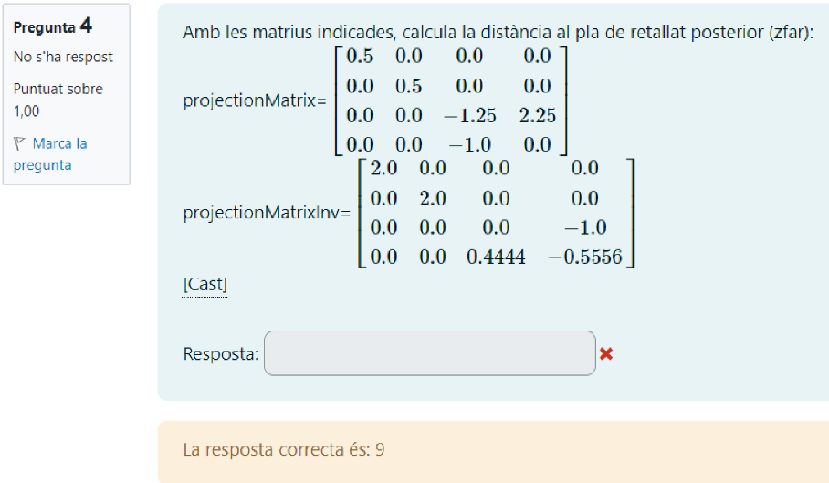


<hr style="border: 15px solid blue;">


## 2. Identificar Camins de Llum (Light Paths)

> **Pregunta original per cercar:**
> "El light path que explica el color dominant al pixel central del quadrat 1 és..."
> "Trieu-ne una: LSDSE, LSDE, LDDE, LSE..."

**Vocabulari (La "Fórmula")**

* **L (Light):** La font de llum (la bombeta).
* **E (Eye):** La càmera o l'ull.
* **S (Specular):** Superfície **Brillant** (Mirall, metall cromat, vidre).
* **D (Diffuse):** Superfície **Mate** (Plàstic, terra, fusta, paret).

---

### 1. Com construir el camí?

*Sempre es llegeix de la Llum (L) cap a l'Ull (E).*

1. **L** (Sempre comença aquí).
2. **Què il·lumina la llum?** (El primer objecte que rep el raig).
3. **On rebota?** (Si veus un objecte dins d'un mirall, el raig ha tocat l'objecte i després el mirall).
4. **E** (Sempre acaba aquí).

---

### 2. Els casos més habituals (Solució)

**A. LSE (Reflex Especular)**

* **Què veus?** El reflex de la bombeta (punt blanc) sobre una bola brillant.
* **Camí:** Llum  Bola(S)  Ull.
* *Exemple:* Quadrat 1 (punt blanc a la bola).

**B. LDE (Color Difús)**

* **Què veus?** Un objecte normal (no mirall) il·luminat.
* **Camí:** Llum  Objecte(D)  Ull.
* *Exemple:* Quadrat 2 (el cilindre verd).

**C. LDSE (Reflex d'un objecte)**

* **Què veus?** Un objecte reflectit DINS d'un mirall o bola cromada.
* **Camí:** Llum  Objecte(D)  Mirall(S)  Ull.
* *Exemple:* Quadrat 3 (Cilindre vist dins el mirall) i Quadrat 4 (Terra vist dins la bola).

**D. LSDE (Càustiques - Cas "Trampa")**

* **Què veus?** Una taca de llum al terra o paret *causada* per un vidre o mirall.
* **Camí:** Llum  Vidre(S)  Terra(D)  Ull.

---

### Exercici

> El light path que explica el color dominant al pixel central del quadrat 1 és...

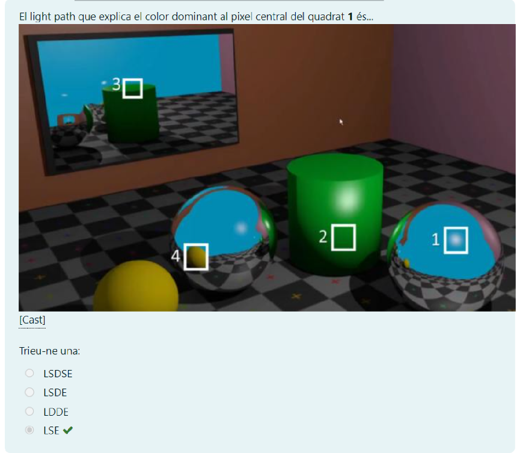

**Solucions per tots els quadrats**

**Quadrat 1:** LSE
**Quadrat 2:** LDE
**Quadrat 3:** LDSE
**Quadrat 4:** LDSE

<hr style="border: 15px solid blue;">

## 3. Calcular la Normal en el Fragment Shader (FS)

> **Pregunta original per cercar:**
> "Soposa que P és un punt en eye space. Una forma d'obtenir en un FS la direcció del vector normal en eye space és..."

**Conceptes Clau / Fórmula**

$$Normal = \text{normalize}(\text{cross}(\frac{\partial P}{\partial x}, \frac{\partial P}{\partial y}))$$

**En codi GLSL:**
`normalize(cross(dFdx(P), dFdy(P)))`

---

### 1. Teoria / Mètode de resolució

Si tens la posició d'un punt **P** però no tens la seva normal, la pots fabricar matemàticament:

1.  **dFdx(P):** Calcula quan canvia P en moure'ns un píxel a la dreta (vector tangent X).
2.  **dFdy(P):** Calcula quan canvia P en moure'ns un píxel avall (vector tangent Y).
3.  **cross(A, B):** El **Producte Vectorial** de dos vectors tangents sempre dona un vector perpendicular a la superfície (la Normal).
4.  **normalize(...):** Sempre hem de normalitzar el resultat perquè tingui longitud 1.

> **Resum ràpid (Mnemotècnia):**
> Busques **CROSS** (producte vectorial) i **dFdx/dFdy**.
> *Mai* triïs "dot" (producte escalar) perquè això dona un número, no un vector.

---

### Exercici

> Suposa que P és un punt en eye space. Una forma d'obtenir en un FS la direcció del vector normal en eye space és..."

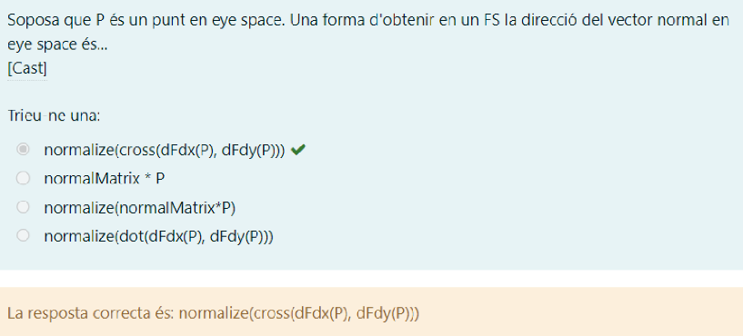

**Solució de l'exercici:**
* `normalize(cross(dFdx(P), dFdy(P)))`

**Variants i Trampes:**
* **Variant A (Ordre invers):** `cross(dFdy(P), dFdx(P))` $\rightarrow$ La normal miraria cap endins (al revés).
* **Variant B (Flat Shading):** Aquesta tècnica s'utilitza per aconseguir un efecte *Flat Shading* (cares planes) quan no volem normals suavitzades.
* **Per què no és "normalMatrix * P"?** Perquè P és una **posició** (punt), no un vector normal. La matriu de normals només es multiplica per normals.

<hr style="border: 15px solid blue;">

## 4. Arbres de Ray Tracing Clàssic (Whitted)

> **Pregunta original per cercar:**
> "Indica quin arbre de rajos pot ser generat per Ray Tracing clàssic"

**La Regla d'Or (Visual)**

$$\mathbf{D} \rightarrow \text{STOP} \quad | \quad \mathbf{S} \rightarrow \text{CONTINUA}$$

* **D (Difús / Mate):** És un punt final (fulla). **MAI** pot tenir fills a sota.
* **S (Especular / Brillant):** Pot rebotar. **SI** que pot tenir fills (Reflexió/Refracció).

---

### 1. Teoria / Mètode de resolució

El **Ray Tracing Clàssic (Whitted)** funciona així:
1.  Es llança un raig des de l'ull (**E**).
2.  Si toca un objecte **Especular (S)** (mirall o vidre), es generen nous rajos secundaris (fills).
3.  Si toca un objecte **Difús (D)** (parets, terra mate), es calcula el color local i **S'ACABA** la recursivitat. No es generen rebots difusos (això seria Global Illumination/Path Tracing, no Clàssic).

**L'algoritme visual:**
Busca la lletra **D**. Si veus que surt alguna línia de sota d'una D... **És FALSA.**

---

### Exercici

> Indica quin arbre de rajos pot ser generat per Ray Tracing clàssic:

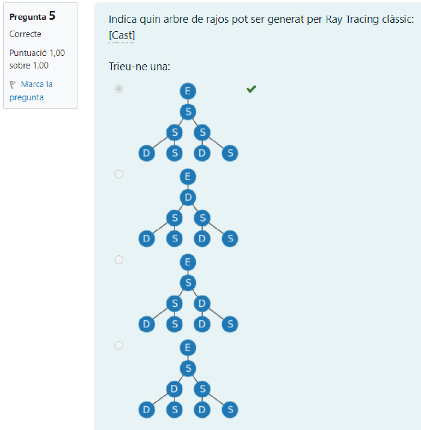

**Solució de l'exercici:**
* La **Primera Opció** (la de dalt).

**Per què les altres són falses?**
* **Opció 2:** El node E va a **D**, i d'aquesta **D surten fills**. Impossible en Ray Tracing Clàssic.
* **Opció 3:** A la dreta hi ha una **D**, i d'aquesta **D surten fills**. Impossible.
* **Opció 4:** A l'esquerra hi ha una **D**, i d'aquesta **D surten fills**. Impossible.

**Variants possibles:**
* Et poden canviar l'ordre, però tu només has de fer l'escàner visual: **"Tots les D han de ser finals de trajecte"**. Si una D té fills, descarta-la.

<hr style="border: 15px solid blue;">

## 5. Descartar Fragments (Pipeline Optimization)

> **Pregunta original per cercar:**
> "Indica quina tasca/opció pot fer que alguns fragments no segueixin processant-se:"

**Concepte Clau (Tests de Visibilitat)**

$$\text{Fragment} \rightarrow [\text{Scissor}] \rightarrow [\text{Stencil}] \rightarrow [\mathbf{Depth}] \rightarrow \text{Color Buffer}$$

Si un fragment falla qualsevol d'aquests tests, **es descarta** (mor) immediatament i es deixa de processar per estalviar rendiment.

---

### Teoria / Mètode de resolució

Hem d'identificar quines operacions **MATEN** el fragment (eviten que s'escrigui) i quines només el **MODIFIQUEN**.

**Operacions que DESCARTEN (Aturen el procés):**
1.  **Depth Test (Z-Test):** Si l'objecte està darrere d'una paret, no cal pintar-lo. La GPU el llença.
2.  **Stencil Test:** Màscara de retall (plantilla).
3.  **Scissor Test:** Retall rectangular de la pantalla.
4.  **Alpha Test / Discard:** Si el shader diu `discard`.

**Operacions que NO descarten (El fragment es processa igual):**
1.  **Blending:** Barreja el color (transparència). La feina es fa igualment.
2.  **ColorMask:** Es calcula tot, però al final decidim no guardar algun canal (R, G, B o A).
3.  **Clear:** Això esborra la pantalla *abans* de començar, no durant el procés de fragments.

---

### Exercici

> Indica quina tasca/opció pot fer que alguns fragments no segueixin processant-se:

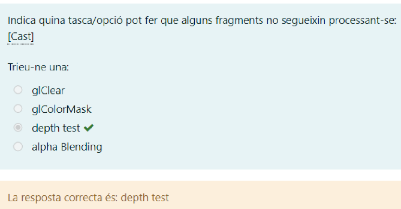

**Solució de l'exercici:**
* **depth test**

**Per què les altres són falses?**
* **alpha Blending:** El fragment es calcula completament i després es barreja matemàticament amb el fons. No s'atura.
* **glColorMask:** La GPU fa tota la feina de calcular el color, simplement al final se li diu "no guardis el vermell", per exemple.
* **glClear:** Això és una comanda global inicial, no afecta fragments individuals mentre es dibuixen.

<hr style="border: 15px solid blue;">

## 6. Radiància en Superfícies Difoses (Lambertianes)

> **Pregunta original per cercar:**
> "Una superfície plana perfectament difosa rep una irradiància de... Si L és la radiància reflectida..."

**La Regla d'Or (Llei de Lambert)**

$$L(\theta) = \text{Constant}$$

En una superfície **perfectament difosa** (Lambertiana), la **Radiància (L)** és la mateixa miris des d'on miris.

---

###  Teoria / Mètode de resolució

Heu de distingir entre dos conceptes que sonen semblant però es comporten diferent:

1.  **Radiància ($L$):** És la "brillantor" que veu l'ull. En superfícies mat (difoses), **NO canvia** amb l'angle. Un full de paper es veu igual de blanc si el mires de front o de costat.
    * *Fórmula:* $L = L'$ (Sempre).

2.  **Intensitat Radiant ($I$):** És l'energia bruta enviada en una direcció. Aquesta **SÍ que baixa** amb l'angle (Llei del Cosinus).
    * *Fórmula:* $I_{\theta} = I_{normal} \times \cos(\theta)$.

**El Truc:**
Si la pregunta diu **"Radiància" ($L$)** $\rightarrow$ La resposta és **Igualtat ($=$)**.
Si la pregunta diu **"Intensitat" ($I$)** $\rightarrow$ La resposta porta **cosinus ($\cos$)**.

---

### Exercici

> Una superfície plana perfectament difosa rep una irradiància de 8 W/m^2. Si L és la radiància reflectida de sortida en direcció perpendicular a la superfície, i L' és la radiància reflectida de sortida a 70 graus de la normal, llavors...

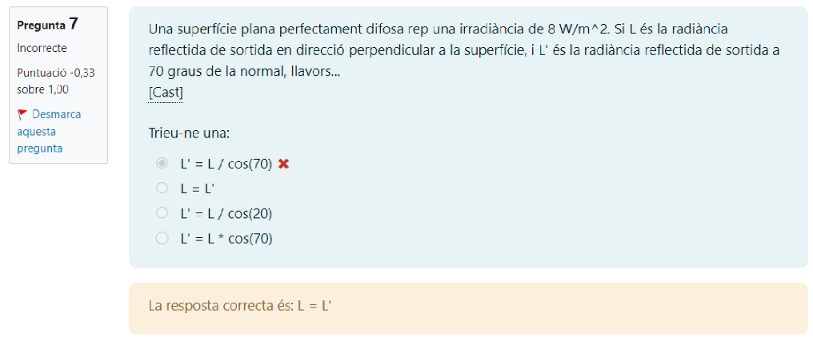

**Solució de l'exercici:**
* **$L = L'$**

**Per què?**
Perquè és una superfície "perfectament difosa". La brillantor aparent (Radiància) és constant en totes les direccions. El número "8 W/m²" i els "70 graus" són dades irrellevants per despistar.

**Variants possibles:**
* **Si et pregunten per la INTENSITAT ($I$):** Llavors la resposta seria $I' = I \times \cos(70)$.
* **Si et pregunten per l'IRRADIÀNCIA ($E$) rebuda:** Si la llum ve inclinada, llavors sí que depèn del cosinus ($E = E_0 \times \cos\theta$).

<hr style="border: 15px solid blue;">

## 7. Il·luminació Global (L'Objectiu Final)

> **Pregunta original per cercar:**
> "Siguin P = punt visible de l'escena... En última instància, resoldre el problema de la il·luminació global equival a estimar..."

**Concepte Clau (El Sant Greal)**

$$\text{Rendering} = \text{Calcular } L_o(P, \omega_{out})$$

L'objectiu de qualsevol motor de render és trobar la **Radiància de Sortida ($L$)** que surt del punt $P$ i viatja cap a la càmera.

---

### Teoria / Mètode de resolució

Per no confondre't amb les opcions, recorda la diferència entre el que "arriba" i el que "veus":

1.  **Irradiància ($E$):** És la llum que **arriba** al punt (incoming). Això no és el que veus, és el que il·lumina l'objecte.
2.  **Radiància ($L$):** És la llum que **surt** (outgoing) i viatja per un raig específic. Això és el que percep l'ull/càmera.

**La Direcció (-w):**
Si l'enunciat diu que $w$ és la "direcció de visió" (de l'Ull cap al Punt), nosaltres necessitem la llum que fa el camí invers: del Punt cap a l'Ull. Per tant, la direcció és **$-w$**.

> **Resum:** Busques la paraula **Radiància** + **Sortida** + **Direcció oposada a la visió**.

---

### Exercici

> Siguin
> P = punt visible de l'escena en una certa direcció de visió w
> N = normal de la superfície en el punt P
> L = vector unitari del punt P cap a la llum
> En última instància, resoldre el problema de la il·luminació global equival a estimar...

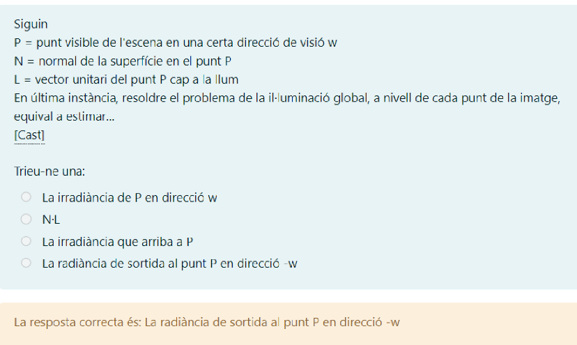

**Solució de l'exercici:**
* **La radiància de sortida al punt P en direcció -w**

**Per què les altres són falses?**
* **La irradiància...:** Irradiància és la llum que "cau" sobre l'objecte, no la imatge final.
* **N·L:** Això és només el "Factor de Lambert" (el cosinus de l'angle). És una part petita de l'equació, no la solució completa.
* **Direcció w:** Això seria la llum que travessa l'objecte i s'allunya de la càmera.

<hr style="border: 15px solid blue;">

## 8. Ordenar el Pipeline d'OpenGL (Timeline)

> **Pregunta original per cercar:**
> "Assigna a cada crida/tasca l'ordre relatiu (1,2,3,4) en que s'executa en un pipeline d'OpenGL sense GS"

**EL MAPA MESTRE (Ordre Universal)**

Imagina una línia de temps que va de la **CPU** (el teu codi C++) fins a la **Pantalla**.

---
### 🔽 FASE 1: CPU (Preparació)
1. `glGenVertexArrays` / `glGenBuffers`
2. `glBindBuffer` / `glBufferData` (Enviar dades)
3. `glDrawArrays` / `glDrawElements` (L'ordre de disparar)

### 🔽 FASE 2: Vèrtexs (Geometry)
4. **VS execution starts** (S'inicia el Vertex Shader)
5. `gl_Position is written` (El VS acaba calculant la posició)

### 🔽 FASE 3: Primitives i Retall (Fixed Function)
6. **Clipping to viewing frustum** (Retallar el que no es veu)
   * *Nota:* Aquí dins passa la *"Interpolation of attributes for new vertices generated during clipping"*.
7. **Perspective Division** (Dividir per W)
8. **Viewport transformation** (Adaptar a la mida de la finestra)
9. **Backface culling** (Descartar cares posteriors)

### 🔽 FASE 4: Rasterització
10. **Rasterization** (Generar fragments)

### 🔽 FASE 5: Fragments i Tests (Pixel Processing)

11. **FS execution** (Fragment Shader)
12. `fragColor is written` (El FS decideix el color)
13. **Scissor Test**
14. **Stencil Test**
15. **Depth Test** (Z-Buffer)
16. **Blending**
---

### Exercicis Resolts (Variants de l'examen)

He agrupat les teves captures en 4 casos. Busca quins ítems et surten i ordena'ls segons el mapa de dalt.

#### Cas A: El Pipeline Bàsic de Geometria
> Ítems: *Backface culling, gl_Position is written, VS execution starts, Clipping*

1. **VS execution starts** (Comença VS)
2. **gl_Position is written** (Acaba VS)
3. **Clipping to viewing frustum** (Retall)
4. **Backface culling** (Descartar cares)

#### Cas B: Des de la CPU fins al Final (Depth)
> Ítems: *VS execution starts, Clipping, glBufferData, Depth test*

1. **glBufferData** (CPU: Enviar dades $\to$ Sempre el primer)
2. **VS execution starts** (GPU: Comença a processar)
3. **Clipping to viewing frustum** (GPU: Retallar)
4. **Depth test** (GPU: El test final $\to$ Sempre l'últim)

#### Cas C: Setup i Viewport
> Ítems: *Interpolation (clipping), glGenVertexArrays, VS execution, Viewport transformation*

1. **glGenVertexArrays** (CPU: Crear memòria $\to$ Primeríssim)
2. **VS execution starts** (Comença el shader)
3. **Interpolation of attributes... during clipping** (Part del procés de Clipping)
4. **Viewport transformation** (Després del clipping, abans de rasteritzar)

#### Cas D: Dibuix i Fragments
> Ítems: *fragColor is written, Rasterization, Call to glDrawArrays, Stencil Test*

1. **Call to glDrawArrays** (L'ordre de pintar $\to$ Inici)
2. **Rasterization** (Es creen els fragments)
3. **fragColor is written** (Es calcula el color al Shader)
4. **Stencil Test** (Es filtra si el píxel es guarda o no)

#### Cas E: Tests de Fragments (El final del camí)

1. **Clipping to viewing frustum** (Geometria: Retallar abans de pintar)
2. **Stencil Test** (Píxel: Màscara de retall)
3. **Depth test** (Píxel: Comprovació de profunditat)
4. **Alpha blending** (Píxel: Barreja de colors $\to$ Sempre l'últim pas)

<hr style="border: 15px solid blue;">

Aquí tens l'explicació de l'exercici seguint exactament la mateixa estructura i format que m'has passat.

## 9. Transformació de Coordenades de Textura (UV Mapping)

> **Pregunta original per cercar:**
> "Disposem d'aquesta textura: G H I J K... Indica amb quina opció el FS de sota obté aquest resultat amb l'objecte plane: G."

**Concepte Clau (Retallar i Seleccionar)**

En OpenGL/GLSL, les coordenades de textura ($UV$) van habitualment de $0.0$ a $1.0$.
Quan volem mostrar només una **part** d'una imatge (un *sprite* o una lletra d'un atlas), hem de transformar les coordenades d'entrada (que venen del pla complet $0 \to 1$) perquè només "llegeixin" un trosset petit de la textura.

La fórmula màgica és:
$$COORD_{final} = \text{factor} \times COORD_{entrada} + \text{offset}$$

* **Factor (Escala/Zoom):** Defineix la **mida** de la porció que volem llegir. Si el factor és $< 1$, llegim un tros més petit (fem "zoom" a una part).
* **Offset (Desplaçament):** Defineix la **posició inicial** on comencem a llegir.

---

### Teoria / Mètode de resolució

Per resoldre aquests exercicis sense calcular res complex, segueix aquests passos lògics:

1.  **Compta les divisions:** La imatge té 10 lletres horitzontals (G, H, I, J, K, L, M, N, O, P).
    * L'amplada total és $1.0$.
    * L'amplada d'una sola lletra és $1.0 / 10 = \mathbf{0.1}$.
2.  **Mira la vertical:** Només hi ha una fila de lletres.
    * L'alçada total és $1.0$. La lletra ocupa tota l'alçada.
3.  **Localitza l'objectiu:** Volem la lletra **"G"**.
    * La "G" és la **primera** lletra (posició 0).
    * Comença a $U = 0.0$ i acaba a $U = 0.1$.

**La Lògica del Factor:**
Si el nostre pla ens dona valors de $0$ a $1$, però nosaltres volem que la textura només es llegeixi de $0$ a $0.1$, hem de multiplicar per **0.1**.
$$Entrada(1.0) \times Factor(0.1) = Resultat(0.1)$$

**La Lògica de l'Offset:**
La "G" està al principi de tot (esquerra), per tant, no hem de desplaçar res. L'offset horitzontal és **0.0**.

> **Resum:** Factor = Mida de la casella (0.1). Offset = On comença la casella (0.0).

---

### Exercici

> Disposem d'aquesta textura:
> **G H I J K L M N O P**
> Volem obtenir el resultat: **G**
> Codi: `fragColor = texture(colorMap, factor*vtexCoord + offset)`

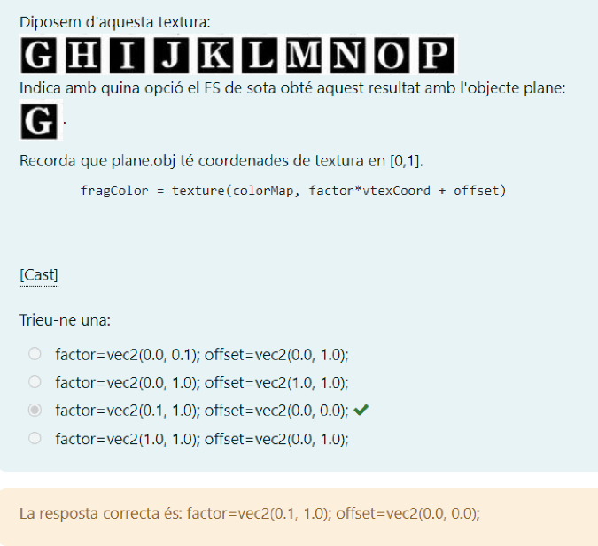

**Solució de l'exercici:**

```glsl
factor = vec2(0.1, 1.0);
offset = vec2(0.0, 0.0); // Desplaça 4 posicions a la dreta
```

### Exemple Pràctic: Si volguessis la "K"

```glsl
factor = vec2(0.1, 1.0);
offset = vec2(0.4, 0.0); // Desplaça 4 posicions a la dreta
```

<hr style="border: 15px solid blue;">

## 10. Radiometria: Càlcul d'Il·luminància (Esfera)

> **Pregunta original per cercar:**
> "Considera un sistema de cinema 360º basat en una pantalla gegant de forma esfèrica... projector emet 3000 lumens..."

**Concepte Clau (Repartir la mantega)**


Imagina que tens una quantitat fixa de pintura (Llum/Lumens) i has de pintar tota la paret interior d'una pilota gegant (Esfera).
La **Il·luminància ($E$)** mesura "que densa" queda la capa de pintura. Com més gran sigui l'esfera, més repartida quedarà la llum i més baix serà el valor.

La fórmula fonamental és:
$$E = \frac{\Phi}{A}$$

* **$E$ (Il·luminància):** La llum que rep la superfície (es mesura en **Lux**).
* **$\Phi$ (Flux Lluminós):** La potència total de llum que surt del projector (es mesura en **Lumens**).
* **$A$ (Àrea):** La superfície total on impacta la llum.

---

### Teoria / Mètode de resolució

Per resoldre problemes de projectors centrals en esferes, només has de recordar l'àrea d'una esfera.

1.  **Fórmula de l'Àrea de l'Esfera:**
    $$A = 4 \cdot \pi \cdot R^2$$
2.  **Dividir el total pel total:**
    Agafem tots els lumens i els dividim per tota l'àrea calculada.

> **Nota:** Si el projector no fos 360º (per exemple, només il·luminés una semiesfera), dividiríem l'àrea per 2. Però aquí diu "totes direccions" o "cinema 360º".

---

### Exercici

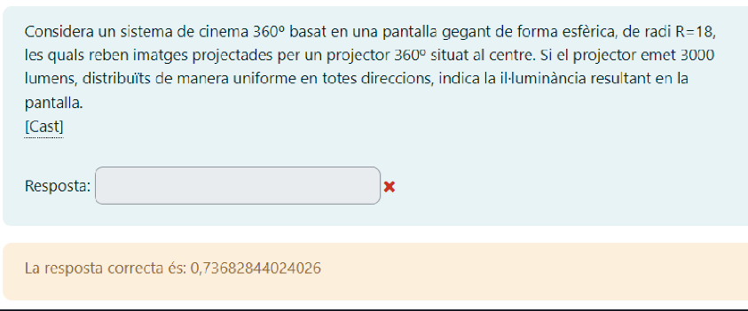

> **Dades:**
> * Radi ($R$) = $18$
> * Flux ($\Phi$) = $3000$ lumens
> * Distribució uniforme (tota l'esfera)
>
> **Pregunta:** Indica la il·luminància resultant ($E$).

**Pas 1: Calcular l'Àrea de la pantalla (Esfera)**
$$A = 4 \cdot \pi \cdot (18)^2$$
$$A = 4 \cdot \pi \cdot 324$$
$$A = 1296 \cdot \pi \approx 4071.504$$

**Pas 2: Calcular la Il·luminància**
$$E = \frac{3000}{1296 \cdot \pi}$$

**Càlcul final:**
$$E \approx 0.736828... \text{ lux}$$

**Solució de l'exercici:**
* **0.73682844024026**

<hr style="border: 15px solid blue;">


## 11. Tests de Fragment: Stencil i Depth (La Lògica de Buffers)

> **Pregunta original per cercar:**
> "Per un determinat pixel (x,y), els valors al frame buffer són: depthBuffer[x,y]=0.5, stencilBuffer[x,y]=4... glStencilTest(GL_ALWAYS, 6, 255)... glStencilOp(GL_ZERO, GL_INCR, GL_REPLACE)"

**Concepte Clau (Distingir els Valors)**

Abans de començar, és vital no barrejar els números:
1.  **Valor al Stencil Buffer ($4$):** És el que hi ha "pintat" actualment a la memòria.
2.  **Valor de Referència ($6$):** És el número que nosaltres proposem al test (`glStencilTest`). Si fem un `GL_REPLACE`, aquest és el valor que escriurem.
3.  **Valor al Depth Buffer ($0.5$):** La profunditat del píxel antic.
4.  **Valor Z del Fragment ($0.6$):** La profunditat del píxel nou.

---

### Teoria: L'Arbre de Decisió (Quin paràmetre agafo?)

La funció és `glStencilOp(sfail, dpfail, dppass)`.
Imagina que tens 3 cartes a la mà. Només en pots jugar una segons què passi als controls de seguretat.

* **1a Carta (`sfail` - GL_ZERO):** Es juga si et tomben al primer control (Stencil).
* **2a Carta (`dpfail` - GL_INCR):** Es juga si passes el primer control, però et tomben al segon (Depth).
* **3a Carta (`dppass` - GL_REPLACE):** Es juga si passes tots dos controls (Èxit total).

**Diagrama de Flux:**

1.  **STENCIL TEST:** ¿Passa?
    * **NO:** $\rightarrow$ Aplica la **1a Opció** (`GL_ZERO`). *Fi.*
    * **SÍ:** $\rightarrow$ Continua al Depth Test.
        * **DEPTH TEST:** ¿Passa? ($Z_{nou} < Z_{vell}$)
            * **NO:** $\rightarrow$ Aplica la **2a Opció** (`GL_INCR`). *Fi.*
            * **SÍ:** $\rightarrow$ Aplica la **3a Opció** (`GL_REPLACE`). *Fi.*


Exacte, ho has intuït molt bé, però **no són les úniques opcions**. N'hi ha 8 en total (les típiques comparacions matemàtiques).

Per saber si el Stencil falla o no, has de mirar el **primer paràmetre** de la funció `glStencilTest(funcio, ref, mask)`.

Aquesta funció compara dos valors:

1. **Ref:** El valor de referència (el que tu poses a la funció, ex: 6).
2. **Buffer:** El valor que ja hi ha guardat al píxel (ex: 4).

### La Llista Completa (Els 8 Casos)

Aquí tens la "xuleta" per saber quan passa (és True) i quan falla (és False):

| Funció (`func`) | Què significa? | Resultat en el teu exemple (Ref=6 vs Buffer=4) |
| --- | --- | --- |
| `GL_ALWAYS` | **Sempre PASSA**. Ignora els números. | **PASSA** |
| `GL_NEVER` | **Sempre FALLA**. Ignora els números. | **FALLA** |
| `GL_LESS` | Passa si `Ref < Buffer` | Falla ( és fals) |
| `GL_GREATER` | Passa si `Ref > Buffer` | **PASSA** ( és cert) |
| `GL_LEQUAL` | Passa si `Ref <= Buffer` | Falla |
| `GL_GEQUAL` | Passa si `Ref >= Buffer` | **PASSA** |
| `GL_EQUAL` | Passa si `Ref == Buffer` | Falla () |
| `GL_NOTEQUAL` | Passa si `Ref != Buffer` | **PASSA** |

### Resum ràpid

* Si veus **`GL_ALWAYS`**: No calculars res. Passa directe a la següent porta (Depth Test).
* Si veus **`GL_NEVER`**: No calculis res. Et tomben a la primera porta (executes `sfail`).
* Si veus qualsevol altra cosa (**`GL_LESS`**, **`GL_EQUAL`**, etc.): Has de comparar el número que et donen al test (ref) amb el que et diuen que hi ha al buffer.

---

### Resolució de l'Exercici Pas a Pas

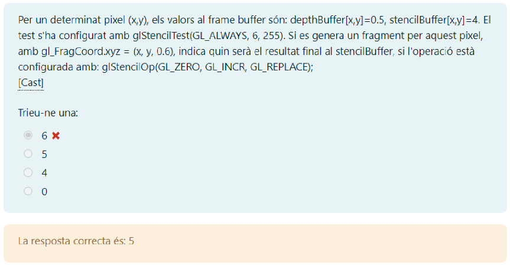

> **Situació:**
> * Test: `GL_ALWAYS` (Sempre diem que SÍ).
> * Profunidat: $0.6$ (Nou) vs $0.5$ (Vell). El $0.6$ és més gran $\to$ Està darrere $\to$ **Falla**.
> * Buffer Actual: $4$.
> * Referència: $6$.

**Anàlisi del Camí:**
1.  **Stencil Test:** Com que és `GL_ALWAYS`, **PASSA**. (Descartem la 1a opció).
2.  **Depth Test:** $0.6 > 0.5$. El nou objecte està tapat. **FALLA**. (Descartem la 3a opció).
3.  **Conclusió:** Ens quedem amb la **2a Opció** del mig: `GL_INCR`.

---

### Què hagués passat en cada cas? (Simulació)

Aquí tens el càlcul per a les tres possibilitats, perquè vegis d'on surten els números:

**CAS A: Si haguéssim agafat la 1a opció (`GL_ZERO`)**
* *Quan passaria?* Si el `glStencilTest` hagués fallat (ex: `GL_NEVER`).
* *Acció:* Posar el buffer a 0.
* *Resultat:* **0**

**CAS B: Si haguéssim agafat la 2a opció (`GL_INCR`) [EL NOSTRE CAS]**
* *Quan passa?* Stencil OK, però Depth KO (objecte tapat).
* *Acció:* Agafar el valor que ja teníem al buffer ($4$) i sumar-li 1.
* *Càlcul:* $4 + 1 = 5$.
* *Resultat:* **5**

**CAS C: Si haguéssim agafat la 3a opció (`GL_REPLACE`)**
* *Quan passaria?* Si l'objecte estigués davant ($Z=0.4$) i es pintés correctament.
* *Acció:* Substituir el valor del buffer pel **Valor de Referència** definit al test ($6$).
* *Càlcul:* El buffer passa a valer $6$ directament.
* *Resultat:* **6**

> **Solució Final:** Com que estem al Cas B, la resposta és **5**.

<hr style="border: 15px solid blue;">

## 12. Transformacions: La Trampa de la W (Divisió Homogènia)

> **Pregunta original per cercar:**
> "El punt 3D que resulta d'aplicar la transformació representada per la matriu... al punt (24.00, 8.00, 16.00, 4.00) és..."

**Concepte Clau (No t'oblidis de dividir!)**

En gràfics per ordinador, treballem amb coordenades de 4 dimensions $(x, y, z, w)$ per poder fer translacions amb matrius.
Quan et demanen el **"Punt 3D resultant"** (Cartesià), no n'hi ha prou amb multiplicar. Has de fer dos passos:

1.  **Multiplicació:** $\text{Matriu} \times \text{Punt}$
2.  **Normalització (Divisió per W):** Dividir tots els components pel quart número ($w$).

$$P_{final} = \left( \frac{x'}{w'}, \frac{y'}{w'}, \frac{z'}{w'} \right)$$

---

### Teoria / Mètode de resolució

Segueix sempre aquests dos passos:

**Pas 1: Multiplicar la Matriu pel Vector**
Mirem la matriu de l'exercici. És gairebé una matriu identitat, però té un $4$ a la segona posició (eix Y).
$$
\begin{bmatrix}
1 & 0 & 0 & 0 \\
0 & \mathbf{4} & 0 & 0 \\
0 & 0 & 1 & 0 \\
0 & 0 & 0 & 1
\end{bmatrix}
\times
\begin{bmatrix}
24 \\
8 \\
16 \\
4
\end{bmatrix}
$$
* $X = 1 \cdot 24 = 24$
* $Y = 4 \cdot 8 = \mathbf{32}$
* $Z = 1 \cdot 16 = 16$
* $W = 1 \cdot 4 = \mathbf{4}$

Resultat temporal (Homogeni): **(24, 32, 16, 4)**

**Pas 2: Passar a 3D (Dividir per W)**
Aquí és on vas fallar a la resposta marcada. El punt té una $W=4$. Per saber on cau realment a l'espai 3D, has de dividir-ho tot per 4.

* $X_{final} = 24 / 4 = \mathbf{6}$
* $Y_{final} = 32 / 4 = \mathbf{8}$
* $Z_{final} = 16 / 4 = \mathbf{4}$

---

### Exercici

> **Dades:**
> Matriu: Escala la Y per 4.
> Punt d'entrada: $(24, 8, 16, \mathbf{4})$
>
> **Pregunta:** Quin és el punt 3D final?

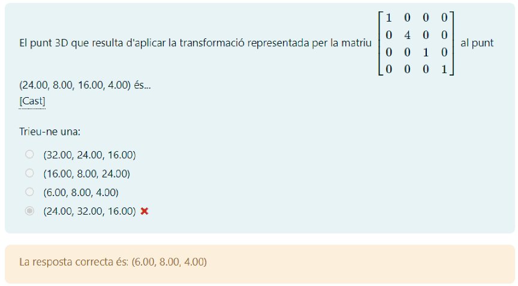


<hr style="border: 15px solid blue;">

## 13. Matriu de Projecció Perspectiva (El Truc de l'Última Fila)

> **Pregunta original per cercar:**
> "Selecciona la única matriu de projecció (projectionMatrix) plausible per a una càmera perspectiva..."

**Concepte Clau (La Deformació de la W)**

En gràfics 3D hi ha dos tipus principals de càmeres:
1.  **Ortogràfica:** Les línies paral·leles es mantenen paral·leles. Els objectes no es fan petits amb la distància.
2.  **Perspectiva:** Les línies convergeixen en un punt de fuga. Els objectes llunyans es veuen més petits.

Per aconseguir l'efecte de "fer-se petit", l'ordinador divideix les coordenades per la profunditat ($Z$).
Perquè això passi automàticament, la matriu ha de moure la $Z$ al lloc de la $W$ (el quart component).

**La Regla d'Or Visual:**
* Si l'última fila és `0 0 0 1` $\rightarrow$ És **Ortogràfica** (o una simple rotació/translació).
* Si l'última fila és `0 0 -1 0` $\rightarrow$ És **Perspectiva**.

---

### Teoria / Mètode de resolució

Només cal que miris la **4a fila** (la de baix de tot) de cada matriu.

En una matriu de projecció perspectiva estàndard (com `gluPerspective`), la coordenada $W_{clip}$ ha de ser igual a $-Z_{view}$ (per poder fer la divisió després).
Això s'aconsegueix posant un **-1** a la columna de la Z (3a columna) i un **0** a la columna de la W (4a columna).

L'estructura típica és així:
$$
\begin{bmatrix}
f/aspect & 0 & 0 & 0 \\
0 & f & 0 & 0 \\
0 & 0 & \frac{Z+N}{N-F} & \frac{2FN}{N-F} \\
\mathbf{0} & \mathbf{0} & \mathbf{-1} & \mathbf{0}
\end{bmatrix}
$$

---

### Exercici

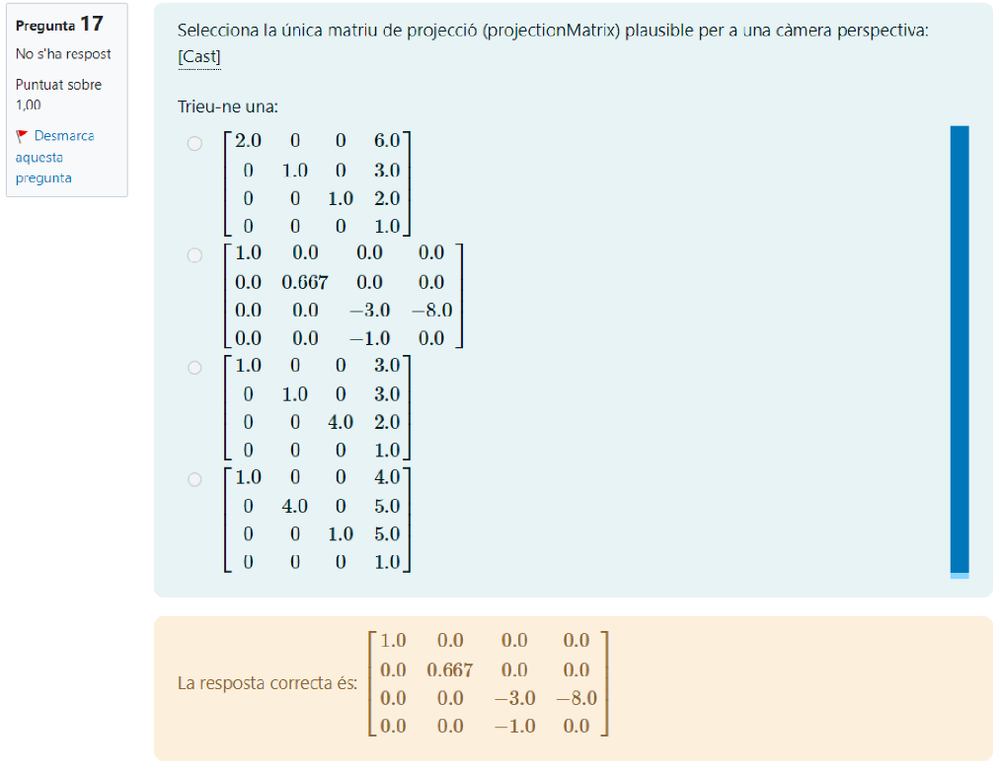


<hr style="border: 15px solid blue;">

## 14. Transformacions Inverses i Espais de Coordenades

> **Pregunta original per cercar:**
> "Tria l'espai de coordenades en que ha d'estar P per tal que la transformació modelMatrixInverse*P tingui sentit"


---

### Teoria / Mètode de resolució

El pipeline gràfic estàndard funciona en aquest ordre:
$$\text{Object Space} \xrightarrow{\text{Model Matrix}} \mathbf{World Space} \xrightarrow{\text{View Matrix}} \text{Eye Space}$$

1.  **La `modelMatrix` normal:**
    * **Entrada:** Object Space.
    * **Sortida:** World Space.

2.  **La `modelMatrixInverse` (La inversa):**
    * Fa el camí invers exactament.
    * **Entrada:** **World Space**.
    * **Sortida:** Object Space.

Per tant, si vols multiplicar `modelMatrixInverse * P`, el punt $P$ ha de ser, per força, a l'espai d'entrada d'aquesta matriu.

---

### Exercici

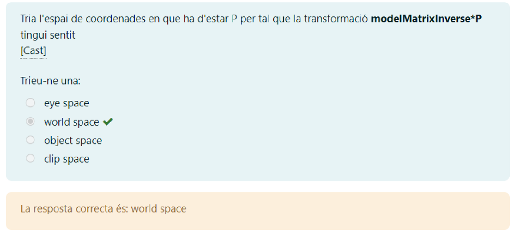

> **Operació:** `modelMatrixInverse * P`
> **Pregunta:** En quin espai ha d'estar $P$?

**Anàlisi Lògica:**
* La matriu inversa serveix per *desfer* la transformació de model.
* La transformació de model deixa els punts al **Món** (World).
* Per tant, per desfer-la, hem d'agafar el punt del **Món**.

**Per què les altres són falses?**
* *Object space:* Aquí és on estaríem si utilitzéssim la `modelMatrix` normal (anada), no la inversa.
* *Eye space:* Això seria si estiguéssim desfent la `viewMatrix`.
* *Clip space:* Això és al final de tot del pipeline.

**Solució de l'exercici:**
* **world space**

<hr style="border: 15px solid blue;">

## 15. Estimadors i Variància (El Soroll Visual)

> **Pregunta original per cercar:**
> "Un estimador de la il·luminació global amb molta variància es distingeix per..."

**Concepte Clau (Variància = Soroll)**


En el món del renderitzat realista (com el Ray Tracing o Path Tracing), calculem la llum llançant raigs aleatoris (mètode de Monte Carlo).
Imagina que tires dards a una diana per calcular la puntuació mitjana.
* **Baixa Variància:** Tots els dards cauen a prop del centre. El resultat és fiable ràpidament.
* **Alta Variància:** Els dards cauen dispersos per tot arreu. Necessites tirar milions de dards perquè la mitjana sigui correcta. Si en tires pocs, el resultat és un caos.

Visualment, en una imatge, aquesta "dispersió" o incertesa es tradueix en **GRANOLLERS** o **SOROLL** (punts blancs i negres que ballen).

---

### Teoria / Mètode de resolució

Quan un algorisme de càlcul de llum (estimador) té "molta variància", vol dir que per a un mateix píxel, cada raig que llances et torna un valor molt diferent (un et diu "molta llum", l'altre "foscor total").

El resultat final a la pantalla és una imatge plena de "gra" (com una foto feta de nit amb el mòbil). Per arreglar-ho, tens dues opcions:
1.  Llançar infinits raigs (triga hores/dies).
2.  Aplicar un filtre per suavitzar la imatge (**Noise Filtering** o Denoising).

---

### Exercici

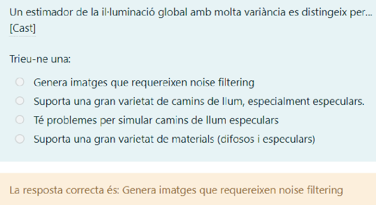

> **Pregunta:** Què distingeix un estimador amb molta variància?

**Anàlisi de les opcions:**
* **"Genera imatges que requereixen noise filtering":** **CORRECTA.** Com que té molta variància, la imatge surt bruta (sorollosa) i necessites netejar-la.
* *"Suporta una gran varietat de camins...":* Això depèn de la complexitat de l'algorisme, no necessàriament de la variància.
* *"Té problemes per simular camins...":* Això seria un problema de "biaix" (bias) o de falta de capacitat, no de variància.

**Solució de l'exercici:**
* **Genera imatges que requereixen noise filtering**

<hr style="border: 15px solid blue;">## 17. Translació i Divisió Homogènia

> **Pregunta original per cercar:**
> "El punt 3D que resulta d'aplicar la transformació representada per la matriu... al punt (18.00, 6.00, 18.00, 3.00) és..."

**Concepte Clau (Translació Homogènia)**


Aquesta matriu té números a l'última columna. Això indica una **Translació** (moure l'objecte).
$$
\begin{bmatrix}
1 & 0 & 0 & T_x \\
0 & 1 & 0 & T_y \\
0 & 0 & 1 & T_z \\
0 & 0 & 0 & 1
\end{bmatrix}
$$
Però atenció: Com que el punt d'entrada té una $W=3$, aquesta $W$ afectarà la translació quan multipliquem matriu per vector. I al final, com sempre, **hem de dividir per W**.

---

### Teoria / Mètode de resolució

**Pas 1: Multiplicació (Fila per Columna)**

$$
\begin{bmatrix}
1 & 0 & 0 & \mathbf{1} \\
0 & 1 & 0 & \mathbf{3} \\
0 & 0 & 1 & \mathbf{4} \\
0 & 0 & 0 & 1
\end{bmatrix}
\times
\begin{bmatrix}
18 \\
6 \\
18 \\
\mathbf{3}
\end{bmatrix}
$$

Calculem component a component:
* **X:** $(1 \cdot 18) + (1 \cdot 3) = 18 + 3 = \mathbf{21}$
* **Y:** $(1 \cdot 6) + (3 \cdot 3) = 6 + 9 = \mathbf{15}$
* **Z:** $(1 \cdot 18) + (4 \cdot 3) = 18 + 12 = \mathbf{30}$
* **W:** $(1 \cdot 3) = \mathbf{3}$

Resultat intermedi (Homogeni): **(21, 15, 30, 3)**

**Pas 2: La Divisió Homogènia (Normalitzar)**
Per obtenir el punt 3D real, dividim tot per la $W$ resultant ($3$).

* $X_{final} = 21 / 3 = \mathbf{7}$
* $Y_{final} = 15 / 3 = \mathbf{5}$
* $Z_{final} = 30 / 3 = \mathbf{10}$

---

### Exercici

> **Resultat final:**
> El punt 3D és **(7.00, 5.00, 10.00)**

**Per què les altres són falses?**
* *(21.00, 15.00, 30.00)*: Aquesta és la trampa habitual. És el resultat de la multiplicació **abans** de dividir per W. Si oblides l'últim pas, marques aquesta i falles.

**Solució de l'exercici:**
* **(7.00, 5.00, 10.00)**

<hr style="border: 15px solid blue;">

D'acord! Simplifiquem-ho al màxim. Si només tens aquests dos casos (que són els més habituals als exàmens), aquí tens la solució pas a pas per a cadascun, utilitzant les dades exactes de les teves imatges.

El secret en **tots dos** és el mateix: **Primer calcula, després divideix per W.**

---

### CAS 1: TRANSLACIÓ (Moure) - Pregunta 7

**Com la reconeixes?**
Té números a l'última columna (la de la dreta del tot). En el teu cas: **1, 3, 4**.

**Dades:**

* Punt d'entrada: 
* Translació: 

**PAS 1: Calcula el nou punt (Sumant el pes)**
Aquí la trampa és que has de multiplicar la translació per la **W (3)** abans de sumar-la.

* **X:** 18 + (1 × 3) = **21**
* **Y:** 6 + (3 × 3) = 6 + 9 = **15**
* **Z:** 18 + (4 × 3) = 18 + 12 = **30**
* **W:** Es queda igual = **3**

> Resultat temporal: 

**PAS 2: Divideix per W (El pas final)**
Agafa els resultats i divideix-los per 3.

* X: 
* Y: 
* Z: 

**SOLUCIÓ:** **(7.00, 5.00, 10.00)**

---

### CAS 2: ESCALAT (Fer gran/petit) - Pregunta 16

**Com la reconeixes?**
Té un número diferent d'1 a la diagonal (la línia que baixa). En el teu cas: un **4** a la segona posició (Y).

**Dades:**

* Punt d'entrada: 
* Factor d'escala: Multiplica la **Y per 4**.

**PAS 1: Calcula el nou punt (Multiplicant)**
Aquí és més directe, només afectem la coordenada que té el número a la matriu.

* **X:** 24 × 1 = **24** (No canvia)
* **Y:** 8 × 4 = **32** (Aquesta es multiplica)
* **Z:** 16 × 1 = **16** (No canvia)
* **W:** Es queda igual = **4**

> Resultat temporal:   *Compte! Molta gent marca això i falla.*

**PAS 2: Divideix per W (El pas final)**
Agafa els resultats i divideix-los per 4.

* X: 
* Y: 
* Z: 

**SOLUCIÓ:** **(6.00, 8.00, 4.00)**

---

### Resum de la "Xuleta"

1. **Translació:** Sumes  a la coordenada original.
2. **Escalat:** Multipliques la coordenada pel número de la diagonal.
3. **SEMPRE AL FINAL:** Divideix tots els resultats (X, Y, Z) pel valor **W** que tenies al principi.

<hr style="border: 15px solid blue;">

## 18. Ray Tracing: Càlcul de Shadow Rays (Raigs d'Ombra)

> **Pregunta original per cercar:**
> "Tenim una escena tancada que conté 49 objectes difosos i 3 llums puntuals. Volem generar una imatge de 640 x 1080 pixels amb Ray Tracing clàssic. Quants shadow rays cal llançar?"

**Concepte Clau (Un píxel, Tres preguntes)**


En el **Ray Tracing Clàssic**, el procés bàsic per a objectes **difosos** (mate, sense brillantor ni transparència) és molt mecànic:

1.  **Raig Primari:** Surt de la càmera i passa per un píxel.
2.  **Impacte:** Xoca contra una paret o objecte (com que l'escena és "tancada", assumim que **tots** els píxels xoquen contra alguna cosa).
3.  **Shadow Rays (La pregunta):** Un cop hem xocat, hem de preguntar: *"Estic a l'ombra?"*. Per saber-ho, llancem un raig directament cap a **CADA** font de llum.
    * Si tenim 3 llums $\to$ llancem 3 shadow rays per cada xoc.

> **La Trampa:** El nombre d'objectes (49) no importa per a aquest càlcul. Només importa quants píxels tenim i quantes llums hi ha.

---

### Teoria / Mètode de resolució

La fórmula és una simple multiplicació:

$$\text{Shadow Rays Totals} = (\text{Píxels Totals}) \times (\text{Nombre de Llums})$$

On:
$$\text{Píxels Totals} = \text{Amplada} \times \text{Alçada}$$

*Nota: Com que els objectes són difosos, no hi ha raigs secundaris (reflexió/refracció), així que el càlcul s'acaba aquí.*

---

### Exercici


> **Dades:**
> * Resolució: $640 \times 1080$
> * Llums: $3$
> * Objectes: $49$ (Dada irrellevant)
> * Tipus: Escena tancada (100% d'impactes)

**Pas 1: Calcular quants píxels (i per tant, quants impactes primaris) tenim.**
$$\text{Píxels} = 640 \times 1080 = 691.200$$

**Pas 2: Calcular els Shadow Rays.**
Per a cadascun d'aquests $691.200$ punts, hem de comprovar les $3$ llums.
$$\text{Shadow Rays} = 691.200 \times 3$$

**Càlcul Final:**
$$691.200 \times 3 = 2.073.600$$

**Solució de l'exercici:**
* **2073600**

<hr style="border: 15px solid blue;">

## 19. Shadow Mapping: Matriu de Transformació (De l'Objecte a la Textura)

> **Pregunta original per cercar:**
> "Indica la matriu que s'utilitza a la tècnica de shadow mapping per obtenir les coordenades de textura (s,t,p,q) d'un vèrtex, si el vèrtex es troba en object space."

**Concepte Clau (El Viatge del Vèrtex)**


El **Shadow Mapping** consisteix a mirar l'escena des del punt de vista de la llum. Per saber si un píxel està a l'ombra, hem de transformar la seva posició 3D en una coordenada 2D dins del mapa d'ombres (la textura de profunditat).

El repte és que les coordenades de projecció estàndard van de **-1 a 1** (Clip Space), però les textures es llegeixen de **0 a 1**.
Per tant, al final de tot, cal fer una "petita trampa" matemàtica (Escalar i Traduir) per adaptar el rang.

---

### Teoria / Mètode de resolució

Hem de construir la cadena completa de transformacions. Recorda que en matrius (column-major), les operacions s'escriuen d'esquerra a dreta, però s'apliquen de **dreta a esquerra**.

L'ordre lògic del viatge és:
1.  **Object Space $\to$ World Space:** Necessitem la matriu **Model ($M$)**. *(Dada clau de l'enunciat: el vèrtex comença en object space).*
2.  **World Space $\to$ Light Space:** Necessitem la matriu de **Vista de la Llum ($V$)**.
3.  **Light Space $\to$ Clip Space:** Necessitem la matriu de **Projecció de la Llum ($P$)**.
    * *Ara tenim coordenades normalitzades entre [-1, 1].*
4.  **Clip Space $\to$ Texture Space [0, 1]:**
    * Primer dividim per 2 (fem petit): **Escalat $S(0.5)$**. $\to$ Rang [-0.5, 0.5].
    * Després sumem 0.5 (movem al centre): **Translació $T(0.5)$**. $\to$ Rang [0, 1].

**La Fórmula Final:**
$$Matriu = T(0.5) \cdot S(0.5) \cdot P \cdot V \cdot M$$

---

### Exercici

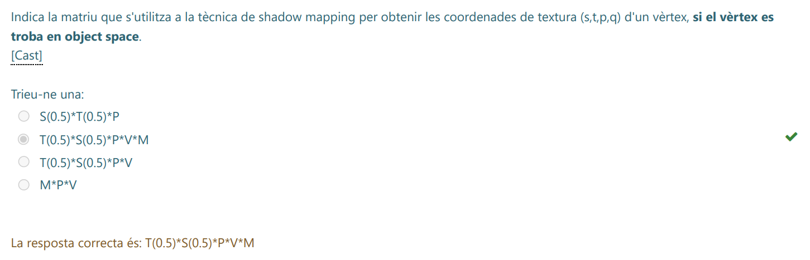


> **Condició:** El vèrtex es troba en **Object Space**.

Analitzem les opcions:

1.  **$S(0.5)*T(0.5)*P$**: Incorrecte. L'ordre S i T està girat, i falten V i M.
2.  **$T(0.5)*S(0.5)*P*V*M$**: **CORRECTA.**
    * $M$: Mou l'objecte al món.
    * $V$: El posa davant de la llum.
    * $P$: El projecta.
    * $S(0.5) \cdot T(0.5)$: El converteix a rang de textura [0,1].
3.  **$T(0.5)*S(0.5)*P*V$**: Incorrecte. Falta la $M$. Aquesta seria correcta si l'enunciat digués que el vèrtex ja és en *World Space*.
4.  **$M*P*V$**: Incorrecte. L'ordre és absurd i falta l'ajust de coordenades de textura.

**Solució de l'exercici:**
* **T(0.5)*S(0.5)*P*V*M**

<hr style="border: 15px solid blue;">


## 20. Refracció i Llei de Snell (El paràmetre Eta)

> **Pregunta original per cercar:**
> "Indica quina és l'opció més adient per a completar aquest codi... vec3 T = refract(ray.dir, Nhit, ______ );"

**Concepte Clau (La Ràtio de Refracció)**


Quan un raig de llum travessa la frontera entre dos materials (per exemple, de l'aire a l'aigua), es desviu. Aquest fenomen es diu **Refracció**.
La direcció del nou raig ($T$) es calcula utilitzant la **Llei de Snell**:
$$n_1 \cdot \sin(\theta_1) = n_2 \cdot \sin(\theta_2)$$

En programació gràfica (GLSL/C++), la funció `refract(I, N, eta)` ja fa tots els càlculs vectorials per nosaltres, però necessita un paràmetre clau: **eta ($\eta$)**.

Aquest paràmetre `eta` és sempre la **divisió** (ràtio) entre l'índex de refracció d'on venim i l'índex de refracció on entrem.

$$\eta = \frac{n_{origen}}{n_{desti}}$$

---

### Teoria / Mètode de resolució

Analitzem les variables del codi per identificar qui és qui:

1.  **`mu` (paràmetre de la funció):** És l'índex de refracció del medi pel qual **estava viatjant** el raig fins ara (Origen, $n_1$).
2.  **`muHit` (variable de l'intersecció):** És l'índex de refracció del **nou material** que acabem de tocar (Destí, $n_2$).

Per calcular el vector de transmissió $T$ (el raig refractat), hem de dir-li a la funció la relació entre aquests dos números.

**La Fórmula:**
$$\text{eta} = \frac{\text{Medi Actual}}{\text{Medi Nou}} = \frac{\text{mu}}{\text{muHit}}$$

---

### Exercici

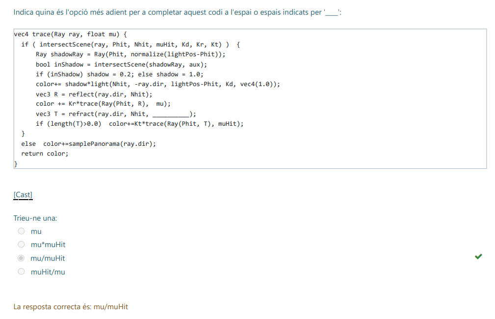

> **Codi:** `vec3 T = refract(ray.dir, Nhit, ________ );`

**Anàlisi de les opcions:**
* `mu`: Incorrecte. La funció espera una ràtio, no un índex absolut.
* `mu * muHit`: Incorrecte. La llei de Snell treballa amb quocients, no productes.
* **`mu / muHit`**: **CORRECTA.** Representa la ràtio $\frac{n_1}{n_2}$ necessària per a la fórmula estàndard.
* `muHit / mu`: Incorrecte. Això seria per sortir del material, no per entrar-hi (o si la funció esperés l'invers, però l'estàndard és origen/destí).

**Solució de l'exercici:**
* **mu/muHit**

<hr style="border: 15px solid blue;">

## 21. Coordenades Homogènies (Equivalència)

> **Pregunta original per cercar:**
> "Donat el punt (1.00, 3.00, 6.00), una representacio equivalent en coordenades homogenies es..."

**Concepte Clau (L'Escalat de la W)**


En gràfics per ordinador, un punt 3D $(x, y, z)$ no té una única representació en coordenades homogènies $(X, Y, Z, W)$, sinó que en té **infinites**.
Totes representen el mateix punt sempre que la proporció sigui la mateixa.

La regla bàsica és:
$$\text{Punt 3D} = \left( \frac{X}{W}, \frac{Y}{W}, \frac{Z}{W} \right)$$

Això vol dir que si multipliques **tots** els components (inclosa la W) pel mateix número ($k$), el punt no canvia de lloc.
$$(x, y, z, 1) \equiv (k \cdot x, \quad k \cdot y, \quad k \cdot z, \quad k \cdot 1)$$

---

### Teoria / Mètode de resolució

Per saber quina opció és correcta, has de fer la **prova de la divisió** (normalització) amb cada opció. Divideix els tres primers números pel quart ($W$). Si obtens el punt original $(1, 3, 6)$, és la bona.

El punt original és: **(1, 3, 6)**.

---

### Exercici

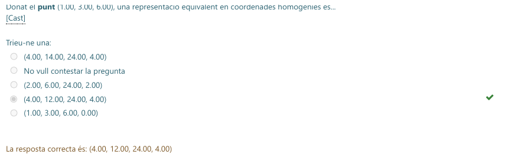

Analitzem les opcions una per una:

1.  **Opció (4.00, 14.00, 24.00, 4.00):**
    * $X = 4/4 = 1$ (Bé)
    * $Y = 14/4 = 3.5$ (**Malament**, hauria de ser 3)

2.  **Opció (2.00, 6.00, 24.00, 2.00):**
    * $X = 2/2 = 1$ (Bé)
    * $Y = 6/2 = 3$ (Bé)
    * $Z = 24/2 = 12$ (**Malament**, hauria de ser 6)

3.  **Opció (4.00, 12.00, 24.00, 4.00):** [**CORRECTA**]
    * $X = 4/4 = \mathbf{1}$
    * $Y = 12/4 = \mathbf{3}$
    * $Z = 24/4 = \mathbf{6}$
    * *Nota:* Aquesta opció és simplement el punt base $(1, 3, 6, 1)$ multiplicat tot per 4.

4.  **Opció (1.00, 3.00, 6.00, 0.00):**
    * $W=0$. Això no és un punt, és un **vector** (una direcció a l'infinit). No pots dividir per zero.

**Solució de l'exercici:**
* **(4.00, 12.00, 24.00, 4.00)**

<hr style="border: 15px solid blue;">

## 22. Càlcul del LoD (Level of Detail) en Textures

> **Pregunta original per cercar:**
> "Per a un determinat fragment, les derivades parcials... tenen aquests valors... = 64... Quin és el LoD més adient..."

**Concepte Clau (La Piràmide de Mipmaps)**


El **Mipmapping** és una tècnica per evitar que les textures "brillin" o facin soroll quan estan lluny. Consisteix a tenir versions de la imatge cada cop més petites (meitat d'amplada i alçada).
* Nivell 0: Imatge original ($1:1$).
* Nivell 1: Meitat de mida ($2:1$).
* Nivell 2: Quart de mida ($4:1$).
* Etc.

El **LoD (Level of Detail)** ens diu a quin "pis" de la piràmide hem d'anar a buscar el color.
Si un píxel de pantalla ocupa **molts** píxels de la textura (texels), necessitem un LoD alt.

---

### Teoria / Mètode de resolució

Per calcular el nivell, hem de mirar la "taxa de canvi" (les derivades).
Si la derivada és **$X$**, vol dir que 1 píxel de pantalla salta sobre **$X$** píxels de la textura.

La fórmula per trobar el nivell és el **Logaritme en base 2** d'aquest salt màxim:

$$LoD = \log_2(\max(\text{derivades}))$$

Simplement ens preguntem: **"A quina potència he d'elevar el 2 per obtenir aquest número?"**

---

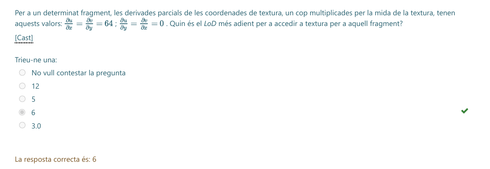

### Exercici

> **Dades:**
> * Derivades: $\frac{\partial u}{\partial x} = 64$.
> * (Les altres són 0, així que el màxim és 64).

**El Raonament:**
El valor és **64**. Això vol dir que hem de comprimir 64 texels en 1 píxel.
Busquem la potència de 2:

* $2^1 = 2$
* $2^2 = 4$
* $2^3 = 8$
* $2^4 = 16$
* $2^5 = 32$
* $2^{\mathbf{6}} = \mathbf{64}$

Com que $2^6 = 64$, el nivell de detall (LoD) és **6**.

**Solució de l'exercici:**
* **6**

<hr style="border: 15px solid blue;">

## 23. Càlcul de LOD en GLSL (La funció `length`)

> **Pregunta original per cercar:**
> "Indica quina és l'opció més adient per a completar aquest codi... float rho = max(________(dFdx(uv)), ________(dFdy(uv)));"

**Concepte Clau (La Mida del Vector)**


Per calcular quin nivell de Mipmap (LOD) necessitem, hem de saber "quants texels de textura caben dins d'un píxel de pantalla".
En GLSL, les funcions `dFdx(uv)` i `dFdy(uv)` ens diuen quant canvien les coordenades de textura quan ens movem un píxel a la dreta (X) o un píxel avall (Y).

El problema és que `uv` és un vector (`vec2`). Per tant, `dFdx(uv)` ens retorna un **vector de direcció** que ens diu cap a on i quant es mou la textura.
Per comparar magnituds (qui és més gran?), necessitem convertir aquest vector en un sol número (un escalar) que representi la seva **longitud** o distància.

---

### Teoria / Mètode de resolució

La fórmula matemàtica per estimar el factor de compressió ($\rho$) és agafar la longitud màxima dels vectors derivats:

$$\rho = \max\left( \left\| \frac{\partial UV}{\partial x} \right\|, \left\| \frac{\partial UV}{\partial y} \right\| \right)$$

En programació d'ombres (GLSL), la funció que calcula la norma o mòdul d'un vector ($||v|| = \sqrt{x^2 + y^2}$) s'anomena **`length()`**.

L'estructura lògica és:
1.  Calculem el vector de canvi en X: `dFdx(uv)`
2.  Calculem la seva mida: `length(...)`
3.  Fem el mateix per la Y.
4.  Ens quedem amb el més gran (`max`).

---

### Exercici

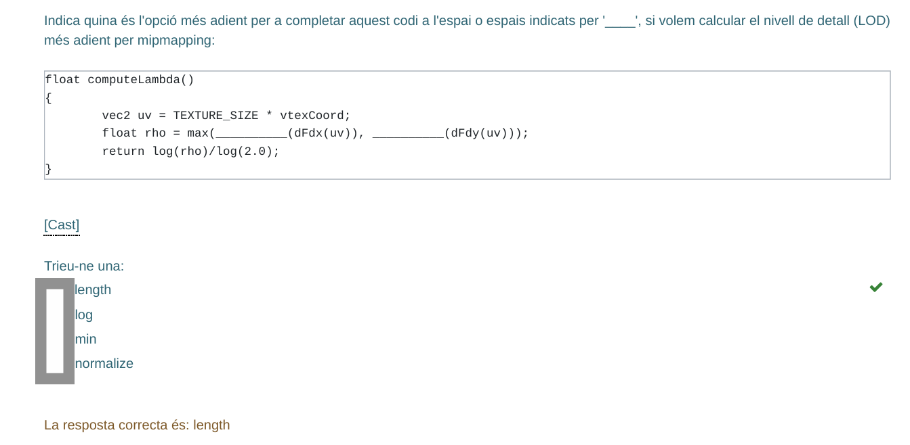

> **Codi a completar:**
> `float rho = max(________(dFdx(uv)), ________(dFdy(uv)));`

**Anàlisi de les opcions:**
1.  **`length`**: [**CORRECTA**]. Agafa el `vec2` que retorna la derivada i calcula la seva longitud (float). Això és exactament el que necessitem per saber la "taxa de canvi".
2.  `log`: Això és una operació matemàtica per escalar el resultat final, no per mesurar un vector.
3.  `min`: No tindria sentit aquí. Busquem la longitud del vector, no el mínim dels seus components.
4.  `normalize`: Això convertiria el vector en longitud 1. Destruiria la informació de la mida, que és justament el que necessitem per saber el nivell de detall!

**Solució de l'exercici:**
* **length**

<hr style="border: 15px solid blue;">

## 24. Nivells de Mipmapping (La Piràmide Completa)

> **Pregunta original per cercar:**
> "Si volem crear una piràmide de mipmapping completa a partir d'una textura de 32x32 texels, quants nivells de detall (LoD) hem de definir?"

**Concepte Clau (Dividir entre 2 fins a arribar a 1)**


Una **piràmide de mipmapping completa** conté la textura original i totes les reduccions successives (dividint l'amplada i alçada per 2) fins a arribar a la textura més petita possible: un sol píxel ($1 \times 1$).

Per saber quants nivells hi ha en total, simplement has de comptar quantes vegades pots dividir la mida per 2, **més l'original**.

---

### Teoria / Mètode de resolució

La fórmula ràpida és utilitzar el logaritme en base 2:
$$\text{Nivells Totals} = \log_2(\text{Mida}) + 1$$

El $+1$ és molt important perquè comptem el nivell 0 (l'original).

---

### Exercici

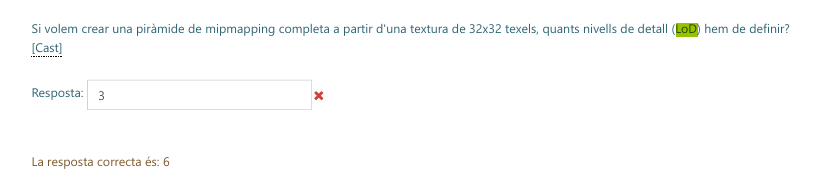

> **Dades:** Textura de $32 \times 32$.

Fem el compte **pas a pas** (reduint a la meitat):

1.  **Nivell 0:** $32 \times 32$ (Original)
2.  **Nivell 1:** $16 \times 16$
3.  **Nivell 2:** $8 \times 8$
4.  **Nivell 3:** $4 \times 4$
5.  **Nivell 4:** $2 \times 2$
6.  **Nivell 5:** $1 \times 1$ (Final)

Si els comptes, veuràs que hi ha **6 imatges** en total a la cadena.

**Càlcul matemàtic:**
$32$ és $2^5$.
Per tant, tenim $5$ passos de reducció.
$5 \text{ (reduccions)} + 1 \text{ (original)} = \mathbf{6}$.

**Solució de l'exercici:**
* **6**

<hr style="border: 15px solid blue;">

## 25. Càlcul Invers de Mipmaps (Trobant la Mida Original)

> **Pregunta original per cercar:**
> "El LOD 2 d'una textura té 256 x 128 texels. Quina mida té el LOD 0 d'aquesta mateixa textura?"

**Concepte Clau (Pujar i Baixar l'Escala)**


La piràmide de Mipmaps funciona sempre amb potències de 2:
* **Augmentar el LOD (0 $\to$ 1 $\to$ 2):** Fem la imatge més petita (Dividim per 2).
* **Disminuir el LOD (2 $\to$ 1 $\to$ 0):** Fem la imatge més gran (Multipliquem per 2).

En aquest exercici ens donen un nivell reduït (LOD 2) i ens demanen recuperar la mida original (LOD 0). Per tant, hem de fer el camí invers: **Multiplicar**.

---

### Teoria / Mètode de resolució

Si estàs al nivell $N$ i vols tornar al nivell $0$, has de multiplicar les dimensions per $2^N$.

$$\text{Mida Original} = \text{Mida Actual} \times 2^{(\text{Nivell Actual})}$$

O, més fàcil, anar pas a pas multiplicant per 2.

---

### Exercici

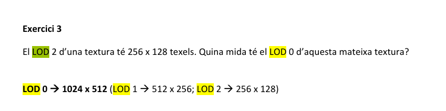

> **Dades:**
> * LOD 2 = $256 \times 128$
> * Objectiu: LOD 0

**Càlcul Pas a Pas (Marxa Enrere):**

1.  **Som a LOD 2:** $256 \times 128$.
    * *Per passar al nivell anterior (LOD 1), multipliquem per 2.*

2.  **Pas a LOD 1:**
    * Amplada: $256 \times 2 = 512$
    * Alçada: $128 \times 2 = 256$
    * Mida LOD 1: $512 \times 256$.

3.  **Pas a LOD 0 (Original):**
    * *Tornem a multiplicar per 2.*
    * Amplada: $512 \times 2 = \mathbf{1024}$
    * Alçada: $256 \times 2 = \mathbf{512}$

**Solució de l'exercici:**
* **1024 x 512**

<hr style="border: 15px solid blue;">


## 26. Generació Automàtica de Coordenades de Textura (Repetició)

> **Pregunta original per cercar:**
> "Volem texturar un polígon rectangular situat sobre el pla Z = 0. Sabem que el seu vèrtex mínim té coordenades (0,0,0), i el vèrtex màxim té coordenades (6, 2, 0)... indica l'opció..."

**Concepte Clau (La Regla de Tres de la Textura)**


Quan generem coordenades de textura automàticament usant **plans** (vectors $S$ i $T$), estem definint una equació lineal:
$$s = (S.x \cdot x) + (S.y \cdot y) + \dots$$
$$t = (T.x \cdot x) + (T.y \cdot y) + \dots$$

El secret és entendre què signifiquen els valors de coordenada de textura:
* $s=0 \to s=1$: Una còpia de la textura.
* $s=0 \to s=5$: **5 repeticions** de la textura.

Per tant, per trobar els valors del vector, només cal dividir les **Repeticions** per la **Mida** del polígon.
$$\text{Valor del Vector} = \frac{\text{Repeticions Visuals}}{\text{Mida Geomètrica}}$$

---

### Teoria / Mètode de resolució

**Pas 1: Analitzar la Geometria (Mides)**
L'enunciat diu que el rectangle va de $(0,0)$ a $(6,2)$.
* Amplada ($X$): $6$ unitats.
* Alçada ($Y$): $2$ unitats.

**Pas 2: Analitzar la Imatge Resultant (Repeticions)**
Compta quants cops apareix l'edifici original (la casella de dalt) en la imatge final de sota.
* **Horitzontalment:** Si comptes els blocs de finestres, veuràs que el patró es repeteix **5 vegades**.
* **Verticalment:** Es veuen clarament **3 pisos** (fileres de finestres).

**Pas 3: Calcular els Vectors (Regla de Tres)**

* **Vector S (Eix X - Horitzontal):**
    Volem que en $6$ metres de paret hi càpiguen $5$ repeticions.
    $$S.x = \frac{\text{Repeticions}}{\text{Mida}} = \frac{5}{6} = \mathbf{0.833...}$$
    El vector serà: `S = vec4(0.83, 0, 0, 0)` (només afecta a la X).

* **Vector T (Eix Y - Vertical):**
    Volem que en $2$ metres d'alçada hi càpiguen $3$ pisos.
    $$T.y = \frac{\text{Repeticions}}{\text{Mida}} = \frac{3}{2} = \mathbf{1.5}$$
    El vector serà: `T = vec4(0, 1.5, 0, 0)` (només afecta a la Y).

---

### Exercici


Busquem l'opció que tingui $0.83$ a la primera posició de la S i $1.5$ a la segona posició de la T.

**Anàlisi de les opcions:**
1.  `S=vec4(5.00...)`: Incorrecte.
2.  `S=vec4(5.00...)`: Incorrecte.
3.  `S=vec4(5.00...)`: Incorrecte.
4.  **`S=vec4(0.83, ...); T=vec4(0.00, 1.50, ...)`**: **CORRECTA.** Coincideix amb els càlculs ($5/6$ i $3/2$).

**Solució de l'exercici:**
* **S=vec4(0.83, 0.00, 0.00, 0.00); T=vec4(0.00, 1.50, 0.00, 0.00);**

<hr style="border: 15px solid blue;">

## 27. Rang de Coordenades de Textura al Vertex Shader

> **Pregunta original per cercar:**
> "Les coordenades de textura (s,t) que rep un VS en general seràn dins l'interval..."

**Concepte Clau (El Llenç Infinit)**


Hi ha una confusió molt habitual en gràfics:
* Una **imatge de textura** té un tamany finit (de 0.0 a 1.0).
* Però les **coordenades de textura** que assignem als vèrtexs poden ser qualsevol número.

Imagina que empaperes una paret. El rotllo de paper té una amplada fixa (de 0 a 1).
* Si la paret fa 10 metres, utilitzaràs la coordenada 10.0. Això vol dir que el patró es repetirà 10 vegades.
* Si comences a empaperar abans de l'origen, pots tenir coordenades negatives.

El Vertex Shader (VS) només rep números `float`. No li importa si la imatge s'acaba al 1.0; ell processa el número que li donis. És després (al Fragment Shader o al Sampler) on es decideix què fer amb aquests números grans (repetir, estirar, etc.).

---

### Teoria / Mètode de resolució

Les coordenades de textura `(s, t)` o `(u, v)` són atributs del vèrtex, igual que la posició o la normal. Matemàticament, no tenen cap límit.

* **Interval [0, 1]:** És el rang "normal" per mostrar la textura una sola vegada.
* **Valors > 1:** S'utilitzen per fer **tiling** (repetició). Per exemple, $s=5.0$ repeteix la textura 5 cops.
* **Valors < 0:** S'utilitzen sovint amb modes com `GL_MIRRORED_REPEAT` o simplement per moure la textura.

Per tant, l'interval de definició possible és infinit.

---

### Exercici


> **Pregunta:** Quin és l'interval general de les coordenades que rep el VS?

**Anàlisi de les opcions:**
* `(0,1)` o `[0,1]`: Incorrecte. Això només permetria pintar la textura una vegada sense repeticions.
* `[-1,1]`: Incorrecte. Són les coordenades normalitzades de dispositiu (NDC), no les de textura.
* **$[-\infty, \infty]$**: **CORRECTA.** Un modelador 3D pot assignar la coordenada `1000.0` o `-50.5` a un vèrtex sense cap problema. El sistema gràfic ho accepta perfectament.

**Solució de l'exercici:**
* **$[-\infty, \infty]$**

<hr style="border: 15px solid blue;">


## 28. Generació Automàtica de Coordenades (Càlcul de S i T)

> **Pregunta original per cercar:**
> "Volem texturar un polígon rectangular... vèrtex mínim (0,0,0) i màxim (4, 3, 0)... indica l'opció..."

**Concepte Clau (Repeticions vs Mida)**


Recorda la fórmula màgica per a la generació de coordenades amb plans:
$$\text{Factor del Vector} = \frac{\text{Repeticions Visuals (Compte)}}{\text{Mida Geomètrica (Metres)}}$$

Aquest factor és el número que ha d'anar a la posició $X$ del vector $S$ (per a l'amplada) i a la posició $Y$ del vector $T$ (per a l'alçada).

---

### Teoria / Mètode de resolució

**Pas 1: Analitzar la Geometria (Mida del Polígon)**
Les coordenades van de $(0,0)$ a $(4,3)$.
* **Amplada (X):** $4$ unitats.
* **Alçada (Y):** $3$ unitats.

**Pas 2: Analitzar la Imatge (Comptar Repeticions)**
Mira la imatge resultat (el mur de finestres). Compta quantes finestres hi ha.
* **Horitzontalment (Columnes):** Hi ha **3** finestres.
* **Verticalment (Files):** Hi ha **4** finestres.

**Pas 3: Calcular els Factors (Divisió)**

* **Per al vector S (Horitzontal - Eix X):**
    Volem ficar $3$ finestres en un espai de $4$ metres.
    $$S.x = \frac{3}{4} = \mathbf{0.75}$$
    El vector serà: `S = vec4(0.75, 0, 0, 0)`

* **Per al vector T (Vertical - Eix Y):**
    Volem ficar $4$ finestres en un espai de $3$ metres.
    $$T.y = \frac{4}{3} = 1.333... \approx \mathbf{1.33}$$
    El vector serà: `T = vec4(0, 1.33, 0, 0)`

---

### Exercici


Busquem l'opció que tingui $0.75$ a la primera component de S i $1.33$ a la segona component de T.

**Anàlisi de les opcions:**
1.  `S=vec4(0.00, 0.75...)`: Malament. El 0.75 està a la Y (2a posició), hauria d'estar a la X.
2.  `S=vec4(4.00...)`: Malament.
3.  **`S=vec4(0.75, 0.00...); T=vec4(0.00, 1.33...)`**: **CORRECTA.** Coincideix perfectament amb els càlculs.
4.  `S=vec4(0.75...); T=vec4(4.00...)`: Malament la T.

**Solució de l'exercici:**
* **S=vec4(0.75, 0.00, 0.00, 0.00); T=vec4(0.00, 1.33, 0.00, 0.00);**

<hr style="border: 15px solid blue;">

## 29. Shadow Mapping: De Clip Space a Textura

> **Pregunta original per cercar:**
> "Indica la matriu... si el vèrtex ja es troba en 'clip space of the light camera'."

**Concepte Clau (Llegir la lletra petita)**


En la pregunta 19, ens demanaven la matriu completa des de l'inici (**Object Space**). Per això necessitàvem totes les matrius ($M, V, P$) abans de fer l'ajust de textura.

En aquesta pregunta, l'enunciat diu: **"el vèrtex JA es troba en Clip Space"**.
Això vol dir que el viatge "3D" ja s'ha fet. Les matrius $M$ (Model), $V$ (View) i $P$ (Projection) ja s'han aplicat.
Només queda l'últim pas: convertir les coordenades normalitzades (NDC) en coordenades de textura.

* **Clip Space / NDC:** Va de **-1 a 1**.
* **Texture Space:** Va de **0 a 1**.

---

### Teoria / Mètode de resolució

Només necessitem la "Matriu de Biaix" (Bias Matrix) que fa l'adaptació del rang.
L'operació matemàtica és: $x' = (x \cdot 0.5) + 0.5$.

Això es tradueix en dues transformacions simples:
1.  **Escalat per 0.5 ($S$):** Redueix el rang de $[-1, 1]$ a $[-0.5, 0.5]$.
2.  **Translació de 0.5 ($T$):** Mou el rang a $[0, 1]$.

**Ordre de les matrius:**
Com sempre, s'apliquen de dreta a esquerra. Primer escalem, després movem.
$$Matriu = T(0.5) \cdot S(0.5)$$

---

### Exercici

> **Estat inicial:** Clip Space (per tant, $P, V, M$ ja estan incloses en el punt).

Analitzem les opcions:

1.  **`T(0.5)*S(0.5)`**: **CORRECTA.** Només aplica l'ajust de rang. És l'únic que falta.
2.  **`S(0.5)*T(0.5)*P*V*M`**: Incorrecte. Això seria si comencéssim des de zero (Object Space). A més, l'ordre S i T està girat.
3.  **`T(0.5)*S(0.5)*P`**: Incorrecte (la que estava marcada amb la creu vermella). Si multipliques per $P$ una altra vegada, estàs projectant un punt que ja estava projectat. Això donaria resultats absurds.
4.  **`M*P*V`**: Incorrecte.

**Per què vas fallar la marcada?**
Vas marcar l'opció que incloïa la **P**. Vas assumir que "Clip Space" vol dir "abans de projectar", però és al revés: Clip Space és el resultat de la projecció. Per tant, la $P$ sobra.

**Solució de l'exercici:**
* **T(0.5)*S(0.5)**

<hr style="border: 15px solid blue;">


## 30. Interpolació Bilineal (Càlcul de Colors)

> **Pregunta original per cercar:**
> "La figura representa un grup de 2x2 texels, amb diferents colors RGB... Una mostra bilinial al quadrat retornarà..."

**Concepte Clau (La Mescla de Colors)**


La **Interpolació Bilineal** calcula el color d'un punt fent una mitjana ponderada dels 4 texels veïns (Dalt-Esquerra, Dalt-Dreta, Baix-Esquerra, Baix-Dreta).

Si el punt de mostreig (el quadrat $\square$) està **exactament al mig**, la lògica diu que hauríem de sumar els 4 colors i dividir per 4 (pes de 0.25 cadascun). Però en aquest exercici hi ha un truc visual o de coordenades.

---

### Pas 1: Identificar els Colors (RGB)
Mirem els cercles de colors:
* **Dalt-Esquerra:** Groc (Yellow) $\to$ **(1, 1, 0)**
* **Dalt-Dreta:** Magenta (Rosa) $\to$ **(1, 0, 1)**
* **Baix-Esquerra:** Vermell (Red) $\to$ **(1, 0, 0)**
* **Baix-Dreta:** Verd (Green) $\to$ **(0, 1, 0)**

### Pas 2: Analitzar el Resultat Correcte (Enginyeria Inversa)
L'opció marcada com a correcta és **(1.00, 0.50, 0.50)**.
Mirem què vol dir això component per component:
* **Vermell (R) = 1.00:** Això és molt important. Per obtenir una mitjana d'1, **tots** els colors que sumem han de tenir Vermell=1 (o els que no en tinguin han de tenir pes 0).
    * El Groc, el Magenta i el Vermell tenen R=1.
    * El **Verd** té R=0.
    * *Conclusió:* Perquè surti 1.0, el texel Verd **no pot estar participant** en la suma.

* **Blau (B) = 0.50:**
    * El Groc té B=0.
    * El Magenta té B=1.
    * *Mitjana:* $(0 + 1) / 2 = 0.5$.
    * *Conclusió:* Això coincideix perfectament amb la mitjana de la fila de dalt.

### Pas 3: La Deducció
Si fem la mitjana estàndard dels 4 colors, sortiria:
* R: $(1+1+1+0)/4 = 0.75$ (No coincideix amb 1.00).

Però, si fem la mitjana **NOMÉS de la fila de dalt** (Groc i Magenta):
* **R:** $(1 + 1) / 2 = \mathbf{1.0}$
* **G:** $(1 + 0) / 2 = \mathbf{0.5}$
* **B:** $(0 + 1) / 2 = \mathbf{0.5}$

**Resultat: (1.00, 0.50, 0.50)**. Coincideix exactament!

Això implica que, malgrat que el dibuix sembla centrat, la mostra (el quadrat) s'ha d'interpretar com si estigués situada **sobre la línia superior** (entre el groc i el magenta), ignorant la fila de baix.

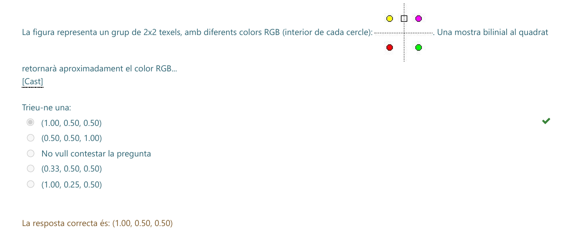

**Solució de l'exercici:**
* **(1.00, 0.50, 0.50)**

<hr style="border: 15px solid blue;">

## 31. Cost de Memòria del Mipmapping (La Regla del 1.33)

> **Pregunta original:**
> "Una textura de 1024x1024 requereix... 1M texel. Quants texels cal emmagatzemar si la textura fa servir mipmapping?"

**Concepte Clau (El "+33%" extra)**


Quan actives el **Mipmapping**, la targeta gràfica no només guarda la imatge original. També guarda automàticament una cadena de versions reduïdes (la meitat d'ample i la meitat d'alt cada vegada) fins a arribar a 1x1.

La pregunta és: **Quant espai extra ocupa tot això?**
Hi ha una regla d'or en gràfics:
> **El Mipmapping augmenta l'ús de memòria en un 33% (o 1/3).**

---

### Teoria / Mètode de resolució

Vegem d'on surt aquest número màgic mirant les àrees:

1.  **Nivell 0 (Original):** $100\%$ dels píxels ($1$).
2.  **Nivell 1:** Com que reduïm l'ample per 2 i l'alt per 2, l'àrea es divideix per 4. Ocupa el $25\%$ ($1/4$).
3.  **Nivell 2:** Ocupa el $6.25\%$ ($1/16$).
4.  **Nivell 3:** Ocupa el $1.56\%$ ($1/64$).

Si sumes aquesta sèrie infinita ($\sum \frac{1}{4^n}$), el resultat matemàtic exacte és $\frac{4}{3}$, que és **1.333...**

$$\text{Memòria Total} \approx \text{Memòria Original} \times 1.33$$

---

### Exercici


> **Dades:**
> * Textura original: 1M texels ($1024 \times 1024$).

**Càlcul:**
Simplement apliquem el factor d'expansió del mipmapping:
$$1\text{M} \times 1.3333... = \mathbf{1.33\text{M}}$$

**Solució de l'exercici:**
* **1.33 M texel** (Exactament el que posa a la imatge).

<hr style="border: 15px solid blue;">


## 32. Parametrització Equirectangular (D'Esfèriques a Cartesianes)

> **Pregunta original per cercar:**
> "A la parametrització equirectangular estudiada a classe, el punt amb coordenades esfèriques (en radians) $\Theta = 5.2, \Psi = 1.3$ correspon..."

**Concepte Clau (Trigonometria a l'Esfera)**


[Image of spherical to cartesian coordinates diagram]


Volem passar de coordenades esfèriques (angles) a coordenades 3D $(x,y,z)$ en una esfera de radi 1.
La fórmula estàndard que s'utilitza en aquest context (on $\Psi$ és latitud/elevació) és:

1.  **$Y = \sin(\Psi)$**: L'alçada ve donada directament per la latitud.
2.  **$R = \cos(\Psi)$**: El radi del cercle horitzontal a aquesta alçada (com més amunt, més petit és el cercle).
3.  **$X = R \cdot \sin(\Theta)$** i **$Z = R \cdot \cos(\Theta)$**: La posició horitzontal ve donada per la longitud.

---

### Teoria / Mètode de resolució

Utilitzarem els valors donats:
* **Latitud ($\Psi$):** 1.3 radians.
* **Longitud ($\Theta$):** 5.2 radians.

**Pas 1: Calcular l'Alçada (Eix Y)**
L'angle $1.3$ està molt a prop de $\pi/2$ ($\approx 1.57$), que és el Pol Nord. Per tant, la Y ha de ser positiva i propera a 1.
$$Y = \sin(1.3) \approx \mathbf{0.96}$$

**Pas 2: Calcular el Radi Horitzontal ($R$)**
Necessitem saber com de gran és el cercle a aquesta alçada per calcular la X i la Z.
$$R = \cos(1.3) \approx \mathbf{0.267}$$

**Pas 3: Calcular X i Z (usant el radi R)**
Ara projectem l'angle $\Theta = 5.2$. Aquest angle està al **4t quadrant** (entre $4.71$ i $6.28$), per tant el Sinus serà negatiu i el Cosinus positiu.
* **Component 1:** $0.267 \times \sin(5.2) \approx 0.267 \times (-0.88) \approx \mathbf{-0.24}$
* **Component 2:** $0.267 \times \cos(5.2) \approx 0.267 \times 0.46 \approx \mathbf{0.13}$

---

### Exercici


Mirem les opcions disponibles:

1.  $(0.13, 0.96, -0.24)$
2.  $(0.96, -0.24, 0.13)$ $\to$ Incorrecte: La Y ha de ser 0.96.
3.  $(1.24, 0.96, 0.13)$ $\to$ Incorrecte: X no pot ser major que 1.
4.  **$(-0.24, 0.96, 0.13)$**: **CORRECTA.**

Coincideix perfectament amb els càlculs:
* $X = -0.24$
* $Y = 0.96$
* $Z = 0.13$

**Solució de l'exercici:**
* **(-0.24, 0.96, 0.13)**

<hr style="border: 15px solid blue;">